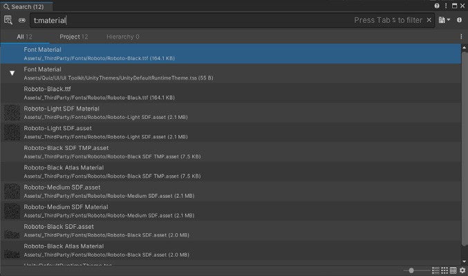
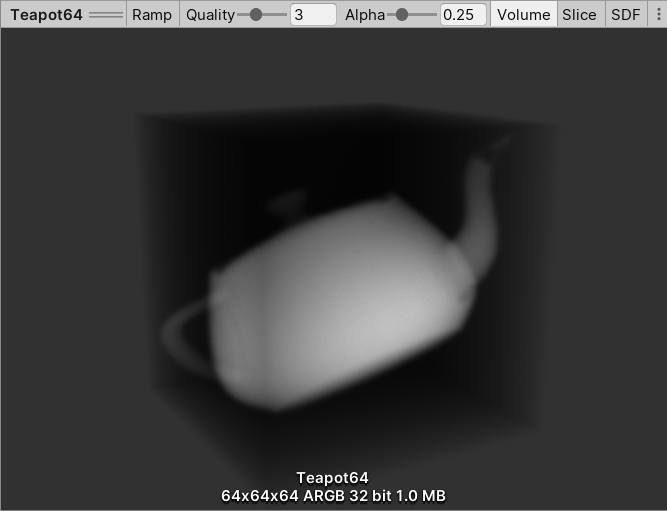
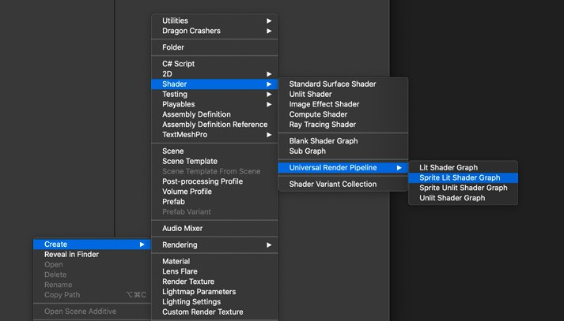
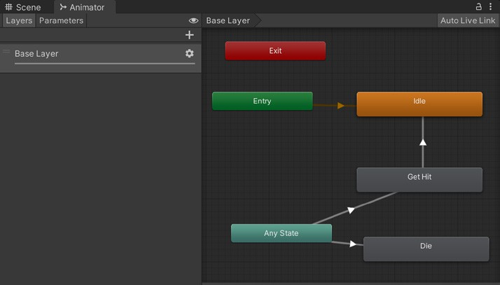
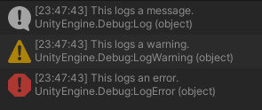
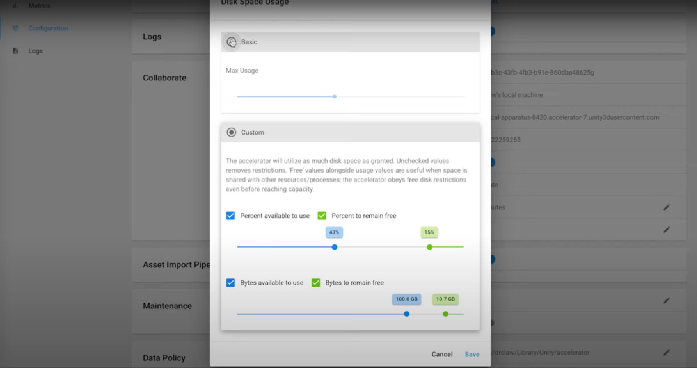

80个提升你在 Unity 2022 LTS 中生产力的技巧

# 介绍

本指南提供了超过80个技巧，帮助您更快地使用 Unity 的程序员和美术工具集。它涵盖了 Unity 2022 LTS 中的许多新功能，以及大量多年来一直是 Unity 一部分的节省时间的步骤和工作流程。

当您每天在 Unity 中工作时，每一秒或每一次鼠标点击都会累积起来。我们希望您能够减少浪费的时间，提高工作效率。无论您是新手还是经验丰富的Unity开发者，本指南都可以帮助您在游戏开发的每个阶段加速工作流程。

请访问 [Unity 2022 LTS 网站](https://unity.com/releases/lts)或 Unity 文档中的 [Unity 2022 新功能](https://docs.unity3d.com/Manual/WhatsNew2022LTS.html)部分，以了解其新功能和能力的完整信息。

Unity 的许多团队都在努力改善我们创作者的生活质量，例如[加速解决方案团队](https://unity.com/solutions/accelerate-solutions-games)，他们为本指南贡献了宝贵的知识。加速解决方案团队支持众多 Unity 客户，帮助他们充分利用引擎。他们识别并帮助优化项目在速度、稳定性和效率方面的关键点。

# 编辑器工作流

Unity 2022 LTS 包含多项改进，可加速编辑器工作流程，例如新的搜索选项帮助您更快地找到内容、快捷键管理器的细粒度功能、大规模项目的优化、运行模式的改进、UI Toolkit 中更灵活的布局和高级样式选项等等。

这些改进加在一起，可以在数天甚至数周内为你节省数小时的工作时间，因为你可以更快地迭代并更高效地开发。试试这些技巧和快捷方式，让你在 Unity 中工作得更快。

以下是 Unity 2022 LTS 中一些编辑器的幕后改进：

- 改进了加载编辑器窗口时的包检索过程

- 减少了进入运行模式的时间

- 减少了进入运行模式或制作构建时静态批处理所需的时间

- 改进了在场景视图中选择大型对象的性能

- 改进了选择多个 LODGroups 时场景视图的性能

- 优化了预制件编辑：大型预制件修改成本降低 20%

- 大规模项目的编辑器工作流程优化：

  - 更快的层次结构滚动和对象选择

  - 优化了游戏对象的多选

  - 改进了预览多个纹理时的性能

  - 减少了切换到大型预制件时的卡顿

  - 改进了创建新资源时的性能（特别是在大型项目中）

  - 优化了 StripPrefabObjectsWhichAreNotUsed：大型场景速度提升 28%

## Pakage Manager


_更新后的 Pakage Manager 界面_

Unity 2022 LTS 中对 [Pakage Manager](https://docs.unity3d.com/2022.1/Documentation/Manual/upm-ui.html) 的更新，帮助你在导入和整理包时节省时间：

- 在 Pakage Manager 窗口支持[多选](https://docs.unity3d.com/Manual/upm-ui-multi.html)；可以一次性对多个包执行相同操作，而无需逐个操作

- 改进了[从资产商店导入完整项目](https://docs.unity3d.com/Manual/upm-ui-import.html#complete-proj)的工作流程；可以将完整项目导入到临时项目中，在不影响主项目的情况下安全地浏览内容

- 重新设计了 **Unity Registry**、 **My Registry**、**In Project** 和 **My Assets lists** 中的 [Filters](https://docs.unity3d.com/Manual/upm-ui-filter2.html) 和 [Sorting](https://docs.unity3d.com/Manual/upm-ui-sort.html) 控件

- 在 [My Assets list](https://docs.unity3d.com/Manual/upm-ui.html) 的刷新列表中新增了 **Check for Update** 选项；使用此选项可以检查电脑上所有包的更新，而不仅仅是 **My Assets list** 列表中可见的包

- 新增 **Update** 按钮，可自动将 Git 包更新到最新版本

## 快捷键管理器

[快捷键管理器](https://docs.unity3d.com/2022.3/Documentation/Manual/ShortcutsManager.html)是一个交互式可视化界面，帮助你管理编辑器热键。在这里，你可以为不同的上下文分配快捷键，并可视化你常用工具的现有绑定。


_快捷键管理器界面_

你可以将任意按键或按键组合绑定到 Unity 编辑器命令。例如，R 键默认绑定到工具上下文中的缩放工具。

**绑定冲突**类别还会识别你是否将同一个快捷键分配给了可以同时执行的两个命令。你可以通过界面解决此类冲突。注意：如果命令处于不同上下文且不会同时执行，你可以将同一快捷键分配给多个命令。


_识别快捷键之间的绑定冲突_

可以通过Unity主菜单访问快捷键管理器：

- 在 Windows 和 Linux 上，选择 **Edit > Shortcuts**。
- 在 macOS 上，选择 **Unity > Shortcuts**。

你还可以使用 [UnityEditor.ShortcutManagement](https://docs.unity3d.com/2019.1/Documentation/ScriptReference/ShortcutManagement.ActiveProfileChangedEventArgs.html) 命名空间下的API，在自己的脚本和包中定义自定义快捷键。

### 常用快捷键

以下是一些常用的默认快捷键：

  | **操作** | **Windows** | **Mac** |
  |----------|-------------|---------|
  | 聚焦选中对象 | **F** | **F** |
  | 复制项目 | **Ctrl + D** | **Cmd + D** |
  | 删除游戏对象 | **Shift + Del** | **Cmd + Delete** |
  | 视图/移动/旋转/矩形/变换 | **Q/W/E/R/T** | **Q/W/E/R/T** |
  | 切换枢轴模式 | **Z** | **Z** |
  | 切换枢轴旋转 | **X** | **X** |
  | 顶点吸附 | **V** | **V** |
  | 吸附 | **Ctrl + LMB** | **Cmd + LMB** |
  | 切换最大化 | **Shift + 空格** | **Shift + 空格** |
  | 上下文中编辑预制件 | **P** | **P** |


_常用编辑器快捷键_

## 聚焦检视面板

[聚焦检视面板窗口](https://docs.unity3d.com/2022.3/Documentation/Manual/InspectorFocused.html)允许你检查特定游戏对象、组件或资源的属性。无论你在场景中选择了什么，它始终显示你为其打开时的项目属性。

右键点击一个游戏对象或组件，选择 **Properties**。这会弹出一个可移动、可停靠、可调整大小的浮动检视面板窗口，就像其他窗口一样。

 

_聚焦检视面板可以比较两个游戏对象_

最常用的是方法一的表格形式，因为它既符合 Markdown 语法，又有良好的兼容性。

同时打开多个聚焦检视面板，可以在修改场景时参考多个游戏对象。


_你还可以只聚焦于游戏对象的某个特定组件，从而减少屏幕空间占用_

## 预设（Presets）

预设允许你自定义检视面板中任何内容的默认状态。创建[预设](https://docs.unity3d.com/2022.3/Documentation/Manual/Presets.html)可以复制组件或资源的设置，将其保存为一个资源，然后稍后将相同的设置应用到其他项目上。

使用预设可以强制执行标准，或为新资源应用合理的默认值。这确保了团队内的一致标准，避免常被忽略的设置影响项目性能。


_上图中红色高亮的是预设图标_

点击组件右上角的预设图标。点击 **Save current to...** 可以将预设保存为资源。点击可用的预设之一可以加载一组数值。

  

_在此示例中，预设根据用途（反照率、法线或实用（utility））包含了2D纹理的不同导入设置_

其他实用的预设用法：

- **用默认值创建游戏对象：** 将预设资源拖放到 Hierarchy 面板中，即可创建一个带有预设值组件的新游戏对象。

- **将特定类型与预设关联：** 在**Preset Manager**（**Project Settings > Preset Manager**）中，为每种类型指定一个或多个预设。此后新建组件时会默认使用指定的预设值。

  - 专业提示：为每种类型创建多个预设，并依靠筛选器通过名称关联正确的预设。

- **保存和加载管理器设置：** 管理器窗口也可以使用预设，这样设置可以复用；例如，如果你计划重新应用相同的标签和层或物理设置，预设可以减少下一个项目的设置时间。

## 场景可见性

随着场景变得越来越大，你可以临时隐藏特定对象，以便更轻松地选择和编辑你的游戏对象。

与其禁用游戏对象（这可能导致意外行为），不如切换场景可见性控制。这允许你在不改变游戏内可见性的情况下，在场景视图中隐藏和显示对象。

使用 Hierarchy 窗口中的工具栏，可以为视口中的游戏对象启用或禁用场景可见性。


_使用场景可见性控制在场景视图中隐藏对象_

请注意，层级中的状态图标可能会发生变化，具体取决于父对象或子对象是否被隐藏。

| **图标** | **状态** |
|----------|----------|
|  | 游戏对象可见，但其部分子对象被隐藏。 |
|  | 游戏对象被隐藏，但其部分子对象可见。 |
|  | 游戏对象及其子对象可见，但只有在悬停时才会显示。 |
|  | 游戏对象及其子对象都被隐藏。 |


_切换场景视图控制栏的开关，可以覆盖全局场景可见性_

使用 **Isolation View** 可以专注于某个对象及其子对象。在 Hierarchy 窗口中选择游戏对象并按下 **Shift + H** 即可切换隔离视图。此操作会覆盖你其他的场景可见性设置，直到你退出为止。

  

_隔离视图让你可以在没有干扰的情况下编辑游戏对象_

记住，你也可以随时使用 **Shift + 空格** 快捷键最大化视口并隐藏编辑器的其他部分。

## 场景拾取

你可以像设置场景可见性一样，修改游戏对象的可拾取状态。使用工具栏可以阻止特定游戏对象在场景视图中被选中。这在大型场景中可以避免误选和误编辑游戏对象。


_层级拾取性_

你可以为整个分支或单个对象切换拾取性，因此有些游戏对象本身可拾取，但其子对象或父对象不可拾取。下列图标区分了它们的状态。

| **图标** | **状态** |
|----------|----------|
|  | 你可以拾取该游戏对象，但不能拾取其部分子对象。 |
|  | 你不能拾取该游戏对象，但可以拾取其部分子对象。 |
|  | 你可以拾取该游戏对象及其子对象（仅在悬停时显示）。 |
|  | 你不能拾取该游戏对象及其子对象。 |

## 搜索

编辑器中的搜索功能在最近的 LTS 版本中得到了改进，在 2022 LTS 中，你有多种高效搜索 Unity 内容的方式。除了 Hierarchy 视图和项目视图中的搜索功能外，你还可以使用主菜单栏上的搜索按钮图标，或使用 Ctrl + K 快捷键。


这会打开一个搜索窗口，方便你筛选搜索内容。着陆页的顶部区域允许你为搜索选择一个搜索区域（搜索提供者）。点击某个搜索区域块会筛选下方的查询和最近搜索。双击某个搜索区域块会在搜索栏中插入该区域的过滤标记，帮助你进一步缩小搜索范围。


_更新后的搜索窗口_


_带有查询的搜索窗口_

中间部分显示当前选定搜索区域可用的查询列表。你可以点击任意查询来执行。查询可以是 SearchTemplate（在代码中使用 [SearchTemplate] 属性时为指定搜索区域动态生成的查询），也可以是带有 Scene Template 属性的普通 SearchQuery。

在按名称搜索时，你还可以按类型搜索。使用下拉菜单选择 **Type**，或使用 **t:** 简写语法，例如 t:scene（搜索所有场景）或 t:texture（搜索所有纹理）。


_搜索功能还支持搜索设置和菜单_

此外，搜索窗口允许你以多种方式可视化对象：紧凑列表视图、大列表视图或多种尺寸的网格图标。你还可以以表格方式显示对象。



_带有查询的搜索窗口_

如果你想按名称（或描述）排序项目，尤其是想通过[搜索表达式](https://github.com/Unity-Technologies/com.unity.search.extensions/wiki/Blog-Search-21.2#search-expressions)从 [SearchItems](https://docs.unity3d.com/2022.3/Documentation/ScriptReference/Search.SearchItem.html) 中提取属性并创建列布局时，这非常实用。此外，当保存[搜索查询](https://github.com/Unity-Technologies/com.unity.search.extensions/wiki/Blog-Search-21.2#saving-queries)时，Unity 会保留所有搜索视图状态，包括任何列的设置。这让你可以创建自己的“数据浏览器”，便于对比多个属性值。

## 查询生成器

你可以在搜索窗口中输入几个字符来快速查找对象。但通过丰富的搜索语言语法，也可以实现复杂且精确的查询。然而，记住某个特定搜索区域提供者有哪些可用过滤器，或者某种类型的属性名称，以便与阈值进行比较，这可能会有些困难。

全新的查询生成器工作流可以帮助你构建复杂查询并探索你的项目。


_查询生成器_

可以通过生成器切换按钮（见搜索栏旁的拼图按钮）激活查询生成器。注意，生成器工作流与新的搜索着陆页配合得很好。

## 检视面板调试模式

你可以在每个游戏对象的检视面板中切换普通模式和调试模式。点击**更多选项**（ ⁝ ）按钮打开上下文菜单，选择所需模式。

调试模式只显示所选组件的属性及其数值，同时也会显示私有变量（但你无法编辑它们）。


_检视面板调试模式_

## 10个小型工作流技巧

这10个小而强大的增强功能将帮助你进一步加快编辑器中的工作效率。

1.  在 Hierarchy 窗口中剪切和粘贴游戏对象。你还可以通过右键菜单选择 **Paste As Child（粘贴为子对象）**。


_粘贴为子对象_

2.  使用 **F** 快捷键在场景视图中聚焦选中对象。现在支持更多对象类型，并能更好地聚焦它们。在运行模式下，按 **Shift + F** 可以锁定到正在移动的选中游戏对象。

3.  在检视面板预览中显示 UV、法线、切线和其他网格信息。


_检视面板预览_

4.  检视面板预览中可查看改进的3D纹理预览，如体积渲染、3D纹理切片或有号距离场。



_体积渲染_

5.  使用图层菜单切换任何图层（如UI）的可见性，避免其遮挡场景视图。锁定图层可避免意外更改其状态。


_切换和编辑图层_

6.  如果你经常选择场景中的同一组对象，可以在 **Edit > Selection** 下使用快捷键组合，快速保存或加载选择集。


_加载和保存选择集_

7.  在 **Project Settings > Editor** 中修改重复对象的 **Numbering Scheme（编号方案）**。

你可以在这里定义命名选项，以及实例编号的填充和间距。


_编号方案_

8.  使用 **EditorOnly** 标签标记不会出现在应用构建中的游戏对象。


_EditorOnly_

9.  通过 **Unity > Preferences > Colors** 更改编辑器中的颜色，以便更快地找到特定 UI 元素或对象。调整运行模式色调，提醒自己当前处于运行模式，避免退出时丢失未保存的更改。


_运行模式色调_

如果你在运行模式下做了想要保留的更改，可以使用 **More Items**（ ⁝ ）按钮。在运行时复制组件或变换的数值，退出运行模式后从剪贴板粘贴。或者，如果有多个组件更改，可以拖出一个临时预制件，将你的工作保存到那里。

10. 设置摄像机时，使用 **GameObject > Align With View**，让游戏摄像机与场景摄像机对齐。或者，如果你想反向操作，使用 **Align View to Selected（视图对齐到选中对象）**，让场景摄像机对齐到 Hierarchy 中的另一个摄像机。


_与视图对齐_

### 更多资源

- [高级编辑器脚本技巧节省你的时间：第一部分](https://blog.unity.com/engine-platform/advanced-editor-scripting-hacks-to-save-you-time-part-1)

- [高级编辑器脚本技巧节省你的时间：第二部分](https://blog.unity.com/engine-platform/advanced-editor-scripting-hacks-to-save-you-time-part-2)

- [使用 Unity Hub 提升你的工作效率](https://blog.unity.com/engine-platform/speed-up-your-productivity-with-the-unity-hub)

# 美术工作流

2D 和 3D 美术、动画师以及关卡设计师在 Unity 中有许多节省时间、提升效率的在场景内迭代方式。特别是在 Unity 2022 LTS 中，使用 UI Toolkit 自定义编辑器的流程更加流畅，HDRP 和 URP 带来了更高级的视觉质量与性能选项，2D 工具也有了改进，等等。完整的新功能、改进和修复列表请参见 [Unity 2022](https://unity.com/releases/editor/whats-new/2022.1.0) [发行说明](https://unity.com/releases/editor/whats-new/2022.1.0)。


_Happy Harvest 的 2D 美术_


_*Happy Harvest*，现已在 [Unity Asset Store](https://assetstore.unity.com/packages/essentials/tutorial-projects/happy-harvest-2d-sample-project-259218) 上架，充分利用了 Unity 2022 LTS 中 URP 的最新功能，实现了 2D 光照、阴影和特效。[了解详情](https://blog.unity.com/engine-platform/unity-2022-lts-is-coming-in-june)_

## 2D 美术技巧

这里介绍的许多 2D 技巧和改进都应用在 [Happy Harvest](https://assetstore.unity.com/packages/essentials/tutorial-projects/happy-harvest-2d-sample-project-259218) 中，这是一个 2D 俯视视角农场模拟游戏演示，展示了 Unity 2022 LTS 在 2D 光照、阴影特效、骨骼动画、精灵库、视觉特效等方面的能力。

你可以阅读一系列与演示配套的深度文章，这些文章详细讲解了如何在 *Happy Harvest* 中创建 2D 视觉效果，帮助你将这些技术应用到自己的项目中：

1. [通用渲染管线中的 2D 光照与阴影技术](https://unity.com/how-to/2d-light-shadow-techniques-in-the-universal-render-pipeline)
2. [如何在 Unity 2022 LTS 中制作 2D 角色动画](https://unity.com/how-to/2d-characters-and-animation-unity-2022-lts)
3. [如何用 2D Tilemap 创作美术与玩法](https://unity.com/how-to/create-art-and-gameplay-2d-tilemaps-unity)
4. [用 VFX Graph 和 Shader Graph 制作 2D 特效](https://unity.com/how-to/2d-special-effects-vfx-graph-shader-graph)

你还可以在电子书[《2D 游戏美术、动画与灯光艺术家指南》](https://unity.com/resources/2d-game-art-animation-lighting-for-artists-ebook?isGated=false)》中探索更多 2D 美术与优化技巧。

1. 2D 项目通常用精灵（Sprite）来创建视觉效果，这可能包含大量纹理资源并导致许多绘制调用。为优化资源，建议使用 **Sprite Atlas (Asset > Create > Sprite Atlas)**，而不是单独渲染每个精灵和纹理。

    Sprite Atlas V2 在 Unity 2022 LTS 中已脱离预览版，可在编辑器中完整使用，无需进入 Play 模式或构建即可体验精灵图集的优势。它还支持 [Unity Accelerator](https://docs.unity3d.com/Manual/UnityAccelerator.html)，并自 2021.2 起支持将文件夹作为可打包对象。Sprite Atlas V2 利用 [AssetDatabase V2](https://docs.unity3d.com/2022.3/Documentation/Manual/AssetDatabase.html)（ADBV2）提供的功能，如[缓存服务器](https://docs.unity3d.com/Manual/UnityAccelerator.html) 支持。

    

    _一个 Sprite Atlas 可以将多个精灵打包到一张合成纹理中_

    将精灵添加到[待打包对象列表](https://docs.unity3d.com/Manual/SpriteAtlasWorkflow.html#objectlist)，并启用[包含到构建](https://docs.unity3d.com/Manual/SpriteAtlasWorkflow.html#inclbuild) 选项。使用[打包选项](https://docs.unity3d.com/Manual/SpriteAtlasWorkflow.html#Optimized) 决定精灵在图集中的布局紧密程度及是否允许旋转。合并纹理后，Unity 只需一次绘制调用即可访问打包纹理，性能开销更小。

    

    _在 Unity 的 UI 系统中，图集和游戏对象结构对批处理也很重要_

2. 如果正确组织 UI 布局，SpriteAtlas 可以减少绘制调用。Unity 会自上而下扫描游戏对象层级，批处理使用相同纹理和材质的对象。更多最佳实践请参阅 [Unity UI 优化技巧](https://unity.com/how-to/unity-ui-optimization-tips)。

[SpriteAtlas API](https://docs.unity3d.com/ScriptReference/U2D.SpriteAtlas.html) 提供了运行时的更多控制。你还可以创建[变体精灵图集](https://docs.unity3d.com/Manual/VariantSpriteAtlas.html)，或通过 [Late Binding](https://docs.unity3d.com/Manual/LateBinding.html) 脚本为图集准备[分发形式](https://docs.unity3d.com/Manual/SpriteAtlasDistribution.html)。

3. [2D Pixel Perfect Package](https://docs.unity3d.com/Packages/com.unity.2d.pixel-perfect%405.0/manual/index.html) 提供了像素完美相机（Pixel Perfect Camera），确保你的像素美术在不同分辨率下依然清晰，无需手动缩放资源。

    

    _像素完美相机_

    阅读 SouthPAW Games 如何用 Unity 2D 工具制作首款像素美术游戏：[2D Pixel Perfect for a crisp conquest in *Skul: The Hero Slayer*](https://blog.unity.com/games/2d-pixel-perfect-for-a-crisp-conquest-in-skul-the-hero-slayer)。

    

    _2D像素完美相机_

4. 如果你需要处理 Photoshop 文件资源，建议使用 [PSD Importer Package](https://docs.unity3d.com/Packages/com.unity.2d.psdimporter%408.0/manual/index.html)。无需导出单独精灵，直接导入 **.PSD** 或 **.PSB** 文件即可。这允许你从不同图层导入多个精灵，并生成精灵表或 2D 角色骨骼。详见[加速 2D 美术工作流的 PSD Importer 指南](https://blog.unity.com/engine-platform/how-to-speed-up-2d-art-workflows-with-2d-psd-importer)。

    在 Unity 2022 LTS 中，你可以在 PSD Importer 检查器中选择要导入的图层，并在马赛克模式下设置精灵间距。

    

    _2D PSD Importer 可在 Pakage Manager 中获取_

5. 使用 [Tilemaps](https://docs.unity3d.com/2022.3/Documentation/Manual/class-Tilemap.html) 创建大型网格世界，包括六边形和等距版本，优化体积和性能。更多技巧见[如何用 2D Tilemap 创作美术与玩法](https://unity.com/how-to/create-art-and-gameplay-2d-tilemaps-unity)。

    _Tilemap 可描述等距或其他网格环境_

    

    

    _在 Happy Harvest 中设置 rule tiles_

6. 用 [2D 骨骼动画](https://docs.unity3d.com/Packages/com.unity.2d.animation%409.1/manual/index.html) 实现平滑动画，包括绑定、细分和骨骼创建。2D 反向动力学（IK）简化动画制作，自动计算骨骼如何到达目标位置。详见[如何在 Unity 2022 LTS 中制作 2D 角色动画](https://unity.com/how-to/2d-characters-and-animation-unity-2022-lts)。

    

    _在 Happy Harvest 中使用 2D IK 求解器为主角制作动画：左图显示了修改骨骼的位置和旋转，而中间和右图则展示了使用 Sprite Resolver 更改手部的精灵_

7. 用 [2D 光源](https://docs.unity3d.com/Packages/com.unity.render-pipelines.universal%4014.0/manual/Lights-2D-intro.html) 增强视觉效果。光源参数易于配置，如颜色、强度、衰减和混合效果。更多 2D 光照技巧见 Odd Bug Studio 的[文章](https://unity.com/how-to/use-2d-lights-unity-set-mood)及[通用渲染管线中的 2D 光影技术](https://unity.com/how-to/2d-light-shadow-techniques-in-the-universal-render-pipeline)。

    

    _在吊灯周围使用带有光环的精灵图像_

8. [2D Sprite Shape](https://docs.unity3d.com/Packages/com.unity.2d.spriteshape%409.0/manual/index.html) 让你用可视化直观的流程创建丰富的自由形状 2D 环境。它会沿着形状轮廓自动铺排精灵，并根据轮廓角度自动变形和切换。

    

    _在最新的 2D 示例项目中，2D 精灵形状的一个使用示例_

    你可以根据需要的方向对[精灵排序](https://docs.unity3d.com/Manual/2DSorting.html)。如果同一层和排序顺序下有多个精灵（如卡牌游戏中卡片重叠），这会很有帮助。

    在内置渲染管线中，进入 **Edit >  Project Settings > Graphics**，为 **Transparency Sort Mode** 选择 **Custom Axis**。例如，使用 (0, 1, 0) 作为 **Transparency Sort Axis**，可实现从上到下的 Y 轴排序。

    在通用渲染管线中，设置 [Camera.transparencySortMode](https://docs.unity3d.com/ScriptReference/Camera-transparencySortMode.html) 为 **TransparencySortMode.CustomAxis**，再用 [Camera.transparencySortAxis](https://docs.unity3d.com/ScriptReference/Camera-transparencySortAxis.html) 设置轴向。

    

    _透明度排序模式（Transparency Sort）与排序轴（Sort Axis）_

9. 需要自定义着色器？Shader Graph 包含专为 2D 设计的 **Sprite Lit** 和 **Sprite Unlit** 两个主节点。创建 [2D 着色器](https://docs.unity3d.com/Packages/com.unity.render-pipelines.universal%4014.0/manual/ShaderGraph.html)，提升 2D 项目视觉表现。Unity 2022 LTS 中，VFX Graph 也支持 2D。你可以在图形输出中添加 2D Shader Graph，利用 GPU 渲染数百万粒子。

    

    

    _Dragon Crashers 中的 Shader Graph 示例_

10. 为提升性能，避免 OverDraw。为每个精灵在[导入设置](https://docs.unity3d.com/Manual/class-TextureImporter.html) 中将 **Mesh Type** 切换为 **Tight**。尽量将重叠图形合并为单个精灵，并禁用游戏中无用的背景精灵，减少重叠区域和潜在的绘制浪费。

    

    _减少精灵之间的 OverDraw_

11. 你还可以用 [2D 精灵编辑器](https://docs.unity3d.com/Manual/SpriteEditor.html)为每个精灵定义 [custom outline（自定义轮廓）](https://docs.unity3d.com/Manual/SpriteOutlineEditor.html)，以最小化未使用区域。2022 LTS 的 Sprite Library Editor 在管理大型内容集时性能更优。

    

    使用自定义轮廓的 Sprite Editor

12. [Sprite Swap](https://docs.unity3d.com/Packages/com.unity.2d.animation%409.0/manual/SpriteSwapIntro.html) 允许你在运行时更换游戏对象的渲染精灵。比如可轻松创建多个共用骨架的角色（需 PSD Importer 包），或在外观不同的情况下复用骨骼和网格数据。

    Unity 2022 LTS 优化了 Sprite Swap 工作流，在动画窗口中可更流畅地为 Sprite Swap 关键帧设定。

    

    _将 Happy Harvest 中初始虚拟角色所使用的精灵库替换为具有男性和女性两种变体的版本，这些变体具有相同的类别和标签_

13. 2022 LTS 还为 2D 动画师带来了精灵变形和 IK 求解器在动画预览窗口的支持。Skinning 编辑器新增了角色枢轴工具。你可以用新工具将旧版 Sprite Library 资源和动画片段升级到最新版本。

*Happy Harvest* 创作者的 2D 专业技巧：

- 角色绘制时保持中立姿势，手脚伸直。若身体部位弯曲，动画时可能出问题。
- 分辨率略高于游戏的像素单位（[PPU](https://blog.unity.com/engine-platform/choosing-the-resolution-of-your-2d-art-assets)）建议值。静止时分辨率可能看起来不错，但旋转和拉伸时容易像素化。
- 如果游戏大量使用 2D 光照并希望充分利用法线贴图，不要直接在精灵上绘制光影，而是绘制无方向性的阴影（环境光遮蔽）。这样精灵效果更好，但要避免使用如阳光等方向性光源。
- 用 Sprite Swap 功能切换身体部位图层时，应按组归类。例如，所有嘴型图层应在图像编辑软件中放在名为“mouth”的组里。

    

    _在 2D 上下视角或等距视角的游戏中，角色旋转有多种可能性。下图展示了主角朝三个不同方向的动画效果_

- 2D IK 简单设置常用于装饰性元素。例如 *Happy Harvest* 的猪预制件。街灯的摆动动画也是用循环动画片段实现，仅改变精灵旋转，无需绑定骨骼。
- Flipbook（逐帧）动画适合为次要背景角色制作动画，帧数少，开销低，也适合水花等特效。
- *Happy Harvest* 中的水流和风吹树丛特效是用 Shader Graph 和 VFX Graph 制作的。

    

- 次级纹理：遮罩贴图可控制光照影响精灵的位置，帮助你为游戏添加细节，也用于 2D 光照混合样式。
- *Happy Harvest* 到处用光照和法线贴图营造体积感。你可以将法线贴图与点光、聚光和自由光配合使用。记得在光源对象中启用法线贴图（有快速和精确两种质量设置）。
- 默认情况下，2D 光源通过增加 RGB 值为像素提供光照。RGB 值越高，颜色越亮。但如果将混合样式改为 Multiply，这些 RGB 值会从像素中减去，产生更暗的颜色模拟阴影。你可以用同样的控制方式调整这些模拟阴影（负光照）。
- 快速模拟阴影的方法是用 blob shadow（模糊精灵），也用负光照，可拉伸以表现物体在地面上的环境光遮蔽。

    

    *Happy Harvest* 中的灌木看起来有深度，正是因为在光源组件中启用了法线贴图选项

## 预制件工作流

预制件（Prefab）允许你将完全配置好的游戏对象保存到项目中以便复用。当前的预制件工作流让你能够灵活高效地构建场景。


在 *Dragon Crashers* 中，每个单位都重写了基础单位。Overrides 下拉菜单显示了预制件与原始版本的不同之处。

将你的预制件作为资源在项目中创建，然后在 **Prefab Mode** 下进行独立编辑。单独操作预制件有助于避免意外覆盖。编辑时背景会变灰，让你可以安心修改。


_你可以在上下文中或独立模式下编辑每个预制件_


_在上下文模式下编辑，可以看到预制件与场景中其他对象的相对关系_


_在预制件模式下隔离编辑，避免意外覆盖。注意这个嵌套预制件是由更小的预制件组成的_

**Nested Prefabs（嵌套预制件）** 允许你将预制件相互嵌套。你可以创建更大的预制件（如建筑），由房间和家具等更小的预制件组成。这样可以让多名美术和开发人员同时协作开发不同部分的内容，提高资产开发效率。

**Prefab Variant（预制件变体）** 允许你像面向对象编程中的继承一样，从其他预制件派生出新的预制件。要更改变体，只需覆盖部分内容，无需担心影响原始预制件。你也可以随时移除所有修改并恢复到基础预制件。

另外，如果你想一次性更改所有变体，可以直接在基础预制件上应用更改。


_在 Dragon Crashers 中，这些预制件变体拥有不同的武器和能力_


_使用 **ApplyAll to Base** 可将更改应用到基础对象，或用 **Revert All** 撤销所有覆盖_

更多关于预制件的内容，请参阅 [Unity 官方文档](https://docs.unity3d.com/Manual/Prefabs.html)。

## 材质变体

材质在渲染中起着至关重要的作用，决定了物体如何反射或发射光线。它们可以让物体看起来像金属、玻璃、木头，甚至是抽象或魔法效果。材质包含对着色器对象的引用。如果该着色器对象定义了材质属性，那么材质还可以包含数据，如颜色或纹理引用。

在 Unity 2022 LTS 中，材质变体（Material Variants）允许对共享大部分表面属性的材质进行复用和更高效的管理。

通过材质变体，你可以创建模板或材质预制体。基于基础模板，你可以创建与模板材质共享通用属性的变体，只需重写不同的属性。如果你更改了模板材质中通用且未被重写的属性，变体材质会自动同步这些更改。你还可以锁定材质上的某些属性，使其在变体中无法被重写。


材质变体示例：这些材质都共享同一个基础材质，仅颜色属性不同

在更复杂的设置中，你可以为某个变体材质再创建变体。材质继承层级提升了复用性，加快了材质创作的迭代速度和项目的可扩展性。

## TextMeshPro

TextMeshPro 替代了 Unity 的 UI Text 和传统的 Text Mesh。通过包管理器安装，[TextMeshPro](https://docs.unity3d.com/Manual/com.unity.textmeshpro.html) 使用自定义着色器和高级文本渲染技术，带来灵活的文本样式和纹理效果。

使用 TextMeshPro 可以获得字符、单词、行和段落间距、字距调整、两端对齐、超链接、30 多种富文本标签、多字体和精灵支持、自定义样式等丰富功能。


_*Dragon Crashers* 中的 TextMeshPro 示例_

## 样条线

[Unity 2022 LTS 的 Splines 包](https://docs.unity3d.com/Packages/com.unity.splines%402.5/manual/index.html)让你可以在游戏中创建样条路径，用于河流、道路、摄像机轨迹等路径类视觉效果。根据你所制作的环境类型，样条线可以成为关卡设计中的重要组成部分。


样条线的应用示例：森林中的道路、动画路径、管道或线缆网格等。安装 Splines 包后，你可以在包管理器页面找到更多示例，展示其各种可能性。

通过 **GameObject > Spline > Draw Splines Tool** 创建新的样条线。此操作会在层级视图中创建一个带有 Spline 组件的新 GameObject，并可直接使用相关工具。


Unity 中样条线的操作手柄和控制方式类似于常见 DCC 软件中的矢量或 3D 绘图工具。

创建好样条线后，程序员和美术都可以以有趣的方式加以利用。例如，程序员可以读取样条线上的点，并在游戏逻辑中通过 [API](https://docs.unity3d.com/Packages/com.unity.splines%402.5/api/index.html) 使用它们。

## 吸附

在网格上工作有助于你更轻松、更一致地拼接预制体。合理设计关卡，使各部分能够按比例连接，便于重新排列和组合。

如果你用模块化资源构建场景，建议用网格平面对齐游戏对象。与其在检视面板中手动输入整数坐标，不如用网格吸附工具更快更精确地设置 Transform。


_网格与吸附设置_

Unity 提供三种吸附方式，帮助你快速组装场景：

- **世界网格吸附（World grid snapping）**：确保 **Move** 工具的手柄方向设置为 **Global**。按住 **Ctrl（Windows）** 或 **Cmd（macOS）**，即可按 **Edit > Grid and Snap Settings** 中设定的世界网格步长吸附对象。
- **表面吸附（Surface snapping）**：按住 **Shift** 和 **Ctrl（Windows）/Cmd（macOS）**，可将对象吸附到任意 **碰撞体** 的交点上。
- **顶点吸附（Vertex snapping）**：按住 **V** 键并激活移动工具，将当前游戏对象移动到另一个网格的顶点位置。移动前，将鼠标悬停在活动游戏对象的某个顶点上，使其作为枢轴。**Shift+V** 可切换顶点吸附模式。

结合**顶点吸附**和**表面吸附**可实现快速放置：

- 用 **V** 键或 **Shift+V** 进行顶点吸附。将光标悬停在某顶点作为枢轴，像往常一样吸附到另一个顶点。
- 按住 **Shift** 和 **Ctrl（Windows）/Cmd（macOS）** 拖动，可沿目标网格表面滑动。
- 对象到达目标位置后，松开鼠标和 **V** 键即可。

可通过 **Edit > Grid and Snap Settings** 或网格可见性下拉菜单打开 **Grid and Snap window**。


_网格与吸附设置_

这些网格吸附快捷键为默认设置：

| **操作**             | **默认快捷键**                  |
|----------------------|---------------------------------|
| 增大网格尺寸         | Ctrl + ]（Windows）或 Cmd + ]（macOS） |
| 减小网格尺寸         | Ctrl + [（Windows）或 Cmd + [（macOS） |
| 网格向后微调         | Shift + [                       |
| 网格向前微调         | Shift + ]                       |
| 对齐选中项到网格     | Ctrl + \（Windows）或 Cmd + \（macOS） |

需要更精细的控制？可以考虑使用 [ProGrids](https://docs.unity3d.com/Packages/com.unity.progrids%403.0/manual/grids.html) 包，实现更高级的吸附和网格平面控制。


_ProGrids_

## 动画工作流

你可以使用 **Animation Window**（**Window > Animation > Animation**）在 Unity 中为几乎任何属性制作动画，无需编写一行代码。除了修改移动，还可以驱动自定义脚本中定义的参数。

你可以在这里创建动画片段（Animation Clip），也可以在你喜欢的第三方 DCC 软件（如 Autodesk® Maya®、Blender 等）中制作。每个片段都可以看作是一个独立的动作单元。


_动画窗口可以用曲线或帧表（dopesheet）两种方式展示同一动画数据_

在窗口中以 **Dopesheet** 或 **Curve** 模式编辑 AnimationClip 资源。分别使用快捷键 **K** 或 **C** 切换两种模式。用标准快捷键 **A** 框选所有关键帧，**F** 框选选中关键帧。



_AnimatorController 以可视化图表的方式连接动画片段_

当你的 GameObject 有多个动画片段时，AnimatorController 就像状态机一样，在它们之间创建流程图式的连接。

这让美术人员可以更独立地制作复杂动画。如果你用的是 2D 或 3D 骨骼，可以用不同逻辑为身体部位制作动画。充分利用图层和遮罩功能获得更高的控制力。用可视化编程工具原型化动作，微调片段间的过渡和交互。

还可以通过 [Animation Rigging](https://docs.unity3d.com/Packages/com.unity.animation.rigging%401.3/manual/index.html) 包进一步扩展。该包提供了绑定和逆向动力学约束库，可用于创建程序化运动。动画骨骼可以通过“运行时绑定”与环境交互，或用物理约束添加动态次级运动。


_约束可以在运行时修改动画_

### 优化提示

虽然 AnimatorController 很方便，但要注意以下几点：

- [避免过度使用 Animator](https://youtu.be/W45-fsnPhJY?t=1968)，尤其是在 UI 元素中。Animator 会导致 UI 画布每帧重建，即使没有动画在播放。UI 或简单动画尽量用传统 Animation 组件。也可以考虑用 [tweening](https://easings.net/) 函数或第三方库（如 [DOTween](https://assetstore.unity.com/packages/tools/animation/dotween-hotween-v2-27676)）。

- Unity 默认用 [通用骨骼](https://docs.unity3d.com/Manual/FBXImporter-Rig.html) 导入动画模型，但角色动画时开发者常切换为 Humanoid 骨骼。Humanoid 骨骼每帧都会计算逆向动力学和动画重定向，即使没用到。如果不需要这些功能，建议用通用骨骼节省 CPU。

更多用法请参阅 [AnimationClips](https://docs.unity3d.com/Manual/AnimationClips.html) 和 [AnimationController](https://docs.unity3d.com/Manual/AnimatorControllers.html) 的手册页面。阅读 [Unity 最新最佳实践](https://unity.com/how-to/advanced-programming-and-code-architecture) 了解动画组件优化方法。

## 自定义小工具和图标

Gizmo 是与 GameObject 关联的小型叠加图形。用它们可以在视口中导航或定位特定对象。

通过 **Select Icon** 菜单修改 GameObject 的图标。选择 **Other** 可自定义图标。


_在检视面板下拉菜单中切换小工具_


_用 Other... 选项选择自定义小工具_

你还可以用脚本创建交互式小工具。例如，可以用小工具帮助你为自定义组件定义体积或影响范围。


_本例中，脚本会根据选择情况更改小工具_

用场景控制栏的 **Gizmos** 对话框切换特定小工具或全局开关。

更多用法请参阅[创建开发用自定义 Gizmo](https://learn.unity.com/tutorial/creating-custom-gizmos-for-development-2019-2?uv=2019.4%3F) 教程。也可查阅 [Gizmos](https://docs.unity.cn/ScriptReference/Gizmos.html) 和 [Handles](https://docs.unity.cn/ScriptReference/Handles.html) 的 API。

## UI Toolkit


_Unity 演示项目 UI Toolkit Sample -- *Dragon Crashers*（可在 Asset Store 获取）截图_

UI Toolkit 以高性能和可复用性为目标，其工作流和创作工具借鉴了标准 Web 技术。如果你有网页设计经验，UI 设计师和美术会觉得它很熟悉。

虽然 UI Toolkit 旨在成为推荐的 UI 开发系统，但它并不包含 Unity UI 支持的所有功能。因此，在某些用例和旧项目中，后者可能更合适。更多信息请参见 [Unity UI 系统对比](https://docs.unity3d.com/Manual/UI-system-compare.html)。

### 通过 UI Toolkit 电子书和示例项目深入学习

建议你下载电子书[《Unity 用户界面设计与实现》](https://unity.com/resources/user-interface-design-and-implementation-in-unity?isgated=false)，深入学习如何用 UI Toolkit 为各种设备创建 UI。

电子书配套有示例项目。*[UI Toolkit Sample -- Dragon Crashers](https://assetstore.unity.com/packages/essentials/tutorial-projects/ui-toolkit-sample-dragon-crashers-231178)* 可在 Unity Asset Store 获取。该示例展示了如何将 UI Toolkit 应用于实际项目。演示内容为 2D 项目 *Dragon Crashers* 的一部分完整界面，采用 Unity 2021 LTS 的 UI Toolkit 工作流实现运行时 UI。

## Progressive Lightmapper（渐进式光照贴图）

光照贴图允许你预先计算直接和间接光照，并将结果存储在名为 lightmap 的纹理中以供后续使用。Unity 提供多种全局光照（GI）技术，用于生成高质量的光照和阴影。虽然光照贴图几何体在运行时性能优异，但烘焙光照贴图历来开销较大。


_应用光照贴图后的最终场景_


_未使用光照贴图的同一场景_

[Progressive Lightmapper](https://docs.unity3d.com/Manual/progressive-lightmapper.html) 是一种快速路径追踪器，可以迅速生成结果，并随着时间推移不断优化渲染。你可以随时中断烘焙过程进行修改，无需等待最终烘焙完成，从而加快迭代速度。以下是加速光照贴图的一些建议：

- 启用 **Prioritize View**，让 Progressive Lightmapper 优先处理场景视图中可见的像素，再处理视野外的内容。
- 减少不必要的 **Samples**（直接和间接采样数）和 **Bounces**（通常 2 次就够了，除非有特殊需求）。
- 优化 **Lightmap Resolution** 和像素数量以满足你的光照需求。像素数量越多，光照贴图工作量越大。由于光照贴图是 2D 纹理，分辨率翻倍，工作量会变为四倍。
- 对隐藏面、小物体或细长物体等光照贴图影响不大的部分减少像素。每个参与全局光照的 MeshRenderer 都有 **Scale in Lightmap** 选项，可缩小其在光照贴图中的 UV 占比。
- 选择合适的 [**Lighting Mode**](https://docs.unity3d.com/Manual/lighting-mode.html)：[Baked Indirect](https://docs.unity3d.com/Manual/LightMode-Mixed-BakedIndirect.html)、[Subtractive](https://docs.unity3d.com/Manual/LightMode-Mixed-Subtractive.html)、[ShadowMask](https://docs.unity3d.com/Manual/LightMode-Mixed-Shadowmask.html)。如果美术风格不需要阴影，可以不烘焙阴影。
- 当前 Progressive CPU Lightmapper 使用你的 CPU 和内存。新版 **Progressive GPU Lightmapper**（预览版）则用 GPU 和显存，能大幅加快烘焙速度。如果你的电脑满足[硬件和软件要求](https://docs.unity3d.com/Manual/GPUProgressiveLightmapper.html)，可极大提升光照工作流效率（有时可提升十倍）。


_烘焙光照贴图预览_

## 光照探针（Light Probes）

全局光照（Global Illumination）可以产生美丽的间接光照效果，但其计算和存储成本较高。如果你的场景中有布景或其他不需要烘焙光照贴图（lightmapping）的静态网格体，可以考虑将它们从光照贴图烘焙中移除，改用[光照探针](https://docs.unity3d.com/Manual/LightProbes.html)。

在本例中，光照探针可以近似小型物体的直射和反射光照，将高质量的光照贴图留给更显眼的部分。

光照贴图应用于*Viking Village*项目。对于细节较小、光照贴图效果不明显的部分，建议使用光照探针。

光照探针以前主要用于动态物体，现在也可以应用于静态网格体。在 MeshRenderer 组件中，找到**接收全局光照（Receive Global Illumination）**下拉菜单，将其从**光照贴图（Lightmaps）**切换为**光照探针（Light Probes）**。

选择光照探针

光照探针照明不需要正确的 UV 坐标，这样可以省去展开网格的步骤。探针照明采用球谐函数（Spherical Harmonics），相较于光照贴图，计算速度更快。

在场景中空间布置光照探针和光照探针组。探针照明通常比光照贴图烘焙更快。


光照探针组在关卡中分布探针

更多关于如何用[光照探针](https://docs.unity3d.com/Manual/LightProbes.html)选择性照亮场景对象的信息，请参阅[使用光照探针进行静态照明](https://blog.unity.com/technology/static-lighting-with-light-probes)。

关于 Unity 中的光照工作流，推荐阅读[在 Unity 中打造可信视觉效果](https://docs.unity3d.com/2020.1/Documentation/Manual/BestPracticeMakingBelievableVisuals.html)。

## 自适应探针体积（Adaptive probe volumes）


_场景中的自适应探针体积_

手动放置光照探针既繁琐又不精确。**Unity 2022 LTS 的自适应探针体积（APVs）**（在编辑器中称为 Probe Volumes）通过自动化探针位置，提供了更精确的解决方案。这带来了更高质量的照明，且是按像素而非按物体生效。APV 目前支持 HDRP，URP 支持即将推出。详细了解请观看本次[Unite 2022 演讲](https://www.youtube.com/watch?v=DlxuvvYZO4Q)。

Unity 2022 LTS 和 HDRP（14 及以上版本）对 APV 工作流进行了改进，包括：

- 增加了基于探针有效性减少漏光的系统。包括新的 Probe Touch up Volume，可用于在特定区域调整数值。

- 支持烘焙不同的照明场景并在它们之间进行混合

- 采用更高效的数据布局以优化资源加载时间

## 通用渲染管线（URP）技巧

[URP](https://docs.unity3d.com/Packages/com.unity.render-pipelines.universal%4014.0/manual/whats-new/urp-whats-new.html) 设计目标是让你易于学习、定制，并能扩展到所有 Unity 支持的平台。我们的首要目标是让 URP 成为移动端、XR 和无线硬件的主流渲染器。

URP 是内置渲染管线的继任者，提供你熟悉的全部功能，但拥有更好的性能、更高的可定制性和更高效的工作流。

### URP 深度技术资源

- [《面向高级 Unity 用户的通用渲染管线》](https://unity.com/resources/introduction-universal-render-pipeline-for-advanced-unity-creators?isGated=false)：本电子书由资深 Unity 开发者与 Unity 高级图形工程师合作编写，涵盖内容包括：

  - 如何为新项目配置 URP，或将基于内置渲染管线的项目转换为 URP
  - URP 与内置渲染管线质量设置对比
  - URP 中的光照，包括新场景布光、阴影管理、光照模式、光照层、光照探针等
  - URP 与内置渲染管线着色器对比
  - 两种渲染管线回调的差异
  - Shader Graph、VFX Graph、2D 特性及后处理集成

- [《URP 视觉特效实用配方》](https://unity.com/resources/the-universal-render-pipeline-cookbook-unity-2022-lts-edition?isGated=false)：本手册提供 12 种流行视觉特效配方，适用于各种游戏、美术风格和平台。

以下是 Unity 2022 LTS 中 URP 的一些实用技巧：

1. URP 提供了[通用渲染器](https://docs.unity3d.com/Packages/com.unity.render-pipelines.universal%4013.1/manual/urp-universal-renderer.html)，支持前向渲染（Forward）、[Forward+](https://docs.unity3d.com/Packages/com.unity.render-pipelines.universal%4016.0/manual/rendering/forward-plus-rendering-path.html) 和 [延迟渲染（Deferred）](https://docs.unity3d.com/Packages/com.unity.render-pipelines.universal%4013.1/manual/rendering/deferred-rendering-path.html)路径，以及 [2D 渲染器](https://docs.unity3d.com/Packages/com.unity.render-pipelines.universal%4013.1/manual/2d-index.html)。

URP 在大多数情况下，性能与内置渲染管线相当甚至更优，尤其在相同质量设置下。例如，前向渲染中所有光照在单通道完成。Forward+ 渲染（2022 LTS 及以后可用）通过空间剔除光源而非按物体剔除，提升了每帧可用光源数量。

延迟渲染支持原生 RenderPass API，可将 G-buffer 和光照通道合并为单一渲染通道。

URP 也兼容最新的美术工具，如 [Shader Graph](https://docs.unity3d.com/Packages/com.unity.shadergraph%4013.0/manual/index.html)、[VFX Graph](https://docs.unity3d.com/Packages/com.unity.visualeffectgraph%4012.1/manual/index.html) 和 [渲染调试器](https://docs.unity3d.com/Packages/com.unity.render-pipelines.universal%4014.0/manual/features/rendering-debugger.html)。

2. [渲染层（Rendering Layers）](https://docs.unity3d.com/Packages/com.unity.render-pipelines.universal%4014.0/manual/features/rendering-layers.html)功能允许你配置特定光源只影响特定 GameObject。通过[自定义阴影层](https://docs.unity3d.com/Packages/com.unity.render-pipelines.universal%4014.0/manual/features/rendering-layers.html#shadow-layers)属性，还可让特定 GameObject 只从特定光源投射阴影（即使这些光源不影响该物体）。

渲染层不仅适用于光源，也适用于贴花（Decals）。


_使用渲染层高亮物体_

3. 贴花投影器（Decal Projectors）是为网格添加细节的好方法，可用于弹孔、脚印、标志、裂缝等。

贴花采用投影框架，可适应不平整或曲面。要在 URP 中使用贴花投影器，需在渲染器数据资源中添加**Decal Renderer Feature**。


_添加 Decal Renderer Feature_

大多数情况下可使用默认设置（[详细说明](https://docs.unity3d.com/Packages/com.unity.render-pipelines.universal%4014.0/manual/renderer-feature-decal.html)）。

现在场景已经可使用贴花。右键层级视图，选择 **Rendering > URP Decal Projector** 创建贴花。默认情况下，投影器使用 Decal 材质，会在表面投射白色方块。可用常规工具调整投影器位置和朝向，并在检视面板中调整**宽度（Width）**、**高度（Height）**和**投影深度（Projection Depth）**。如需自定义贴花，可用 **Shader Graph > Decal** 着色器创建材质（支持 Base Map、Normal Map、Normal Blend 三个输入），然后赋给贴花投影器。


_从左到右：无贴花、贴花作用于所有物体、贴花仅作用于墙面（使用渲染层）_

4. 即使你按正确步骤将内置渲染管线项目转换为 URP（步骤见电子书[《面向高级 Unity 用户的 URP 入门》](https://unity.com/resources/introduction-universal-render-pipeline-for-advanced-unity-creators?isGated=false)），场景可能会变成品红色。这是因为内置管线材质的着色器不被 URP 支持。幸运的是，有方法可恢复场景原有品质。

进入 **Window > Rendering > Render Pipeline Converter**。2D 项目选 **Convert Built-in to 2D (URP)**，3D 项目选 **Built-In to URP**。

假设你的项目为 3D，需选择[合适的转换器](https://docs.unity3d.com/Packages/com.unity.render-pipelines.universal%4013.1/manual/features/rp-converter.html)：

- **渲染设置（Rendering Settings）：** 创建多个渲染管线设置资源，尽量匹配内置管线的质量设置，便于测试不同质量等级。详见 [URP 电子书](https://unity.com/resources/introduction-universal-render-pipeline-for-advanced-unity-creators-2022lts?isGated=false)。
- **材质升级（Material Upgrade）：** 将材质从内置管线转换为 URP。
- **动画片段转换器（Animation Clip Converter）：** 转换动画片段，材质升级后自动运行。
- **只读材质转换器（Read-only Material Converter）：** 转换项目中预制的只读材质，会索引项目并生成临时 .index 文件，耗时较长。

选择转换器后，点击 **Initialize Converters** 或 **Initialize And Convert**（Unity 2022 LTS 的 Render Pipeline Converter 窗口有此选项）。项目会被扫描，需转换的资源会加入各转换器面板。若选 **Initialize Converters**，可通过勾选框筛选转换项，然后点击 **Convert Assets** 开始转换。若选 **Initialize And Convert**，初始化后自动开始转换。完成后，可能需重新打开当前场景。

Unity 2022 LTS 对 Render Pipeline Converter 做了改进，包括：

- 部分对话框显示已选元素数和总元素数
- 可点击每个转换器查看更多转换元素信息
- 材质转换器改进：
  - 列表按字母排序
  - 更好地处理包内材质
  - 忽略 Shader Graph 着色器
- 性能提升：
  - 索引速度大幅提升，提升使用 .index 文件的转换器性能

5. 将项目从内置管线转换为 URP 后，可能会发现光照有差异。这是因为内置管线默认使用伽马光照模型，URP 使用线性光照模型。因此，强度不为 1.0 的光源需调整。

设置项在编辑器中的位置也有差异，且需兼顾不同硬件规格。以下介绍一些平衡画质与性能的小技巧。

你将在以下三个位置设置属性，前两处与内置管线一致，第三处仅适用于 URP：

- **Window > Rendering > Lighting：** 设置光照贴图和环境参数，并查看实时和烘焙光照贴图。与内置管线一致。
- **光源检查器（Light Inspector）：** 内置管线与 URP 检查器有显著差异，详见 [URP 电子书 Light 检视面板章节](https://unity.com/resources/introduction-universal-render-pipeline-for-advanced-unity-creators-2022lts?isGated=false)。
- **URP 资源检查器（URP Asset Inspector）：** 主要用于设置阴影。URP 的光照高度依赖此面板的设置。

内置管线的质量设置在 **Window > Rendering > Lighting**，URP 则依赖 URP 资源设置，可通过**Quality**面板切换（详见 [URP 电子书 Quality settings 章节](https://unity.com/resources/introduction-universal-render-pipeline-for-advanced-unity-creators-2022lts?isGated=false)）。

6. 阴影设置不再通过 **Project Settings > Quality** 提供。使用 URP 时需有 Renderer Data 对象和 Render Pipeline Asset。URP 电子书有专门章节介绍如何通过 Render Pipeline Asset 查看场景，并定义阴影质量。


_URP 资源_

URP 资源中的 Lighting 和 Shadow 分组是设置场景阴影的关键。首先将**主光源阴影（Main Light Shadow）**设为**禁用（Disabled）**或**每像素（Per Pixel）**，然后勾选**Cast Shadows**。最后设置阴影贴图分辨率。

主光源阴影的另一个重要参数是最大距离（Max Distance），单位为场景单位。该值应与玩家可见范围和场景单位一致。建议设置为能获得可接受阴影的最小距离。例如，若玩家只在距离相机 60 单位内看到动态物体阴影，则将 Max Distance 设为 60。

7. SRP 的一大亮点是你可以用 C# 脚本在渲染流程的几乎任意阶段插入代码，如：

    - 渲染阴影
    - 渲染预通道
    - 渲染 G-buffer
    - 渲染延迟光照
    - 渲染不透明物体
    - 渲染天空盒
    - 渲染透明物体
    - 渲染后处理

可通过**Universal Renderer Data Asset**的检视面板中**Add Renderer Feature**选项注入脚本。注意，URP 有 Universal Renderer Data 对象和 URP Asset，URP Asset 的 Renderer List 至少分配一个 Universal Renderer Data 对象。你可在**Project Settings \Graphics \Scriptable Render Pipeline Settings**中分配该资源。

如需为不同场景实验多套设置资源，可将以下脚本挂在主相机上，在检视面板中设置**Pipeline Asset**，新场景加载时自动切换资源。

```csharp
using UnityEngine;
using UnityEngine.Rendering;
using UnityEngine.Rendering.Universal;

[ExecuteAlways]
public class AutoLoadPipelineAsset : MonoBehaviour
{
    public UniversalRenderPipelineAsset pipelineAsset;
    void OnEnable()
    {
        if (pipelineAsset)
        {
            GraphicsSettings.renderPipelineAsset = pipelineAsset;
        }
    }
}
```

_场景加载时切换 URP 资源的脚本_

## 高级渲染管线（HDRP）技巧

借助 HDRP 的尖端实时 3D 图形，你可以将玩家带入视觉震撼、突破游戏设计极限的环境。HDRP 在 Unity 现有光照系统基础上扩展了多种功能，使场景渲染更接近真实世界的光照效果，包括：

- 物理光照单位与高级照明
- 天空景观
- 地形
- 水系统
- 雾效
- 体积系统
- 后期处理
- 高级阴影
- 高级反射
- 可扩展性

Unity 2022 LTS 及以上版本在安装时自带 HDRP 包，确保你始终运行最新验证的图形代码。安装最新 Unity 版本时，也会安装对应版本的 HDRP。将 HDRP 图形包与特定 Unity 版本绑定有助于保证兼容性。当然，你也可以通过覆盖 manifest 文件切换到自定义版本的 HDRP。

电子书《[高保真渲染管线照明权威指南](https://unity.com/resources/hdrp-lighting-environments-2022-lts-ebook?isGated=false)》详细介绍了 HDRP 系统的功能、如何理解并最佳利用这些功能，以及实现和调整它们的分步说明。

1. **HDRP Global Settings**（12 版前称为 HDRP 默认设置）决定了项目的基础配置。你可以通过在场景中放置本地或全局体积组件（Volume），根据相机位置覆盖这些设置（见下文 Volumes 部分）。

    全局设置保存在独立的管线资源（Pipeline Asset）中。你可以在这里设置默认的渲染和后期处理选项。

    开发过程中，可能需要返回**Global settings**，开启或关闭某些特性。部分功能只有在 **HDRP Global Settings** 中勾选后才能渲染。

    请只启用你需要的功能，因为它们可能会影响渲染性能和内存占用。此外，某些设置会出现在**体积配置文件（Volume Profiles）**，而其他功能则出现在**帧设置（Frame Settings）**中，具体取决于用途。

    熟悉 HDRP 功能时，可以利用项目设置右上角的搜索栏，只显示相关面板并高亮搜索词。

    

    _搜索 HDRP 功能
    _
    在 HDRP 全局设置中启用某项功能，并不代表所有相机都能随时渲染该功能。你还需确保 **Projects Settings > Quality** 下所选的渲染管线资源（Render Pipeline Asset）也支持该功能。例如，要让相机渲染体积云，需在 **er HDRP Global Settings > Frame Settings > Camera > Lighting** 和当前渲染管线资源的 **Lighting > Volumetrics** 中都开启体积云。

2. HDRP 使用**体积框架（Volume framework）**。该系统允许你根据相机位置划分场景并启用特定设置或功能。

    体积只是带有 Volume 组件的占位对象。你可以通过**GameObject > Volume**菜单选择预设创建，也可以手动为 GameObject 添加正确的组件。

    

    _使用预设创建体积对象_

    Volume 组件本身不包含实际数据，而是引用磁盘上的**体积配置文件（Volume Profile）**，该 ScriptableObject 资源包含 HDRP 渲染场景所需的设置。

    Light Explorer（**Window > Rendering > Light Explorer > Volumes**）可帮助你定位已加载场景中的体积。可用该界面快速调整。

    

    _Light Explorer 可列出所有打开场景中的体积_

3. 每个体积配置文件都以一组默认属性开始。要编辑其值，可使用 Volume Overrides 并自定义各项设置。

    例如，Volume Overrides 可修改体积的雾效、后期处理或曝光。

    添加覆盖是 HDRP 的关键工作流。如果你了解编程中的继承概念，Volume Overrides 会让你觉得很熟悉。

    高层体积设置作为低层体积的默认值。这里，HDRP 默认设置传递给全局体积，全局体积又作为本地体积的“基准”。

    

    通过 Volume Overrides 添加 HDRP 功能

    全局体积覆盖 HDRP 默认设置，本地体积又覆盖全局体积。可通过**优先级（Priority）**、**权重（Weight）**和**混合距离（Blend Distance）**（见下文）解决重叠体积的冲突。

    要调试某个 Volume 组件的当前值，可在 Rendering Debugger 的 Volume 选项卡中查看。

    

    _调试体积_

    完整的 Volume Overrides 列表可查阅 HDRP 文档。

4. 烘焙全局光照（GI）会预先计算场景内的光照交互，并将结果存储为光照贴图（lightmaps）纹理。在移动平台开发中，这通常是实现真实光照的常用策略。烘焙时，计算量大的操作只需离线执行一次。

    优化烘焙 GI 需要在视觉质量、计算效率和内存管理之间取得平衡。

    以下是光照贴图的一般建议：

    - **光照贴图分辨率：** 分辨率越高，细节越丰富，但内存占用也越大。应优先为主角物体设置高分辨率，背景元素则降低分辨率。
    - **避免浪费像素：** 小型或细长物体（如鹅卵石、电线）会不成比例地占用光照贴图资源。除非这些物体对场景光照有显著影响（如颜色鲜艳或自发光材质），否则可在 Static 菜单或 MeshRenderer 中关闭**参与全局光照（Contribute Global Illumination）**，将其排除在 GI 计算之外。

    

    _不要在小物体或细小物体上浪费纹素_

    - **采样：** 采样数直接影响光照烘焙质量。采样越多，光照细节越丰富，但烘焙时间也越长。
    - **去噪：** 在低光照等特定条件下，烘焙可能产生噪点。选择**自动（Auto）**让 HDRP 自动选择去噪算法，或选**高级（Advanced）**手动选择直射和间接去噪器。
    - **光照贴图压缩：** 压缩技术可降低内存占用，但可能略微损失质量。
    - **抗锯齿：** 为优化性能，可降低抗锯齿级别。例如，在 **Project Settings > Quality** 中将 8x 多重采样降为 2x。

5. 你可以为 Progressive Lightmapper 选择 CPU 或 GPU 两种后端。Progressive GPU Lightmapper 利用电脑的 GPU 和独立显存（VRAM）加速烘焙光照贴图。

    使用 GPU Lightmapper 时，可参考以下建议优化烘焙速度：

    - 关闭其他使用 GPU 加速的应用，尤其是占用 VRAM 的程序
    - 切换到基于 CPU 的去噪器（如 Intel Open Image），释放 VRAM
    - 如果有多块 GPU，可分配一块用于渲染，另一块用于烘焙
    - 对于 4096 及以上尺寸的光照贴图，减少抗锯齿采样数

    更多信息请参阅[官方文档](https://docs.unity3d.com/Manual/progressive-lightmapper.html)。

# 开发者工作流

总有一些小巧但实用的快捷方式和技巧，即使是资深的 Unity 开发者也能从中受益。无论是附加在脚本变量上的小型属性标签，还是实用但常被忽视的编辑器设置，我们相信你都能在这里找到许多能加快工作流程的方法。

开发者体验的提升对于日常工作中的高效与生产力至关重要。现在，Unity 的更多功能开始利用 Burst 技术，这为你缩短了迭代时间，提升了调试洞察能力，还让检视面板响应更灵敏 。 

Async 和 await 结构现在让你的异步编程更加高效，你会发现进入和退出运行模式的速度更快，从而有更多时间专注于编码，减少等待。

## 属性

Unity 提供了多种属性，可以放在类、属性或函数上，用于指示特殊行为，比如在检视面板中创建标题、间距或范围字段等。

| **属性** | **描述** | **示例** |
|----------|----------|----------|
| SerializeField | 强制 Unity 序列化私有字段，并使其在检视面板中可见。 | `[SerializeField]`<br>`private GameObject myObject;` |
| Range | 该属性用于 float 或 int 变量，限制其在特定范围内。该字段在检视面板中会以滑块形式显示。 | `[Range(1,6)]`<br>`public int integerRange;`<br>`[Range(0.2f, 0.8f)]`<br>`public float floatRange;` |
| HideInInspector | 使变量在检视面板中不可见，但仍会被序列化。 | `[HideInInspector]`<br>`public int p = 5;` |
| RequireComponent | 自动为游戏对象添加所需组件作为依赖，避免配置错误。<br>注意：该属性只在组件被添加到游戏对象时生效。 | `// PlayerScript 需要 GameObject`<br>`// 拥有 Rigidbody`<br>`[RequireComponent(typeof(Rigidbody))]`<br>`public class PlayerScript: MonoBehaviour`<br>`{`<br>`    private Rigidbody rBody;`<br>`    void Start()`<br>`    {`<br>`        rBody = GetComponent<Rigidbody>();`<br>`    }`<br>`}` |
| Tooltip | 当用户将鼠标悬停在检视面板字段上时显示提示信息。 | `public class PlayerScript: MonoBehaviour`<br>`{`<br>`    [Tooltip("Health value between 0 and 100.")]`<br>`    int health = 0;`<br>`}` |
| Space | 在字段之间添加小间距（无额外文本），用于视觉分隔。 | `[Space(10)] // 添加10像素间距`<br>`int p = 5;` |
| Header | 添加粗体文本和间距，帮助在检视面板中组织变量。只需添加到你希望归为一组的第一个字段上。 | `public class PlayerScript: MonoBehaviour`<br>`{`<br>`    [Header("Health Settings")]`<br>`    public int health = 0;`<br>`    public int maxHealth = 100;`<br>`    [Header("Shield Settings")]`<br>`    public int shield = 0;`<br>`    public int maxShield = 0;`<br>`}` |
| Multiline | 使字符串字段可用多行文本框编辑。可传入可选 int 指定行数。<br>提示：可用于为脚本添加注释。 | `[Multiline]`<br>`public string textToEdit;`<br>`[Multiline(20)]`<br>`public string moreTextToEdit;` |
| SelectionBase | 适用于选择本身为空但子对象包含网格的 GameObject。将该属性加到基础对象的任意组件上。在编辑器中选择对象时，带有 [SelectionBase] 属性的游戏对象会被选中，而不是其子对象。 | `// 添加到基础 GameObject`<br>`[SelectionBase]`<br>`public class PlayerScript: MonoBehaviour`<br>`{`<br>`}` |

这只是众多属性中的一小部分。你想[重命名](https://docs.unity3d.com/ScriptReference/Serialization.FormerlySerializedAsAttribute.html)变量而不丢失其值吗？或者[无需空游戏对象就执行逻辑](https://docs.unity3d.com/ScriptReference/RuntimeInitializeOnLoadMethodAttribute.html)？请查阅脚本 API，获取[所有可用属性](https://docs.unity3d.com/ScriptReference/AddComponentMenu.html)的完整列表。

你甚至可以创建自己的 [PropertyAttribute](https://docs.unity3d.com/ScriptReference/PropertyAttribute.html)，为脚本变量定义自定义属性。

## 自定义窗口和检视面板

Unity 最强大的功能之一就是其可扩展的编辑器。我们推荐你使用 [UI Toolkit](https://docs.unity3d.com/Packages/com.unity.ui.builder%401.0/manual/index.html) 包来创建编辑器 UI，比如自定义窗口和检视面板（你也可以使用即时模式 [IMGUI](https://docs.unity3d.com/2022.3/Documentation/ScriptReference/UnityEngine.IMGUIModule.html)）。

UI Toolkit 的工作流类似于标准的 Web 开发。你可以使用其受 HTML 和 XML 启发的标记语言 **UXML** 来定义用户界面和可复用的 UI 模板，然后通过 **Unity Style Sheets (USS)** 修改 UI 的视觉风格和行为。

另外，你也可以使用即时模式 IMGUI。只需继承 **[Editor](https://docs.unity3d.com/ScriptReference/Editor.html)** 基类，并使用 **CustomEditor** 属性即可。

这两种方式都可以制作[**自定义检视面板**](https://docs.unity3d.com/ScriptReference/Editor.html)。


_自定义编辑器可以修改 MyPlayer 脚本在检视面板中的显示方式_

关于如何使用 UI Toolkit 或 IMGUI 实现自定义编辑器脚本的更多细节，请参阅[创建用户界面 (UI)](https://docs.unity3d.com/Manual/UIToolkits.html)。想快速了解 **UI Toolkit**，可以观看 [Editor 脚本入门](https://www.youtube.com/watch?v=mTjYA3gC1hA)教程。

## 自定义菜单

Unity 提供了一种简单的方法来自定义编辑器菜单和菜单项，即

**MenuItem** 属性。你可以将其应用于脚本中的任何静态方法。

如果你有项目中经常使用的函数，可以将它们整理为菜单项。这样只需一个 PropertyAttribute 修饰符，就能构建一个基础的用户界面。


_MenuItem 属性创建了一个简单的界面，用于绑定静态方法（如截图）_

## 进入运行模式设置

当你进入运行模式时，项目会像构建后那样启动和运行。在运行模式下于编辑器中所做的任何更改，在退出运行模式时都会被重置。

每次在编辑器中进入运行模式时，Unity 都会执行两个重要操作：

- **域重载（Domain Reload）：** Unity 会备份、卸载并重新创建脚本状态。

- **场景重载（Scene Reload）：** Unity 会销毁场景并重新加载。

随着脚本和场景变得更复杂，这两个操作会花费越来越多的时间。

如果你不打算再修改脚本，可以在 **Enter Play Mode Settings (Edit > Project Settings > Editor)** 中关闭这些操作，从而节省一些编译时间。Unity 允许你选择禁用域重载、场景重载或两者都禁用，这样可以加快进入和退出运行模式的速度。

但请记住，如果你后续还要修改脚本，需要重新启用域重载。同样地，如果你修改了场景层级，也应重新启用场景重载，否则可能会导致意外行为。


_禁用“重载域”和“重载场景”设置的效果_

## 进入运行模式优化

在 Unity 2022 LTS 中，进入运行模式的性能得到了优化，以加快迭代速度。这些改进包括更快的场景保存、更广泛地使用多线程以加速静态批处理和粒子预热，以及减少某些包初始化的开销（如 TerrainTools 和 Visual Studio 包）。

## 脚本模板

你是否每次创建新脚本时都要做同样的修改？比如本能地添加命名空间或删除 Update 事件函数？通过设置你喜欢的脚本模板，可以为团队带来一致性，也能为自己省下不少敲键盘的时间。

每次你创建新脚本或着色器时，Unity 都会使用存储在 **%EDITOR_PATH%\\Data\\Resources\\ScriptTemplates** 目录下的模板：

- Windows: *C:\\Program Files\\Unity\\Editor\\Data\\Resources\\ScriptTemplates*
- Mac: */Applications/Hub/Editor/[version]/Unity/Unity.app/Contents/Resources/ScriptTemplates*

默认的 Monobehaviour 模板是：

**81-C# Script-NewBehaviourScript.cs.txt**

此外还有着色器、其他行为脚本和程序集定义的模板。

如果你想为项目自定义脚本模板，可以创建一个 **Assets/ScriptTemplates** 文件夹。将脚本模板复制到该文件夹即可覆盖默认模板。

你也可以直接修改所有项目的默认脚本模板，但请务必在更改前备份原文件。

原始的 **81-C# Script-NewBehaviourScript.cs.txt** 文件内容如下：

```csharp
using System.Collections;
using System.Collections.Generic;
using UnityEngine;
#ROOTNAMESPACEBEGIN#
public class #SCRIPTNAME# : MonoBehaviour
{
    // Start is called before the first frame update void Start()
    {
        #NOTRIM#

    }
    // Update is called once per frame void Update()
    {
        #NOTRIM#
    }

}
#ROOTNAMESPACEEND#
```

有两个关键字可能对你有用：

- **#SCRIPTNAME#** 表示输入的文件名或默认文件名（如 NewBehaviourScript）。
- **#NOTRIM#** 确保大括号内有一行空白。

例如，你可以将默认的 Monobehaviour 模板设置为包含默认区域，以便更好地组织代码：

```csharp
/*
 * Unity Support 修改的模板。
 */

using UnityEngine;

public class #SCRIPTNAME# : MonoBehaviour
{
    #region Public Fields
    #endregion

    #region Unity Methods
    void Start()
    {

    }

    void Update()
    {

    }
    #endregion

    #region Private Methods
    #endregion
}
```

重启 Unity 编辑器后，每次创建自定义 Monobehaviour 时都会看到你的更改。

其他模板也可以用类似方式修改。记得在 Unity 项目外妥善保存原始文件和你的修改版本。

以下是选中内容的中文翻译：

---

## Addressables（可寻址资源系统）

[Addressable Asset System（可寻址资源系统）](https://docs.unity3d.com/Packages/com.unity.addressables%401.21/manual/index.html)简化了你对游戏资源的管理。任何资源，包括场景、预制件、文本资源等，都可以被标记为“可寻址”，并赋予一个唯一名称。你可以在任何地方通过这个别名来调用它。

在游戏与资源之间增加这一抽象层，可以简化某些任务，比如创建独立的可下载内容包。无论资源包是本地还是远程，这一系统都能更方便地引用它们。


_在本例中，Addressables 跟踪了预制件的库存_

首先，从 Pakage Manager 安装 Addressables 包，并为项目添加一些基础设置。此后，项目中的每个资源或预制件都可以选择设为“可寻址”。在检视面板中勾选资源名称下方的选项，即可为其分配一个默认的唯一地址。


_启用可寻址选项并使用默认的可寻址名称_

一旦被标记，相应资源会出现在**Window > Asset Management > Addressables > Groups**窗口中。


_在 Addressables 组中，你可以看到每个资源的自定义地址及其位置_

为方便起见，你可以在资源的 Address 字段中单独重命名每个地址，也可以一次性简化它们。


_通过一个菜单操作简化所有可寻址名称，或单独重命名_


_使用默认构建脚本生成 Addressable Group 资源包_

你可以将这些资源包托管在其他服务器上，或随项目本地分发。无论资源位于何处，系统都会通过可寻址名称字符串定位它。

现在你可以通过 Addressables API 使用你的可寻址资源。

例如，不使用 Addressables 时，如果你想在场景中实例化一个预制件，可能会这样写：

```csharp
public GameObject prefabToCreate;

public void CreatePrefab()
{
    GameObject.Instantiate(prefabToCreate);
}
```

这种方式的缺点是，只要引用了预制件（如 prefabToCreate），即使场景不需要它，也会被加载到内存中。

使用 Addressables，你可以这样做：

```csharp
public string prefabByAddress;
...
public void CreatePrefabWithAddress()
{
    Addressables.InstantiateAsync(prefabByAddress);
}
```

这样会通过地址字符串加载资源。只有在需要时（即调用 Addressables.Instantiate 时），预制件才会被加载到内存中。此外，[Addressables](https://blogs.unity3d.com/2019/07/15/addressable-asset-system/?utm_source=demand-gen&utm_medium=pdf&utm_campaign=asset-links-gmg-choose-unity-for-multiplatform&utm_content=improving-workflows-unity-2020-lts-ebook) 提供高级引用计数，并在资源不再使用时自动卸载资源包及其相关资源。

**[优化实战：用 Addressables 节省内存](https://blog.unity.com/technology/tales-from-the-optimization-trenches-saving-memory-with-addressables)** 提供了如何更高效地组织 Addressable 组的示例。你还可以查看 **[Addressables: 概念介绍](https://learn.unity.com/tutorials#5fade876edbc2a00225e815a)** 教程，快速了解 Addressable 资源系统如何在你的项目中工作。

### 运营在线游戏：结合 Addressables 的云内容分发

如果你在运营在线游戏，可以考虑将 Unity 的云内容分发（CCD）方案与 Addressables 结合使用。Addressables 系统会存储和编目游戏资源，便于自动查找和调用，而 CCD 则将这些资源直接推送给玩家，完全独立于你的代码。这不仅减少了构建体积，还能让你在需要更新时无需让玩家下载和安装新版本。想了解更多，请阅读这篇关于 Addressables 与云内容分发集成的[博客](https://blog.unity.com/engine-platform/your-questions-cloud-content-delivery-and-addressables)。

## 预处理指令

[平台相关编译（Platform Dependent Compilation）](https://docs.unity3d.com/Manual/PlatformDependentCompilation.html)功能允许你将脚本划分为针对特定平台编译和执行的代码。

下面的示例使用了现有的平台 **#define** 指令和 **#if** 编译指令：

```csharp
using UnityEngine;
using System.Collections;

public class PlatformDefines : MonoBehaviour
{
    void Start()
    {
        #if UNITY_EDITOR
        Debug.Log("Unity Editor");
        #endif

        #if UNITY_IOS
        Debug.Log("Iphone");
        #endif

        #if UNITY_STANDALONE_OSX
        Debug.Log("Stand Alone OSX");
        #endif

        #if UNITY_STANDALONE_WIN
        Debug.Log("Stand Alone Windows");
        #endif
    }
}
```

使用 **DEVELOPMENT_BUILD** #define 可以判断你的脚本是否运行在使用**开发构建（Development Build）**选项构建的播放器中。

你还可以针对特定的 Unity 版本和/或脚本后端进行选择性编译。

在编辑器中测试时，你也可以自定义 #define 指令。打开[Player settings](https://docs.unity3d.com/Manual/class-PlayerSettings.html)的**Other Settings**面板，找到**Scripting Define Symbols**。


更多关于 Unity 预处理指令的信息，请参阅[平台相关编译](https://docs.unity3d.com/Manual/PlatformDependentCompilation.html)。

## ScriptableObjects

ScriptableObject 是一种数据容器，可以独立于类实例保存大量数据。通过避免值的拷贝，ScriptableObject 能减少项目的内存占用。

ScriptableObject 有助于推动良好的编码实践，将数据与逻辑分离。这意味着更容易进行修改而不会引发意外副作用，从而提升可测试性和模块化。当你与美术或策划等非程序员协作时，它们也非常有用。

举个例子，假设项目中有一个预制件，其不变数据存储在附加的 MonoBehaviour 脚本中。与 MonoBehaviour 不同，保存到 ScriptableObject 的数据会作为资源写入硬盘，而不是附加在游戏对象上，因此可以在会话之间持久存在。

_Dragon Crashers_ 展示了一个典型用例。`UnitInfoData` 类继承自 **ScriptableObject**，每个实例包含单位的名称、精灵和生命值设置。这些数据在游戏过程中保持不变，非常适合存储在 ScriptableObject 中。


_ScriptableObject 定义了一个数据容器对象_


_CreateAssetMenu 属性会生成一个上下文菜单项，帮助你在硬盘上生成资源。每个单位还有额外的 ScriptableObject 用于音效和特殊能力_

在项目窗口中创建资源后，你可以通过检视面板填写正确的数值：单位名称、Unity Avatar（Sprite）和总生命值。

使用检视面板为 ScriptableObject 资源填写数值。这些数值在游戏过程中不会改变。

然后，游戏对象（如本例中的 `UnitController`）可以引用 ScriptableObject 资源。如果场景中突然出现大量单位，ScriptableObject 资源上的数据不会被复制，从而节省内存。

MonoBehaviour 对象（如上图所示的 `UnitController`）引用了项目中的 ScriptableObject 数据资源。

使用 ScriptableObject 节省内存并保持有序。即使有大量游戏对象，也只需在项目中的资源里设置一次静态数据和设置。

即使你在场景中添加了一千个预制件实例，它们依然引用同一个资源中存储的数据。只需设置一次数值即可保证一致性。

随着游戏中单位类型的增加，只需创建更多 ScriptableObject 资源并适当切换即可。只需调整集中存储的资源即可维护游戏数据。

ScriptableObject 并不能替代应用程序其他需要持久化的数据（如游戏存档和设置），这些数据在游戏过程中可能会发生变化。ScriptableObject 更适合存储静态的游戏设置和数值。与从 JSON 或 XML 解析数据不同，读取 ScriptableObject 资源不会产生垃圾（而且速度更快）。

### 更多资源

- [使用 ScriptableObject 创建模块化游戏架构](https://resources.unity.com/games/create-modular-game-architecture-with-scriptable-objects-ebook?ungated=true)
- [ScriptableObjects 乒乓球演示项目](https://github.com/UnityTechnologies/PaddleGameSO)
- [ScriptableObject 官方文档](https://docs.unity3d.com/Manual/class-ScriptableObject.html)
- [用 ScriptableObject 实现更好的场景工作流](https://blog.unity.com/technology/achieve-better-scene-workflow-with-scriptableobjects)

### 优化建议

你可以使用如 [MessagePack](https://msgpack.org/index.html) 或 [Protocol Buffers](https://developers.google.com/protocol-buffers) 这样的二进制序列化格式来保存数据，而不是像 JSON 或 XML 这样的文本格式。在项目评审中，这些二进制序列化格式能减少后者带来的内存和性能问题。

## 管理程序集

程序集（Assembly）是一个 C# 代码库，是一组被构建为协同工作并形成逻辑功能单元的类型和资源。默认情况下，Unity 会将你几乎所有的游戏脚本编译到预定义的程序集 **Assembly-CSharp.dll** 中。这对于小型项目来说没问题，但也有一些缺点：

- 每次你更改一个脚本，Unity 都会重新编译所有其他脚本；
- 任何脚本都可以访问其他脚本中定义的类型；
- 所有脚本都会为所有平台编译。

将脚本组织到自定义程序集中有助于实现模块化和可复用性。这样可以防止它们被自动添加到默认程序集，并限制它们可以访问哪些其他脚本。

你可以像上图那样将代码拆分为多个程序集。这样，Main 中的代码变动不会影响 Stuff 中的代码。


_项目拆分为多个程序集_

同样，由于 Library 不依赖于其他程序集，你可以更容易地在其他项目中复用 Library 里的代码。

[.NET 中的程序集](https://docs.microsoft.com/en-us/dotnet/standard/assembly/) 介绍了 C# 程序集的一般信息。关于在 Unity 中自定义程序集的更多内容，请参考 Unity 文档中的[程序集定义](https://docs.unity3d.com/Manual/ScriptCompilationAssemblyDefinitionFiles.html)。

## IDE 和调试

Unity 支持以下集成开发环境（IDE）：
- **Visual Studio**（Windows 和 macOS 的默认 IDE）
- **Visual Studio Code**（Windows、macOS、Linux）
- **JetBrains Rider**（Windows、macOS、Linux）

这三种环境的 IDE 集成都作为包出现在 Pakage Manager 中。


_IDE 的集成以包的形式呈现_

Visual Studio 在 Windows 和 macOS 上安装 Unity 时会默认安装。如果你想使用其他 IDE，只需在 **Unity > Preferences > External Tools > External Script Editor** 中浏览选择编辑器即可。

Rider 基于 [ReSharper](https://www.jetbrains.com/resharper/) 构建，并包含其大部分功能。它支持 Unity 中 .NET 4.6 脚本运行时（C# 8.0）的 C# 调试。更多信息请参阅 JetBrains 的 [Rider for Unity](https://www.jetbrains.com/dotnet/promo/unity/) 文档。

VS Code 通过许多可用扩展可以作为完整的 IDE 使用，是 Web 开发者常用的代码编辑器。

要在 Unity 中使用 VS Code，需要完成以下步骤：

1. 从 [官网](https://code.visualstudio.com/) 下载并安装 Visual Studio Code，支持 Windows、macOS 或 Linux 版本。
2. 获取 Unity 的 Visual Studio Editor 包。在 Pakage Manager 窗口中，**确保安装或升级到 2.0.20 或更高版本**。

**注意：** Visual Studio Editor 包现在适用于整个 Visual Studio 产品系列。不要与已不再支持的 Visual Studio Code Editor 包混淆。


_从 Pakage Manager 安装 Visual Studio Editor_

3. 安装 VS Code 和 Visual Studio Editor 包后，需要将 VS Code 设置为外部脚本编辑器。通过 **Unity > Preferences > External Tools** 进入编辑器，在 **External Script Editor** 下拉菜单中选择 **Visual Studio Code**。如果列表中没有 VS Code，点击浏览并定位到你系统上的 VS Code 可执行文件。下次在 Unity 中打开 C# 文件时，Unity 会自动用 VS Code 打开。

4. 下一步是在 Visual Studio Code 中安装 Unity 扩展，为 VS Code 提供流畅的 Unity 开发体验。该扩展基于 C# Dev Kit 和 C# 扩展，并与 VS Code 原生集成。

前往 [Visual Studio Marketplace](https://marketplace.visualstudio.com/items?itemName=visualstudiotoolsforunity.vstuc) 下载扩展。点击下载后，会弹出窗口提示你在 VS Code 应用中打开。VS Code 会自动安装 Unity 扩展，包括 C# Dev Kit 和 C# 扩展。

每种 IDE 都有其独特的生产力优势。更多关于如何选择 IDE 的信息，请参阅[集成开发环境（IDE）支持](https://docs.unity3d.com/Manual/ScriptingToolsIDEs.html)。

### 调试

Unity 调试器允许你在 Unity 实体处于运行模式时调试你的 C# 代码。你可以在代码编辑器中设置断点，以便在运行时检查脚本代码的状态和当前变量。

在 Unity 编辑器状态栏右下角将代码优化模式设置为 **Debug**。你也可以在启动时通过 **Edit > Preferences > General > Code Optimization On Startup** 更改此模式。


_调试模式_

在代码编辑器中，在你希望调试器暂停执行的位置设置断点。只需点击左侧边距/行号区域即可切换断点（或右键点击以查看更多选项）。高亮行号旁会出现一个红色圆圈。


_切换断点_

在代码编辑器中选择 **Attach to Unity**。在 Unity 编辑器中运行项目。


_将调试器附加到 Unity 中_

进入运行模式后，应用会在断点处暂停，方便你检查变量并排查异常行为。


_调试变量_

在调试时，你可以逐步观察变量的变化，逐步构建变量列表。


_调试控制：继续执行、单步跳过、单步进入以及单步退出_

使用**继续执行**、**单步跳过**、**单步进入**和**单步跳出**控件来导航控制流。

按下**停止**按钮可终止调试并恢复编辑器中的执行。


_调试控制：停止_

你也可以在 Unity Player 中调试脚本代码。只需在构建 Player 前确保在 **File > Build Settings** 中启用了 **Development Build** 和 **Script Debugging**。勾选 **Wait for Managed Debugger** 以在 Player 执行任何脚本代码前等待调试器连接。

要将代码编辑器附加到 Unity Player，选择你的 Player 的 IP 地址（或机器名）和端口，然后在 Visual Studio 中正常选择 **Attach To Unity** 选项即可。

#### 其他调试技巧

Unity 还包含一个 [Debug](https://docs.unity3d.com/Manual/class-Debug.html) 类，帮助你在编辑器运行时可视化信息。你可以用它在控制台窗口打印消息或警告，在场景视图和游戏视图中绘制可视化线条，并通过脚本暂停编辑器的运行模式。

1. 用 [**Debug.Break**](https://docs.unity3d.com/ScriptReference/Debug.Break.html) 暂停执行。如果应用难以手动暂停，这有助于你在检查检视面板中的某些值时使用。

2. 你应该熟悉 [**Debug.Log**](https://docs.unity3d.com/ScriptReference/Debug.Log.html)、[**Debug.LogWarning**](https://docs.unity3d.com/ScriptReference/Debug.LogWarning.html) 和 [**Debug.LogError**](https://docs.unity3d.com/ScriptReference/Debug.LogError.html) 用于打印控制台消息。还有 [**Debug.Assert**](https://docs.unity3d.com/ScriptReference/Debug.Assert.html)，它断言条件并在失败时记录错误（仅在定义 UNITY_ASSERTIONS 符号时有效）。



_控制台中的日志信息、警告和错误_

3. 使用 [**Debug.Log**](https://docs.unity3d.com/ScriptReference/Debug.Log.html) 时，可以传入对象作为上下文。点击控制台中的消息，Unity 会在层级窗口中高亮显示对应的 GameObject。

4. 使用[富文本](https://docs.unity3d.com/Packages/com.unity.ugui%402.0/manual/StyledText.html)标记你的 **Debug.Log** 语句，这有助于增强控制台中的错误报告。

5. Unity 不会自动从非开发构建中剥离 **Debug** 日志 API。请将你的 Debug 日志调用封装在自定义方法中，并用 **[Conditional]** 属性修饰。

    从 Player 设置中移除对应的 **Scripting Define Symbol**，可以一次性编译移除所有 Debug 日志。这和用 **#if... #endif** 预处理块包裹效果相同。

    参见[通用优化](https://docs.unity3d.com/Manual/UnderstandingPerformanceGeneralOptimizations.html)指南获取示例。

6. 排查物理问题时，[**Debug.DrawLine**](https://docs.unity3d.com/ScriptReference/Debug.DrawLine.html) 和 [**Debug.DrawRay**](https://docs.unity3d.com/ScriptReference/Debug.DrawRay.html) 可以帮助你可视化射线检测。


_Debug.DrawLine_

7. 只想让代码在 **开发构建** 启用时运行？可以检查 [**Debug.isDebugBuild**](https://docs.unity3d.com/ScriptReference/Debug-isDebugBuild.html) 是否为 true。

8. 使用 [**Application.SetStackTraceLogType**](https://docs.unity3d.com/ScriptReference/Application.SetStackTraceLogType.html) 或 PlayerSettings 中的相关复选框，决定哪些日志消息应包含堆栈跟踪。堆栈跟踪有用但会降低性能并产生垃圾。


### Visual Studio 快捷键

如果你选择使用 Visual Studio 作为 IDE，以下快捷键可能会很有用。

| **操作**                   | **快捷键（Windows）**      | **快捷键（macOS）**      |
|----------------------------|----------------------------|--------------------------|
| 全局搜索项目内容           | Ctrl + T                   | Cmd + .                  |
| 实现 Unity 消息（模板代码）| Ctrl + Shift + M           | Cmd + Shift + M          |
| 注释代码块                 | Ctrl + K / Ctrl + C        | Cmd + /                  |
| 取消注释代码块             | Ctrl + K / Ctrl + U        | Cmd + /                  |
| 从剪贴板历史复制           | Ctrl + Shift + V           |                          |
| 查看任务列表               | Ctrl + T                   | 无默认快捷键，可自定义   |
| 插入包裹片段（如 namespace）| Ctrl + K + S              | 无默认快捷键，可自定义   |
| 重命名变量并更新所有引用   | Ctrl + R                   | Cmd + R                  |
| 编译代码                   | Ctrl + Shift + B           | Cmd + Shift + B          |

观看 [Visual Studio 提升工作效率的技巧与窍门](https://www.youtube.com/watch?v=MBWc4oRBwiE)了解更多 Visual Studio 工作流提升方法。

## 设备模拟器

如果你在为移动设备和平板开发，**设备模拟器**可以帮助你在不同设备上模拟应用。即使你能接触到所有目标硬件，为每台设备构建内容也很耗时。


_模拟器视图_

使用模拟器视图可以在实际构建前快速预览。你可以模拟特定分辨率或硬件条件，并在游戏视图中调整 UI 以适应物理缺口/挖孔。使用模拟器视图时，还可以在多屏设备间切换屏幕。


_将UI调整到设备的物理屏幕_

设备模拟器包自带一组预定义的手机和平板（在 **com.unity.device-simulator/com.unity.device-simulator 文件夹**）。设备定义以 JSON 文件存储，设备列表会随着包更新不断扩展。

阅读 “[用设备模拟器加速移动端迭代](https://blog.unity.com/technology/speed-up-mobile-iteration-with-the-new-device-simulator)” 获取更多技巧，或观看 [设备模拟器演示视频](https://youtu.be/KFJcMG3mlDA?t=872)。

## 控制台日志条目

默认情况下，控制台日志条目显示两行。为了提高可读性，你可以将其配置为只显示一行（见图示）。

![]

_控制台日志条目选项_

当然，如果你希望日志条目更长，也可以设置为显示多行。

## 自定义编译器状态

当 Unity 编译时，右下角的图标很难看清。你可以使用这个自定义编辑器脚本调用 [EditorApplication.isCompiling](https://docs.unity3d.com/ScriptReference/EditorApplication-isCompiling.html)，让编译器状态以浮动窗口的形式更明显地显示出来。

通过菜单项启动以初始化窗口。你还可以通过新的 GUIStyle 修改其外观以适应你的偏好。

```csharp
using UnityEditor;
using UnityEngine;

public class CustomCompileWindow : EditorWindow
{
    [MenuItem("Examples/CustomCompileWindow")]
    static void Init()
    {
        EditorWindow window = GetWindowWithRect(typeof(CustomCompileWindow), new Rect(0, 0, 200, 200));
        window.Show();
    }

    void OnGUI()
    {
        EditorGUILayout.LabelField("Compiling:", EditorApplication.isCompiling ? "Yes" : "No");
        this.Repaint();
    }
}
```

## 更多资源

- [*Unity 游戏性能分析终极指南*](https://unity.com/resources/ultimate-guide-to-profiling-unity-games?isGated=false)
- [如何用 Roslyn 分析器调试游戏代码](https://unity.com/how-to/debugging-with-rosyln-analyzers)
- [如何用 Unity 测试框架为你的游戏运行自动化测试](https://unity.com/how-to/automated-tests-unity-test-framework)
- [用 Microsoft Visual Studio Code 加速调试工作流](https://unity.com/how-to/debugging-with-microsoft-visual-studio-code)
- [如何用 Microsoft Visual Studio 2022 调试你的代码](https://unity.com/how-to/debugging-with-microsoft-visual-studio-2022)
- [Unity 项目的测试与质量保证技巧](https://unity.com/how-to/testing-and-quality-assurance-tips-unity-projects)

# 团队工作流

[Unity DevOps](https://unity.com/products/unity-devops) 由两个核心组件组成：[Unity 版本控制](https://unity.com/solutions/version-control)和[Unity 构建自动化](https://unity.com/solutions/ci-cd)。

当你[注册 Unity DevOps](https://docs.unity.com/ugs/en-us/manual/devops/manual/get-started-end-users) 时，将同时获得版本控制和构建自动化的使用权限。

你可以选择使用 Unity DevOps 的任意组件。例如，构建自动化工作流可以与任何版本控制系统（包括 GitHub）配合使用。

此外，Unity 版本控制依然兼容任何引擎，可无缝集成到你现有的技术栈中。

Unity DevOps 采用按量计费模式，即超出每月免费额度后只需为实际使用量付费。更多定价信息请参见 [Unity DevOps 页面](https://unity.com/products/unity-devops)。


_Unity 帮助你的团队协作_

# Unity 版本控制

[Unity 版本控制](https://docs.unity.com/ugs/en-us/manual/devops/manual/unity-version-control)（Unity VCS）是一款面向游戏和实时 3D 开发的版本控制与源代码管理工具，可提升团队协作与可扩展性，适用于任何引擎。

Unity 版本控制有两种使用方式。Web 端体验提供深度集成的基于角色的工作流、代码评审、用户及用户组管理。Web 端设置方法详见[此处](https://docs.unity.com/ugs/en-us/manual/devops/manual/unity-version-control)。

你也可以为编辑器安装 [Unity 版本控制包](https://docs.unity.com/ugs/en-us/manual/devops/manual/vcs-plugins/unityeditor-plugin/unity-version-control-package)。安装方法详见[包文档](https://docs.unity.com/ugs/en-us/manual/devops/manual/vcs-plugins/unityeditor-plugin/get-started-with-vcs-package)。

# 从 Git 迁移

UVCS 可直接向任意远程 Git 服务器推送和拉取更改。这是因为 UVCS 支持 https:// 和 git:// 协议进行推送和拉取。

这使 UVCS 立即变为完全兼容 Git 的分布式版本控制系统（DVCS）。这样，你可以在本地用 UVCS 或 Git 参与 Git 项目（如 GitHub、CodePlex 等）。

### 什么是 GitSync？

GitSync 是连接到 GitHub 的原生 Windows DVCS。它实际上让 UVCS 成为 Git 的完整 Windows 客户端。

**注意：** GitSync 并不是一个新的 Git 客户端。你在客户端用的是 UVCS，但可以通过 https 或 git 协议与 Git 服务器交互。

如果你是 GitHub（或 Bitbucket、CodePlex）用户，喜欢用云端仓库和 Windows 开发，但不喜欢命令行和缺乏优秀 GUI 工具，那么 GitSync 就能让你兼得云仓库、DVCS 能力和 Windows 工具。

更多关于从 Git 迁移的信息请参见 [UVCS 手册](https://docs.unity.com/ugs/en-us/manual/devops/manual/migrating-from-git)。

### 作为外部 VCS 使用 Git

你也可以使用外部系统（如 Git），包括 [Git LFS（大文件支持）](https://git-lfs.github.com/)，以更高效地管理大型资源（如图形和音频）。

Unity 维护了一个 [.gitignore](https://github.com/github/gitignore/blob/master/Unity.gitignore) 文件，帮助你决定哪些内容应纳入 git 仓库并强制执行这些规则。


_GitHub for Unity 扩展_

如果你想了解如何为团队和 Unity 项目设置版本控制，可下载免费深度指南《[游戏开发者版本控制与项目组织最佳实践](https://unity.com/resources/version-control-project-organization-best-practices-ebook?isGated=false)》。

# Unity 构建自动化

Unity DevOps 构建自动化（前称 Cloud Build）是一套开箱即用的持续集成与部署（CI/CD）解决方案，可在云端执行和部署构建。它让你更频繁地构建和发布，从而实现更高质量、更具创新性的版本。

构建自动化可在几分钟内连接到任意源码仓库，并设置为在每次提交后自动或手动执行构建。它支持 iOS、Android、Windows 和 Unity Web 等多平台，无需为每个平台单独维护构建基础设施。

# Unity Accelerator

[Unity Accelerator](https://docs.unity3d.com/Manual/UnityAccelerator.html) 通过缓存团队资源副本，消除等待时间。只需一人实际导入资源，结果会自动缓存到 Accelerator。下次团队成员导入同一版本资源时，Unity 编辑器会先检查缓存，无需本地重新导入。

Accelerator 提供本地管理员仪表盘，可配置工具、查看磁盘空间使用、节省时间等统计信息，并通过日志诊断问题。



_Unity Accelerator_

Unity 2022 LTS 的 Accelerator 提供损坏检测。缓存资源在存储或传输过程中可能损坏（字节被修改）。内容的哈希值可检测损坏内容；如发现无效内容，将被丢弃并在本地重新导入。你可在项目设置（Editor/Cache Server/Content Validation）中配置此行为。

更多要求和安装流程请参见[官方文档](https://docs.unity3d.com/2022.3/Documentation/Manual/UnityAccelerator.html)。

# Unity Build Server

建议通过 [Unity Build Server](https://unity.com/products/unity-build-server) 将构建过程转移到网络硬件上，以提升团队生产力。这有助于创意团队随时构建项目，更自主地迭代。

随着 Unity 项目规模和复杂度增长，生成构建所需时间也会增加。如果用开发工作站构建项目，团队成员需等待构建完成，影响效率。

Unity Build Server 以批处理模式运行 Unity，专用于构建项目。团队成员可按需请求构建，减少等待 bug 修复和新功能测试的时间。使用独立机器构建可减少每位开发者的停工时间，让大家更快迭代。

更多服务和定价信息请参见 [Unity Build Server 页面](https://unity.com/products/unity-build-server)。


_Unity Build Server 设置_

# Unity 开发者资源

你可以在 [Unity 博客](https://blog.unity.com/)、搜索 **#unitytips** 标签、[社区论坛](https://forum.unity.com/) 和 [Unity Learn](https://learn.unity.com/) 上获取更多生产力技巧、最佳实践和新闻。

[Unity Developer Tools](https://unity.com/developer-tools) 微官网便于你查找 Unity 开发的优质资源，包括文档、知识库、问题追踪器，以及最新路线图和版本信息。

# Unity 技术支持成功计划

Unity 为专业开发者和工作室提供三档成功计划，旨在帮助你在游戏开发过程中最小化技术和战略障碍。我们的技术支持团队将帮助你：

- **预防技术障碍：** 提供建议，帮助你预见、纠正和避免阻碍。
- **优化开发流程：** 直接与 Unity 专家合作，确保项目优化以达成目标。
- **降低风险：** 设立防护措施，帮助你避免未来问题，确保项目按计划和预算推进。

了解更多 [Unity 成功计划](https://unity.com/success-plans)或[联系我们](https://create.unity.com/contact-unity-expert)获取更多信息。
