**创建 C# 代码样式指南——编写更简洁的可扩展代码**


# 介绍

创造力可以是混乱的。

灵光一闪就会变成一连串的代码，然后生成一个可工作的原型。成功!恭喜你跨过了第一道障碍。然而,仅仅让你的代码工作是不够的。游戏开发还有很多东西。

一旦你的逻辑实现了功能，那么重构和清理的过程就开始了。

本指南收集了行业专家关于如何创建代码样式指南的建议。为你的团队的每个成员建立这样一个指南，以遵循将有助于确保你的代码库可以将你的项目发展到商业规模的生产。

这些提示和技巧将有助于你长期的开发过程，即使它们需要你事先付出额外的努力。一个更干净，更可扩展的代码库还有助于扩展团队时，更有效的培训新的开发者。

保持代码整洁，让你自己和项目中的每个人的生活都更轻松。

**贡献者**

本指南由Wilmer Lin撰写，他是一位拥有超过15年影视行业经验的3D和视觉效果艺术家，目前任独立游戏开发者、教育家。高级技术内容营销经理
Thomas Krogh-Jacobsen 和高级Unity工程师Peter Andreasen、Scott Bilas和Robert LaCruise也做出了重大贡献。

## 到底什么是整洁的代码?

大多数游戏开发者都会同意，整洁的代码就是任何易于阅读和维护的代码。

整洁的代码是优雅的、高效的、可读的。

这种一致性是有充分理由的。一些对于原作者来说很明显的东西对于其他开发者来说可能不太明显。同理，当你现在实现一些逻辑时，你可能不记得了

同样的代码片段三个月后做了什么。

整洁的代码旨在使开发更具可扩展性，并符合一套生产标准，包括：

- 遵循一致的命名约定

- 为代码的易读性设置代码的格式

- 组织类和方法，使它们短小易读

- 注释任何非自解释的代码

无论你是在为手机开发益智游戏，还是针对主机开发大型MMORPG，保持代码库整洁都能降低软件维护的总成本。然后你就可以更轻松地实现新功能或为现有软件打补丁。

你未来的队友——以及你未来的自己——将会为此而感激。

# 1 作为一个团队开发

“任何傻瓜都能写出计算机能理解的代码。优秀的程序员能写出人类能理解的代码。”

——Martin Fowler，*《重构》*一书的作者

没有开发人员是孤岛。随着游戏应用的技术需求增长，你将需要帮助。不可避免地，你会添加更多具有不同技能集的团队成员。整洁的代码为你不断扩展的团队引入编码标准，使每个人的想法都是一致的。现在每个人都可以在一套更统一的指导方针下从事同一个项目。

在研究如何创建样式指南之前，让我们先来看看一些通用规则，以帮助你扩展你的Unity开发。

## 保持简单，愚蠢

让我们面对现实：工程师和开发人员可以把事情过度复杂化，即使计算和编程已经足够困难。使用“保持简单，愚蠢”的[KISS原则](https://en.wikipedia.org/wiki/KISS_principle)作为找到手头问题的最简单解决方案的指南。

如果一种经过验证的简单技术可以解决您的难题，那么就没有必要重新发明轮子。为什么要为了使用一种花哨的新技术而使用它呢？Unity已经在它的
脚本API中包含了大量的解决方案。例如，如果现有的（[Hexagonal Tilemap](https://docs.unity3d.com/Manual/Tilemap-Hexagonal.html?utm_source=demand-gen&utm_medium=pdf&utm_campaign=clean-code&utm_content=clean-code-that-scales-ebook)）于你的策略游戏，那就不要编写你自己的。你能写的最好的代码就是完全不写代码。

## KISS原则

众所周知的KISS原则强调设计的简单性，这一理念在不同的时代都很流行，正如以下引用所证明的那样：
> “简单是终极的复杂。”
> ——列奥纳多·达·芬奇

> “把简单的任务简单化!”
> ——Bjarne Stroustrup

> “简单是可靠的先决条件。”
> ——Edsger W.Dijkstra

> “一切都应该尽可能简单，但不能更简单。”
> ——阿尔伯特·爱因斯坦

在编程中，这意味着让你的代码尽可能地精简。避免增加不必要的复杂性

## YAGNI原理
相关的YAGNI原则( “ 您不需要它” ) 指导您只实现你需要的功能。不要担心那些只有在时机成熟时你才可能需要的功能。构建你现在需要的最简单的东西，并构建它来工作。

## 不要围绕问题编写代码

软件开发的第一步是了解你想要解决的问题。这个想法似乎是常识，但太多时候开发人员在不理解实际问题的情况下陷入代码实现的困境，或者他们会修改代码，直到它能工作，而没有完全理解为什么。

举个例子，如果你用一个空合并运算符(??运算符)修正了一个Null引用异常

语句，放在方法的顶部。你确定这是真正的罪魁祸首吗，还是问题出在更深的内部调用了另一种方法?

与其添加代码来解决问题，不如调查根本原因。[问问自己](https://en.wikipedia.org/wiki/Five_whys)为什么会发生这种情况，而不是使用权宜之计。

## 每天都要逐步改善

编写整洁的代码是一个流动的、持续的过程。让整个团队都进入这种思维模式。希望代码清理能成为你作为开发人员日常生活的一部分。大多数人都不打算编写有缺陷的代码。它只是随着时间的推移而演变。你的代码库需要持续的维护和保养。为此预留时间，并确保它能够实现。

## 做好就行，不必追求完美

另一方面，不要追求完美。当你的代码达到生产标准时，就是提交它并继续前进的时候了。

最终，你的代码需要做一些事情。平衡新功能实现与代码清理。不要为了重构而重构。当你认为重构会给你或别人带来好处时才重构。

## 制定计划，但要灵活应变

在《*程序员修炼之道*》一书中，Andrew Hunt和David Thomas写道：“比起建筑，编程更像是园艺。”软件工程是一个有机的过程。请做好一切不按照计划进行的准备。

即使你画了最精致的图，在纸上设计一个花园也不能保证有结果。你的植物开花的时间可能会你的预期不一样。你需要修剪、移植和替换部分代码，才能让这个花园成功。

软件设计不太像建筑师画蓝图，因为它更具延展性，不那么机械。随着代码库的增长，你需要做出反应。

## 保持一致

一旦你决定了如何解决一个问题，就用同样的方法来处理类似的事情。这并不难，但需要持续的努力。将这一原则应用于一切，从命名(类和方法，外壳等)到组织项目文件夹和资源。

最重要的是，让你的团队就样式指南达成一致，然后遵循它。

## 一个巴掌拍不响

尽管保持代码的整洁和简单符合每个人的最佳利益，但“整洁而且简单”和“简单”是不一样的，整洁和简单需要付出努力，对于初学者和有经验的开发人员都是一项艰巨的工作。

如果不加检查，你的项目会变得一团糟。这是很多人在项目的不同部分工作的自然结果。每个人都有责任参与进来，防止代码混乱，每个团队成员都需要阅读和遵循样式指南。清理工作需要团队的努力。

## 为你和你的团队的制定样式指南

本指南主要关注你在Unity开发过程中会遇到的最常见的编码约定。这些是《Microsoft 框架设计指南》的一个子集，它包含了大量的规则，超出了这里所介绍的。

这些指导方针是建议，而不是硬性规定。根据团队的喜好定制。选择一种适合所有人的风格，并确保他们应用它。

坚持才是王道。如果你遵循了这些建议，并且在未来需要修改你的样式指南，几个查找替换操作就可以快速迁移你的代码库。

当您的样式指南与本文档或《[Microsoft C\# 编码规范](https://docs.microsoft.com/en-us/dotnet/csharp/fundamentals/coding-style/coding-conventions)》冲突时，它应该优先遵守你的样式指南，因为这将有助于您的团队在整个项目中保持统一的风格。

# 2 创建一份样式指南

> “计算机科学中只有两个难的的问题：缓存失效和命名。”
> ——Phil Karlton，软件工程师

你的应用程序是由可能拥有不同想法的个人集体创作的成果。样式指南有助于控制这些差异，以创建一个有凝聚力的最终产品。不管有多少贡献者在一个Unity项目上工作，它应该感觉是由一个作者开发的。

微软和谷歌都提供了全面的示例指南：

- 《[Microsoft C\# 编码规范](https://docs.microsoft.com/en-us/dotnet/csharp/fundamentals/coding-style/coding-conventions)》

- 《[Google C\#样式指南](https://google.github.io/styleguide/csharp-style.html)》

这些都是管理你的Unity开发的优秀起点。每个指南都提供了命名，格式化和注释的解决方案。如果你是一个独立开发者，一开始可能会觉得这是一种约束，但在团队工作时遵循样式指南是必不可少的。

可以把样式指南看作是一种初期投资，之后会有回报。如果你将任何人转移到另一个项目中，保持一套单一的标准可以减少重新学习的时间。

样式指南可以让你不用去猜测编码约定和格式。一致的风格就变成了遵循方向的问题。

我们创建了一个[C\#样式表示例](https://github.com/thomasjacobsen-unity/Unity-Code-Style-Guide)，您也可以在组装自己的指南时作为参考。你可以根据需要随意复制和调整。

让我们来一探究竟。

## 命名约定

给事物起名字是一种深层次的心理学。一个名字告诉我们这个实体如何融入这个世界。它是什么?是谁?它能为我们做什么?

你的变量、类和方法的名称不仅仅是标签。它们有分量和意义。好的命名风格会影响阅读你的程序的人如何理解你想要表达的意思。

下面是一些命名时需要遵循的准则。

## 标识符名称

[标识符](https://docs.microsoft.com/en-us/dotnet/csharp/language-reference/language-specification/lexical-structure#identifiers)是分配给类型(类、接口、结构体、委托或枚举)、成员、变量或命名空间的任何名称。标识符必须以字母或下划线(\_)开头。

避免在标识符中使用特殊字符(反斜杠、符号、Unicode字符)，

即使 C\# 允许它们。这些可能会干扰某些 Unity 命令行工具。避免使用不常见的字符以确保与大多数平台的兼容性。

## 命名法大小写术语

你不能在定义变量时使用空格，因为c#使用空格字符来分隔标识符。大小写方案可以缓解源代码中使用复合名称或短语的问题。有几种众所周知的命名
和大小写约定。

### 驼峰命名法
驼峰大小写也被称为驼峰命名法，它是一种没有空格或标点符号的书写方式，用一个大写字母将单词分开，第一个字母是小写的。局部变量和方法参数都是驼峰大小写。
例如：

```cs
examplePlayerController
maxHealthPoints
endOfFile
```

### 帕斯卡命名法
帕斯卡命名法是驼峰命名法的变体，首字母大写。在Unity开发中使用这个来命名类和方法。公共字段也可以是驼峰命名法。例如：

```cs
ExamplePlayerController
MaxHealthPoints
EndOfFile
```

### 蛇形命名法
在这种情况下，单词之间的空格被替换为下划线字符。例如：

```cs
Example_player_controller
max_health_points
end_of_file
```

### 烤肉命名法
在这里，单词之间的空格被替换为破折号。这些单词出现在由破折号组成的“串”上。例如：

```cs
example-player-controller
Max-health-points
end-of-file
naming-conventions-methodology
```

## 字段和变量

为你的变量和[字段](https://docs.microsoft.com/en-us/dotnet/csharp/programming-guide/classes-and-structs/fields)考虑以下规则：

- **使用名词表示变量名**：变量名必须具有描述性、清晰性和无歧义性，因为它们代表了一种事物或状态。因此，在命名它们时使用名词，除非变量
是bool类型(参见下文)。

- **在布尔值前加上动词**：这些变量表示真值或假值。通常它们是一个问题的答案，例如——玩家在跑步吗?游戏结束了吗?在它们前面加一个动词，
让它们的意思更明显。常与描述或条件连用，例如isDead, isWalking, hasDamageMultiplier等。

- **使用有意义的名称，不要缩写（除非是数学）**：你的变量名会暴露它们的意图。选择容易发音而且易于搜索的名字。

- 单字母变量对于循环和数学表达式是可以的，但是，不要缩写。清晰比省略几个元音节省的时间更重要。

- 在做快速原型设计时，你可以使用简短的“垃圾”名称，然后稍后重构为有意义的名称。


| 要避免的例子 | 正确的例子 | 注释 |
| ----------- | --------- | ---- |
| int d | int elapsedTimeInDays | 除非是计数器或表达式，否则避免使用单个字母缩写。 |
| int hp, string tName, int mvmtSpeed | int healthPoints, <br>string teamName, <br>int movementSpeed | 变量名透露意图。使名称易于搜索和发音。
| int getMovemementSpeed | int movementSpeed | 使用名词。为方法保留动词，除非它是布尔类型(如下)。 |
| bool dead | bool isDead<br>bool isPlayerDead | 布尔值字段的问题可以回答为真或假。 |

- **公共字段使用帕斯卡命名法。私有变量使用驼峰命名法：** 或者，对于公共字段，请使用带有公共getter的属性(参见下面的[格式化](#格式化))。

- **避免过多的前缀或特殊编码：** 可以在私有成员变量前加上下划线(\_)，以区别于局部变量。

    或者，可以使用this关键字在上下文中区分成员变量和局部变量，并跳过前缀。公共字段和属性一般没有前缀。

    一些样式指南为私有成员变量(m\_)使用前缀，

    常量(k\_)或静态变量(s\_)，因此名称可以一目了然地揭示有关变量的更多信息。

    很多开发人员会避开这些，转而依赖编辑器。然而，并不是所有的IDE都支持高亮和颜色编码，有些工具根本无法显示丰富的上下文。在决定如何(或是否)作为一个团队一起应用前缀时，请考虑这一点。

- **一致地指定(或省略)访问级别修饰符**：如果您省略访问级别修饰符，编译器将假定访问级别为私有。这很好，但是在省略默认访问修饰符时要保持一致。如果你以后想在子类中使用此字段或变量，记得使用protected。

### 示例代码片段
本指南中的代码片段是非功能性的，并且是简短的。在这里展示它们是为了展示样式和格式。

你也可以参考这个例子为Unity开发者的c#样式表，基于《[Microsoft C\# 编码规范](https://docs.microsoft.com/en-us/dotnet/csharp/fundamentals/coding-style/coding-conventions)》的修改版本。这只是你如何设置团队风格指南的一个例子。

请注意在这些代码示例中发现的具体风格规则:

- 不省略默认的私有访问修饰符。
- 公共成员变量使用帕斯卡命名法。
- 私有成员变量使用驼峰式命名法，并使用下划线(_)作为前缀。
- 局部变量和参数使用驼峰式命名法，不加前缀。
- 公共成员变量和私有成员变量被分组在一起。

回顾示例风格指南中的每条规则，并根据你的团队偏好进行自定义。单个规则的细节没有每个人都同意坚持遵守它重要。当有疑问时，依靠你的团队自己的指南来解决任何风格上的分歧。

```cs
// 示例：public 和 private 变量
public float DamageMultiplier = 1.5f;
public float MaxHealth;
public bool IsInvincible;
private bool _isDead;
private float _currentHealth;
// parameters
public void InflictDamage(float damage, bool isSpecialDamage)
{
    // local variable
    int totalDamage = damage;
    // local variable versus public member variable
    if (isSpecialDamage)
    {
        totalDamage *= DamageMultiplier;
    }
    // local variable versus private member variable
    if (totalDamage > _currentHealth)
    {
    /// ...
    }
}
```

- **每行一个变量声明：** 它不那么紧凑，但增强了可读性。

- **避免多余的名称：** 如果你的类名为Player，则不需要创建名为PlayerScore或PlayerTarget的成员变量。将它们缩减为Score或Target。

- **避免笑话或双关语：** 虽然它们现在可能会引起发笑，但infiniteMonkeys或dudeWheresMyChar变量在阅读几十次后就不成立了。

- **对于隐式类型的局部变量，如果它有助于可读性和类型明显，请使用var关键字：** 在样式指南中指定何时使用var。例如，当var模糊了变量的类型或在循环外使用基本类型时，许多开发人员会避免使用var。

一般来说，应该在代码更易读的时候使用var(例如，使用较长的类型名)，而且类型没有二义性。

```cs
// 示例：var的正确使用
var powerUps = new List<PowerUps>();
var dictionary = new Dictionary<string, List<GameObject>>();
// 避免：潜在的二义性
var powerUps = PowerUpManager.GetPowerUps();
```

## 枚举

枚举是由一组命名常量定义的特殊值类型。默认情况下，这些常量是整数，从0开始计数。

枚举名称和值使用帕斯卡命名法。可以将公共枚举放在类的外面，使它们成为全局的枚举。使用单数名词表示枚举名称。

**注意：** 用System.flagsattribute属性标记的按位枚举是此规则的例外。你通常将它们复数化，因为它们代表不止一种类型。

```cs
//十进制        //二进制
----------------------------
None = 0,      // 000000
Melee = 1,     // 000001
Ranged = 2,    // 000010
Special = 4,   // 000100
```

```cs
public enum WeaponType
{
    Knife,
    Gun,
    RocketLauncher,
    BFG
}

public enum FireMode
{
    None = 0,
    Single = 5,
    Burst = 7,
Auto = 8,
}

// EXAMPLE: but a bitwise enum is plural

[Flags]
public enum AttackModes
{
    // Decimal                        // Binary
    None = 0,                         // 000000
    Melee = 1,                        // 000001
    Ranged = 2,                       // 000010
    Special = 4,                      // 000100

    MeleeAndSpecial = Melee | Special // 000101
}
```

## 类和接口

命名类和接口时，请遵循以下标准规则：

- **使用帕斯卡命名法为类命名。**

- **如果你在一个文件中有一个Monobehaviour，源文件名必须匹配：** 你可以在文件中有其他的内部类，但是每个文件只能有一个Monobehaviour。

- **接口名称以大写I作为前缀：** 后接一个描述其功能的形容词。

```cs
// 示例：类的格式
public class ExampleClass : MonoBehaviour
{
    public int PublicField;
    public static int MyStaticField;

    private int _packagePrivate;
    private int _myPrivate;

    private static int _myPrivate;

    protected int _myProtected;

    public void DoSomething()
    {

    }
}
// 示例：接口
public interface IKillable
{
    void Kill();
}

public interface IDamageable<T>
{
    void Damage(T damageTaken);
}
```

## 方法

在C\#中，每条执行的指令都是在方法的上下文中执行的。

**注意：** “函数”和“方法”在Unity开发中经常互换使用。然而，因为你不能在C#中写一个函数而不把它合并到类中，所以“方法”是公认的术语。

方法执行动作，所以应用这些规则来相应地命名它们：

- **名称以动词开头：** 必要时添加上下文。例如：GetDirection、FindTarget等。

- **参数使用驼峰式命名法：** 像局部变量一样格式化传递到方法中的参数。

- **返回bool的方法应该问问题：** 很像布尔值变量本身，如果方法返

- 回true-false条件，则使用动词前缀，这将以问题的形式表达它们，例

- 如IsGameOver, HasStartedTurn。

```cs
// 示例：方法使用动词开头
public void SetInitialPosition(float x, float y, float z)
{
    transform.position = new Vector3(x, y, z);
}

// 示例：方法在返回bool值时问问题
public bool IsNewPosition(Vector3 currentPosition)
{
    return (transform.position == newPosition);
}
```

## Event 和 event handlers

C\#中的事件实现了[观察者模式。](https://en.wikipedia.org/wiki/Observer_pattern)这个软件设计模式定义了一种关系，其中一个对象，即主体(或发布者)，可以通知被称为观察者(或订阅者)的依赖对象列表。因此，主体可以广播状态变化给它的观察者而不紧密耦合所涉及的对象。主体和观察者对事件及其相关方法存在几种命名方案。试试这些做法：

- **用动词短语命名事件：** 选择一个能够准确传达状态变化的名称。使用现在分词或过去分词来表示“之前”或“之后”的事件，例如，在打开门之前指定“OpeningDoor”，在打开门之后指定“DoorOpened”。

- **对事件使用System .Action delegate：** 在大多数情况下，[Action&lt;T&gt;](https://docs.microsoft.com/en-us/dotnet/api/system.action-1?view=net-5.0) delegate 可以处理游戏玩法所需的事件。你可以传递0到16个不同类型的输入参数，返回类型为void。使用预定义的委托保存代码。

**注意：** 你也可以使用EventHandler或EventHandler<TEventArgs>委托。作为一个团队，就每个人将如何实现事件达成一致。

- **事件引发方法(在广播者中)前缀为“On”：** 引发事件通常在以“On”为前缀的方法中调用，例如。“OnOpeningDoor”或“OnDoorOpened”。

```cs
// 如果有订阅者就触发事件
public void OnDoorOpened()
{
    DoorOpened?.Invoke();
}

public void OnPointsScored(int points)
{
    PointsScored?.Invoke(points);
}
```

- **在事件处理方法(在观察者中)前面加上被观察者的名字，下划线(\_)：** 如果被观察者的名字是“GameEvents”，你的观察者就可以有一个名为“GameEvents\_OpeningDoor”或“GameEvents\_DoorOpened”的方法。

    注意，这被称为“事件处理方法”，不要与EventHandler委托混淆。

    为你的团队决定一个一致的命名方案，并在你的样式指南中实现这些规则。

- **必要时创建自定义EventArgs：** 如果您需要将自定义数据传递给Event，则创建一种新的EventArgs类型，可以继承自[System.EventArgs](https://docs.microsoft.com/en-us/dotnet/api/system.eventargs?view=net-5.0)或自定义结构。

```cs
// 必要时定义 EventArgs
// 示例：只读的，用于传递ID和颜色的自定义结构体
public struct CustomEventArgs
{
    public int ObjectID { get; }
    public Color Color { get; }

    public CustomEventArgs(int objectId, Color color)
    {
        this.ObjectID = objectId;
        this.Color = color;
    }
}
```

## 命名空间

使用[命名空间](https://docs.microsoft.com/en-us/dotnet/csharp/fundamentals/types/namespaces)来确保你的类、接口、枚举等不会与其他命名空间或全局命名空间中的现有类冲突。命名空间还可以防止与 Asset Store 中的第三方资产发生冲突。

应用命名空间时：

- 使用帕斯卡命名法，不要使用特殊符号或下划线。

- 在文件顶部添加using指令，以避免重复输入命名空间前缀。

- 同时创建子命名空间。使用点(.)操作符来划定名称级别，允许您将脚本组织成层次类别。例如，你可以创建MyApplication.GameFlow，等等来保存游戏的不同逻辑组件。

```cs
namespace Enemy
{
    public class Controller1 : MonoBehaviour
    {
        ...
    }

    public class Controller2 : MonoBehaviour
    {
        ...
    }
}
```

在代码中，这些类被称为Enemy。分别为控制器1、敌人以及Controller2。添加一个using行，以保存输入前缀：

当编译器找到Controller1和Controller2这两个类名时，它就知道你指的是Enemy.Controller1和Enemy.Controller2。

```cs
using Enemy;
```
如果脚本需要引用不同的同名类命名空间，使用前缀来区分它们。例如，如果在Player命名空间中有一个Controller1和Controller2类，则可以写出Player.Controller1和Player.Controller2以避免任何冲突。否则，编译器将报错。

# 3 格式化

> “如果你想让你的代码易于编写，那就让它易于阅读。”
> — Robert C.Martin《*代码整洁之道*》一书的作者

和命名一样，格式化有助于减少猜测并让代码变得清晰。通过遵循标准化的样式指南，代码审查更加关注代码的功能，而不是它的外观。

在构建样式指南时，个性化地确定团队代码的格式规范。在设置你的Unity开发样式指南时，考虑以下每一个代码格式建议。忽略、展开或修改这些示例规则，以适应你的团队的需求。

在所有情况下，考虑你的团队将如何实现每个格式化规则，然后让每个人统一应用它。回头看看你的团队的样式指南来解决任何差异。你对格式考虑得越少，你就越可以把精力放在其他事情上。

我们来看看格式化的指导原则。

## 属性

属性提供了一种灵活的机制来读取、写入或计算类的值。属性的行为就好像它们是公共成员变量，但实际上它们是称为[访问器](https://docs.microsoft.com/en-us/dotnet/csharp/programming-guide/classes-and-structs/using-properties)的特殊方法。每个属性都有一个get和set方法来访问私有字段，称为[后备字段。](https://docs.microsoft.com/en-us/ef/core/modeling/backing-field?tabs=data-annotations)

通过这种方式，属性[封装](https://en.wikipedia.org/wiki/Encapsulation_(computer_programming)#Information_hiding)了数据，隐藏了不需要的来自用户或外部对象的更改。

getter和setter都有自己的访问修饰符，使得属性是读写（read-write）、只读（）（read-only）或只写（write-only）。

您还可以使用访问器来验证或转换数据(例如，验证数据符合您首选的格式或将值更改为特定单位)。

属性的语法可以不同，所以你的样式指南应该定义如何格式化它们。使用这些技巧来保持代码中属性的一致性：

- **对单行只读属性使用表达式主体属性(=>)：** 这将返回私有的后备字段。

```cs
// 示例：表达式主体属性
public class PlayerHealth
{
    // 私有后备字段
    private int maxHealth;

    // 只读，返回后备字段
    public int MaxHealth => maxHealth;

    // 等同于:
    // public int MaxHealth { get; private set; }
}

```

- **其他所有使用旧的{ get; set;}语法：** 如果只是想公开一个不需要指定后备字段的公共属性，则使用[自动实现的属性](https://docs.microsoft.com/en-us/dotnet/csharp/programming-guide/classes-and-structs/auto-implemented-properties)。

对set和get访问器应用表达式主体语法。

如果你不想提供写入访问权限，记得把setter设为私有。对于多行代码块，右大括号与左大括号对齐。

```cs
// 示例：表达式主体属性
public class PlayerHealth
{
    // 后备字段
    private int _maxHealth;

    // 显式实现 getter 与 setter 方法
    public int MaxHealth
    {
        get => _maxHealth;
        set => _maxHealth = value;
    }

    // 只写 (不使用后备字段)
    public int Health { private get; set; }

    // 只写，没有显式 setter 方法
    public SetMaxHealth(int newMaxValue) => _maxHealth = newMaxValue;

}

```

## 序列化

脚本序列化是将数据结构或对象状态转换为Unity可以存储和稍后重建的格式的自动过程。出于性能原因，Unity处理序列化的方式与其他编程环境不同。

序列化字段出现在 Inspector 中，但你不能序列化静态字段，常量或只读字段。它们必须是公共的或带有[SerializeField]属性的标记。Unity只序列化某些字段类型，所以请参考[文档页面](https://docs.unity3d.com/Manual/script-Serialization.html?utm_source=demand-gen&utm_medium=pdf&utm_campaign=clean-code&utm_content=clean-code-that-scales-ebook)了解完整的序列化规则集合。

在处理序列化字段时，请遵守一些基本准则：

- **使用SerializeField属性：** SerializeField属性可以与私有或受保护的变量一起使用，使它们出现在Inspector中。这比将变量声明为公有成员更能封装数据，防止外部对象覆盖其值。

- **使用Range属性来设置最小值和最大值：**[Range(min, max)]属性很方便，如果你想限制用户可以分配给数值字段的内容。它还可以方便地在Inspector 中将字段表示为一个滑块。

- **将数据分组到可序列化的类或结构中，以清理Inspector：** 定义一个公共类或结构体，并用[Serializable]标记它属性。为你想在Inspector 中暴露的每种类型定义公共变量。

```cs
// 示例：用于 PlayerStats 的可序列化类
using System;
using UnityEngine;

public class Player : MonoBehaviour
{
    [Serializable]
    public struct PlayerStats
    {
        public int MovementSpeed;
        public int HitPoints;
        public bool HasHealthPotion;
    }

// 示例：私有字段在 Inspector 中可见
[SerializeField]
    private PlayerStats _stats;
}

```
引用这个可序列化类到另一个类中，结果变量会在 Inspector 中以可折叠单元的形式出现。

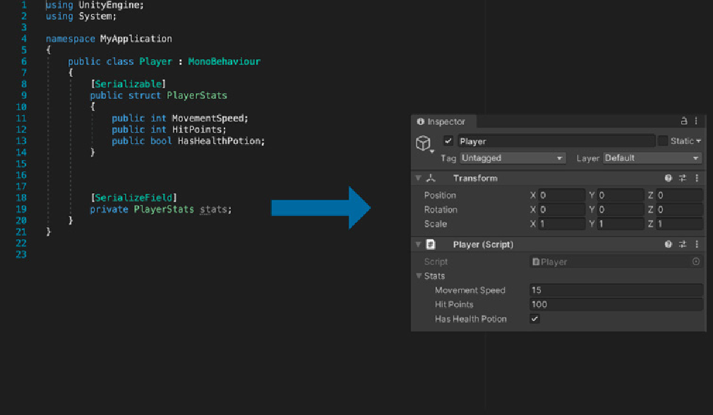
*一个可序列化的类或结构体可以帮助组织Inspector*

## 大括号或缩进样式

C\#中有两种常见的缩进样式：

- [Allman风格](https://en.wikipedia.org/wiki/Indentation_style#Allman_style)将左括号放在新行上，也称为BSD风格(来自BSD Unix)。

- [K&R风格](https://en.wikipedia.org/wiki/Indentation_style#K%26R_style)，或者说“一个真正的大括号样式”，使开始大括号与前一个标题保持在同一行。

```cs
// 示例：Allman 或 BSD 风格将左大括号放在新行上
void DisplayMouseCursor(bool showMouse)
{
    if (!showMouse)
    {
        Cursor.lockState = CursorLockMode.Locked;
        Cursor.visible = false;
    }
    else
    {
        Cursor.lockState = CursorLockMode.None;
        Cursor.visible = true;
    }
}

// 示例：K&R 风格将左大括号放到上一行
void DisplayMouseCursor(bool showMouse){
    if (!showMouse) {
        Cursor.lockState = CursorLockMode.Locked;
        Cursor.visible = false;
    }
    else {
        Cursor.lockState = CursorLockMode.None;
        Cursor.visible = true;
    }
}
```

这些[缩进样式](https://en.wikipedia.org/wiki/Indentation_style)也有不同的变体。本指南中的示例使用了*《[Microsoft 框架设计指南](https://docs.microsoft.com/en-us/dotnet/standard/design-guidelines/)》*中的Allman风格。无论你作为一个团队选择哪一个，请确保每个人都遵循相同的缩进和花括号风格。

试试这些小技巧：

- **确定一个统一的缩进：** 通常是四个或两个空格。让你的团队成员就编辑器首选项中的设置达成一致，避免引发关于[制表符与空格的无休止争论](https://thenewstack.io/spaces-vs-tabs-a-20-year-debate-and-now-this-what-the-hell-is-wrong-with-go/)。请注意，Visual Studio提供了将制表符转换为空格的选项。

在Visual Studio (Windows)中，导航到**工具&gt;选项&gt;文本编辑器&gt;C\#&gt;制表符选项卡**。 


*Visual Studio中的制表符选项卡设置*

在Mac Visual Studio中，导航到**首选项&gt;源代码&gt;C\#源代码**。选择文本样式来调整设置。


*将制表符转换为空格以使缩进一致*

- **在可能的情况下，不要省略大括号，即使是单行语句：** 这增加了一致性，使你的代码更易于阅读和维护。在这个例子中，大括号清晰地将动作 DoSomething 与循环分隔开来。

```cs
// 示例：为了清晰起见，保留大括号……
for (int i = 0; i < 100; i++) { DoSomething(i); }

// ……并且/或者将语句放在单独的一行
for (int i = 0; i < 100; i++)
{
    DoSomething(i);
}

// 避免：省略大括号

for (int i = 0; i < 100; i++) DoSomething(i);
```

如果以后你需要添加调试行或运行 DoSomethingElse，大括号就已经在哪里了。将子句保持在单独的一行中，可以让您轻松添加断点。

- **不要在嵌套的多行语句中删除大括号：** 在这种情况下删除大括号不会抛出错误，但可能会令人困惑。为了清晰起见，即使大括号是可选的，也要加上。

```cs
// 示例：为了清晰起见，保留大括号
for (int i = 0; i < 10; i++)
{
    for (int j = 0; j < 10; j++)
    {
        ExampleAction();
    }
}

// 避免：从嵌套的多行语句中移除大括号
for (int i = 0; i < 10; i++)
    for (int j = 0; j < 10; j++)
        ExampleAction();
```

- **标准化你的switch语句：** 格式可能不同，所以在样式指南中记录你的团队偏好。下面是一个缩进case语句的例子。

// 示例：将 case 语句相对于 switch 语句缩进
```cs
switch (someExpression)
{
    case 0:
        DoSomething();
        break;
    case 1:
        DoSomethingElse();
        break;
    case 2:
        int n = 1;
        DoAnotherThing(n);
        break;
}
```

### 什么是EditorConfig?

你的项目中是否有使用不同编辑器和 IDE 的多个开发者？考虑使用 [EditorConfig](https://docs.microsoft.com/en-us/visualstudio/ide/create-portable-custom-editor-options?view=vs-2019) 文件。

[EditorConfig](https://editorconfig.org/) 文件可以帮助您定义一种适用于整个团队的编码风格。许多ide，如Visual Studio和Rider，都内置了原生支持，不需要单独的插件。

EditorConfig 文件易于阅读，并且可以与版本控制系统配合使用。你可以在[这里](https://editorconfig.org/#example-file)看到一个示例文件。EditorConfig 中的代码样式会跟随你的代码，
即使在 Visual Studio 之外也能强制执行代码样式。

EditorConfig 设置优先于全局 Visual Studio 文本编辑器设置。当你处理没有 .editorconfig 文件的代码库，或者 .editorconfig 文件没有覆盖特定设置时，你个人的编辑器首选项仍然适用。

请参阅 GitHub 仓库中的一些实际[示例](https://github.com/editorconfig/editorconfig/wiki/Projects-Using-EditorConfig)。

## 水平间距

像间距这样简单的东西可以增强代码在屏幕上的外观。你的个人格式偏好可能不同，但请尝试以下建议来提高可读性：

- **增加空格以降低代码密度：** 额外的空格可以在一行中的不同部分之间提供视觉上的分隔。

```cs
// 示例：添加空格使代码行更易于阅读
for (int i = 0; i < 100; i++) { DoSomething(i); }

// 避免：不加空格
for(inti=0;i<100;i++){DoSomething(i);}
```

- 在函数参数之间的逗号后使用一个空格。

```cs
// 示例：参数之间逗号后使用一个空格
CollectItem(myObject, 0, 1);

// 避免
CollectItem(myObject,0,1);
```

- 圆括号和函数参数后面不要加空格。

```cs
// 示例：括号和函数参数之间没有空格
DropPowerUp(myPrefab, 0, 1);
// 避免
DropPowerUp( myPrefab, 0, 1 );
```

- 不要在函数名和圆括号之间使用空格。

```cs
// 示例：函数名和括号之间省略空格
DoSomething()

// 避免
DoSomething ()
```

- 避免在中括号内使用空格。

```cs
// 示例：在中括号内省略空格
x = dataArray[index];

// 避免
x = dataArray[ index ];
```

- 在流程控制条件之前使用一个空格：在流程比较运算符和括号之间添加一个空格。

```cs
// 示例：条件之前有空格；用空格分隔括号。
while (x == y)

// 避免
while(x==y)
```

- 在比较运算符前后使用一个空格。

```
// 示例：条件之前有空格；用空格分隔括号。
if (x == y)

// 避免
if (x==y)
```

- **保持行文简短。考虑水平空白：** 确定一个标准行宽(80-120个字符)。将长行拆分成更小的语句，而不是让它溢出。

- **保持缩进/层次结构：** 缩进代码以增加可读性。

- **除非可读性需要，否则不要使用列对齐：** 这种类型的间距使变量对齐，但可能会使类型与名称难以配对。

然而，列对齐对于位表达式或具有大量数据的结构体。只是要注意，当你添加更多项目时，它可能会为你维护列对齐带来更多的工作。一些自动格式化程序可能还会更改列的哪一部分要对齐。

```cs
// 示例：类型和名称之间有一个空格。
public float Speed = 12f;
public float Gravity = -10f;
public float JumpHeight = 2f;

public Transform GroundCheck;
public float GroundDistance = 0.4f;
public LayerMask GroundMask;

// 避免：列对齐
public float                Speed = 12f;
public float                Gravity = -10f;
public float                JumpHeight = 2f;
public Transform            GroundCheck;
public float                GroundDistance = 0.4f;
public Layer                MaskGroundMask;
```

## 垂直间距

你也可以利用垂直间距。把脚本中相关的部分放在一起，利用空行来发挥你的优势。试试这些建议，让你的代码从上到下组织起来：

- **将依赖的和/或类似的方法组合在一起：** 代码需要具有逻辑性和连贯性。将做相同事情的方法放在一起，这样阅读你的逻辑的人就不必在文件中跳转。

- **根据你的优势使用垂直空格来分隔类的不同部分：** 例如，你可以在之间添加两个空白行：

    - 变量声明和方法

    - 类和接口

    - if-then-else块(如果它有助于可读性)

尽量减少这种情况，并在你的风格指南中注明适用位置。

## Region指令

\#region指令可以让你在C\#文件中折叠和隐藏代码段，使大文件更易于管理和阅读。

但是，如果您遵循本指南中关于类的一般建议，那么您的类大小应该是可管理的，\#region指令应该是多余的。将你的代码拆分成更小的类，而不是将代码块隐藏在region指令后面。如果源文件很短，你将不太倾向于添加region指令。

**注意：** 许多开发人员认为regions是[代码异味或反模式](https://softwareengineering.stackexchange.com/questions/53086/are-regions-an-antipattern-or-code-smell)。作为团队，决定你站在辩论的哪一边。

### Visual Studio 中的代码格式化

如果这些格式规则看起来让人不知所措，不要感到绝望。现代IDE使得设置和执行它们变得高效。你可以创建一个格式规则模板，然后一次性转换你的项目文件。

要为脚本编辑器设置格式规则：

- 在 Visual Studio (Windows) 中，导航到**工具>选项**。找到**文本编辑器>C#>代码样式>常规**。

    使用这些设置来修改“常规”、“缩进”、“换行”、“间距”和“换行”选项。

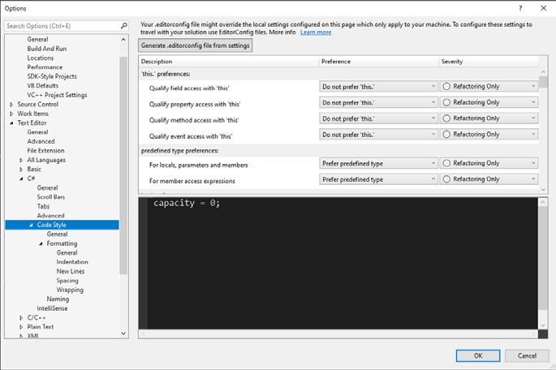
*代码样式格式选项*

- 在 Visual Studio for Mac 中，选择**Visual Studio>首选项**，然后导航到**源代码>代码格式>C# 源代码**。

    选择顶部的“策略”。然后在“文本样式”选项卡中设置间距和缩进。在“C# 格式”选项卡中，调整“缩进”、“换行”、“间距”和“换行”设置。

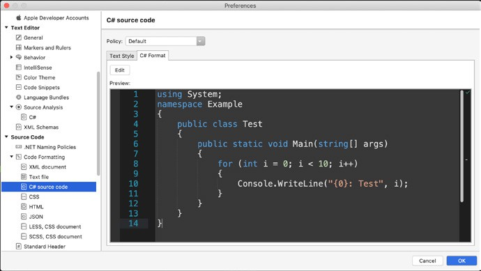
*“预览”窗口会显示你的风格指南选项*

如果你想在任何时候强制你的脚本文件符合风格指南:

- 在 Visual Studio (Windows) 中，转到**编辑>高级>格式化文档（快捷键 Ctrl + K,Ctrl + D）**。如果你只想格式化空格和制表符对齐，
你也可以使用编辑器底部的**运行代码清理（快捷键 Ctrl + K, Ctrl + E）**。

- 在 Visual Studio for Mac 中，转到**编辑>格式化文档（快捷键 Ctrl + I）**。

在 Windows 上，你还可以通过“工具”>“导入和导出设置”共享你的编辑器设置。导出一个包含风格指南的 C# 代码格式的文件，然后让每个团队成员导入该文件。

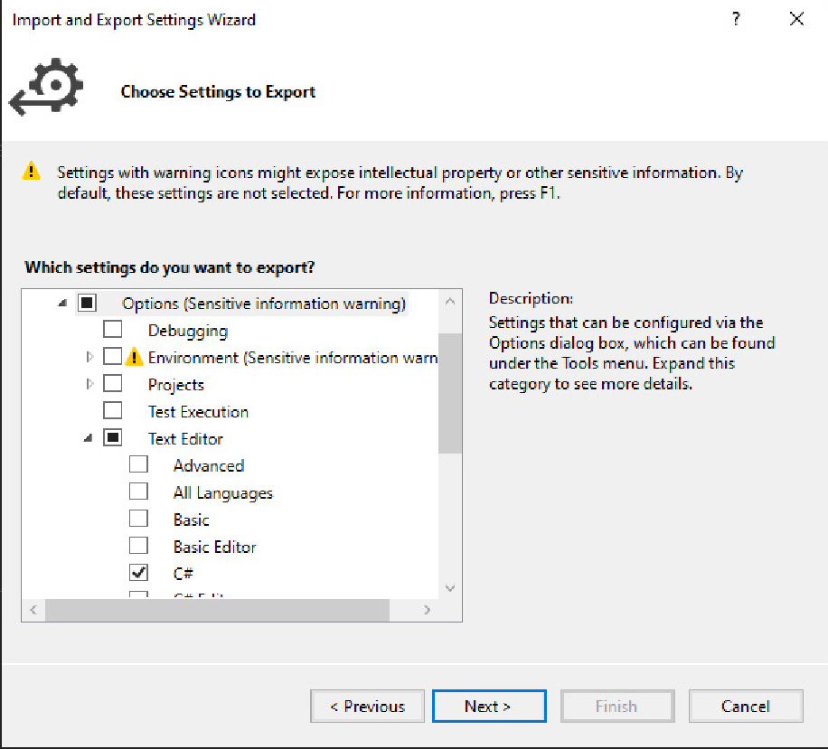
*导出 C# 代码以进行共享*

Visual Studio 使得遵循代码风格指南变得容易。格式化就像使用快捷键一样简单。

**注意：** 你可以配置一个[EditorConfig 文件](https://editorconfig.org/)（见上文）来代替导入和导出Visual Studio 设置。这样做可以让你更轻松地在不同的IDE 之间共享格式，而且它还具有可与版本控制一起使用的额外好处。有关更多信息，请参阅[.NET 代码样式规则选项](https://docs.microsoft.com/en-us/dotnet/fundamentals/code-analysis/code-style-rule-options)。

虽然这并非特定于整洁代码，但请务必查看[使用Visual Studio 加速Unity 编程工作流程的10 种方法](https://blog.unity.com/technology/10-ways-to-speed-up-your-programming-workflows-in-unity-with-visual-studio-2019?utm_source=demand-gen&utm_medium=pdf&utm_campaign=clean-code&utm_content=clean-code-that-scales-ebook) 。如果你应用这些生产力技巧，整洁的代码将更容易格式化和重构。

# 4 类

> “在短暂的计算机发展史中，没有人写出过完美的软件。你不太可能成为第一个。”
> — Andy Hunt，《*程序员修炼之道*》一书的作者

Robert C.Martin的《*整洁代码之道*》中，类的第一条规则是它们应该很小。第二条规则是，它们应该比这个还要小。

限制每个类的大小使其更专注和内聚。人们很容易在一个现有类的基础上不断添加功能，直到它过度扩展。相反，要有意识地努力保持类短小。庞大、臃肿的类会变得难以阅读和排除故障。

## 用报纸来比喻

把一个类的源代码想象成一篇新闻文章。你从顶部开始阅读，标题和署名吸引了你的眼球。开头段落给了你一个大致的总结，然后你继续向下收集更多的细节。

新闻记者们称之为[倒金字塔](https://en.wikipedia.org/wiki/Inverted_pyramid_(journalism))。大多数有新闻价值的项目的概要出现在开头。只有读到最后，你才能了解故事的细微之处。

你的类也应该遵循这个基本模式。自上而下地组织，并将你的函数视为构成一个层次结构。一些方法服务于更高级别，并为全局奠定基础。把这些放在第一位，然后把带有实现细节的低级函数放在后面。

例如，你可能会创建一个名为 ThrowBall 的方法，它引用了其他方法SetInitialVelocity和 CalculateTrajectory。把 ThrowBall
放在首位，因为它描述了主要动作。然后，在它下面添加支持方法。

虽然每一篇新闻文章都很短，但报纸或新闻网站会有很多这样的故事。当这些文章合一起时，就构成了一个统一的、功能齐全的整体。用同样的方式来思考你的Unity项目。它有很多这些类，这些类必须聚集在一起，形成一个更大的、连贯的应用程序。

### 类组织

每个类都需要一些标准化。将类成员分成小组来组织他们：

- 字段
- 属性
- 事件/委托
- Monobehaviour方法(Awake, Start, OnEnable, OnDisable, OnDestroy等)
- 公共方法
- 私有方法

回想一下Unity中推荐的类命名规则：源文件名必须与文件中的Monobehaviour的名称匹配。您可以在文件中有其他内部类， 但每个文件只能存在一个Monobehaviour。

## 单一职责原则

记住，我们的目标是保持个类的简短。在软件设计中，[单一职责原则](https://en.wikipedia.org/wiki/Single-responsibility_principle)引导你走向简洁。

其思想是每个模块、类或函数负责一件事。假设您想要构建一款*乒乓*游戏。你可以从球拍、球和墙的类开始。

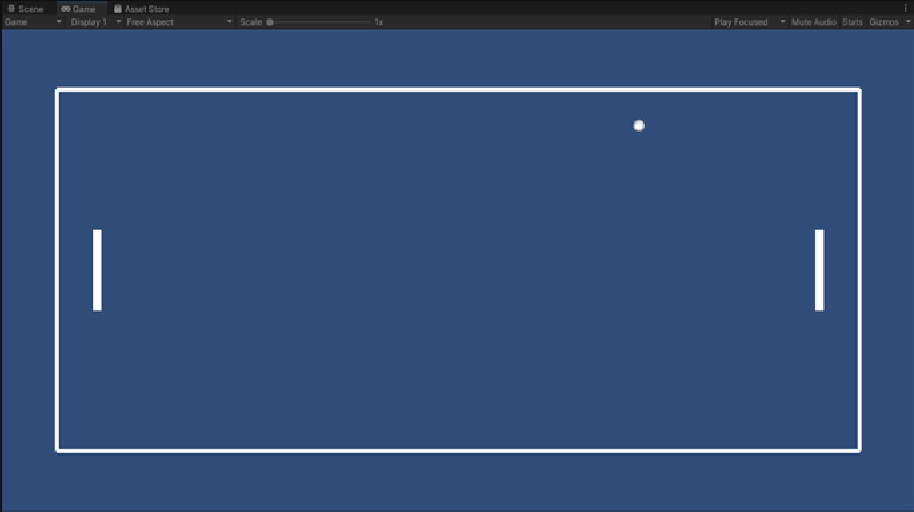

*想玩乒乓游戏吗?*

例如，一个Paddle类可能需要：

- 存储关于它移动速度的基本数据

- 检查键盘输入

- 相应地移动球拍

- 与球碰撞时发出声音

因为游戏设计很简单，你可以把所有这些东西都整合到一个基本的Paddle类中。事实上，完全有可能创建一个Monobehaviour 来完成你需要的一切。

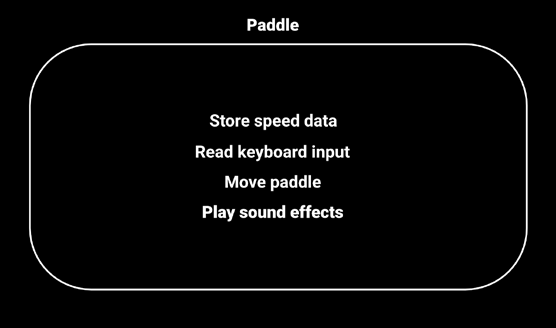

*一个 Monobehaviour 做所有事*

然而，将所有事情都作为一个类的一部分，即使是一个小类，也会因为混合了职责而使设计变得复杂。数据与输入交织在一起，而类需要对两者应用逻辑。与KISS原则相反，你把一些简单的东西纠缠在一起了。

相反，将你的 Paddle类分成更小的类，每个类有一个单一的职责。将数据分离到自己的 PaddleData类中，或者使用[ScriptableObject](https://docs.unity3d.com/Manual/class-ScriptableObject.html?utm_source=demand-gen&utm_medium=pdf&utm_campaign=clean-code&utm_content=clean-code-that-scales-ebook)。然后将其他所有内容重构为PaddleInput 类、PaddleMovement 类和PaddleAudio 类。

PaddleLogic 类可以处理来自 PaddleInput 的输入。应用 PaddleData中的速度信息，它可以使用划桨运动。最后，PaddleLogic 可以通知 PaddleAudio 在球与球拍碰撞时播放声音。

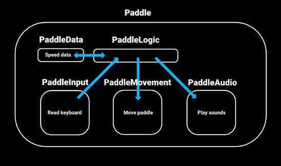

将一个Paddle类重构为单一职责

在这次重新设计中，每个类只做一件事，并适合于小的、易于理解的部分。你不需要滚动浏览几个屏幕来理解代码。

你仍然需要一个球拍脚本，但它的唯一工作是将这些其他类绑在一起。大部分功能被划分到其他类中。

注意，整洁的代码并不总是最紧凑的代码。即使你使用更短的类，重构过程中的总行数也可能增加。然而，每个单独的类变得更容易阅读。当需要调试或添加新功能时，这种简化的结构有助于保持一切井然有序。

### 重构的例子
要更深入地了解重构一个简单的项目，请参阅[如何在项目规模扩大时构建代码](https://unity.com/how-to/how-architect-code-your-project-scales?utm_source=demand-gen&utm_medium=pdf&utm_campaign=clean-code&utm_content=clean-code-that-scales-ebook)。本文演示了如何使用单一责任原则将较大的 Monobehaviours 分解为
较小的部分。你还可以观看 Unite Berlin 的 Mikael Kalms 的原创演讲《[从Pong到15人项目](https://www.youtube.com/watch?v=1le4vScG3gk?utm_source=demand-gen&utm_medium=pdf&utm_campaign=clean-code&utm_content=clean-code-that-scales-ebook)》。

# 5 方法

> “当你读到的每个程序都和你预期的差不多时，你就知道你正在编写整洁的代码。”
> — Ward Cunningham，Wiki的发明者，也是极限编程(eXtreme Programming)的联合创始人

与类一样，方法也应该小而精，并且只有一个职责。每个方法应该描述一个动作或回答一个问题。它不应该两者兼顾。

一个好的方法名字反映了它的作用。例如,GetDistanceToTarget这个名称就阐明了它的预期目的。

当你为自定义类创建方法时，请尝试以下建议：

- **使用更少的参数：** 参数会增加方法的复杂性。减少它们的数量，使你的方法更易于阅读和测试。

- **避免过度的重载：** 你可以生成无穷无尽的方法重载排列。选择几个反映你将如何调用该方法的重载，并实现它们。如果确实要重载方法，请确
保每个方法签名具有不同数量的参数，以防止混淆。

- **避免副作用：** 一个方法只需要做它的名称所宣称的事情。避免修改任何超出其作用域的内容。尽可能按值而不是按引用传递参数。如果通过out
或ref关键字返回结果，请确保这是你希望该方法完成的唯一一件事。

虽然副作用对于某些任务是有用的，但它们可能导致

意想不到的后果。写一个没有副作用的方法来减少意外的行为。

- **与其传入一个标志，不如创建另一个方法：** 不要根据标志设置使你的方法以两种不同的模式工作。创建两个具有不同名称的方法。例如，不要创建一个基于标志设置返回度数或弧度的 GetAngle 方法。而是创建 GetAngleInDegrees 和 GetAngleInRadians 方法。

虽然布尔值标志作为一个参数似乎无害，但它可能导致[实现混乱](https://martinfowler.com/bliki/FlagArgument.html)或破坏单一责任原则。

## 扩展方法

[扩展方法](https://learn.unity.com/tutorial/extension-methods?utm_source=demand-gen&utm_medium=pdf&utm_campaign=clean-code&utm_content=clean-code-that-scales-ebook)提供了一种向可能被密封的类添加额外功能的方法，并且可以作为扩展
UnityEngine API 的一种简洁方法。

要创建扩展方法，请创建一个静态方法，并在第一个参数之前使用this关键字，这将是你想要扩展的类型。

例如，假设你想创建一个名为ResetTransformation的方法来移除GameObject的缩放、旋转或平移。

你可以创建一个静态方法，使用this关键字为第一个参数传递转换：

```cs
// 示例：定义一个扩展方法
public static class TransformExtensions
{
    public static void ResetTransformation(this Transform transform)
    {
        transform.position = Vector3.zero;
        transform.localRotation = Quaternion.identity;
        transform.localScale = Vector3.one;
    }
}
```

然后，当您想要使用它时，调用ResetTransformation方法。

ResetOnStart类在 Start方法中调用当前Transform。

```
// 示例：调用扩展方法
public class ResetOnStart : MonoBehaviour
{
    void Start()
    {
        transform.ResetTransformation();
    }
}
```

为了便于组织，请在静态类中定义扩展方法。例如，你创建一个名为TransformExtensions的类来扩展Transform 的方法，Vector3Extensions用于扩展Vector3，等等。

扩展方法可以构建许多有用的实用程序，而不需要创建更多的monobehaviour。请参阅[Unity学习：扩展方法](https://learn.unity.com/tutorial/extension-methods?utm_source=demand-gen&utm_medium=pdf&utm_campaign=clean-code&utm_content=clean-code-that-scales-ebook)将它们添加到您游戏开发技巧库中。

### DRY原则：不要重复自己

在《*程序员修炼之道*》一书中，Andy Hunt和Dave Thomas提出了 DRY原则，即“不要重复自己”。这个在软件工程中常被提起的箴言建议程序员避免重复或冗余的逻辑。

这样做，你可以减少bug修复和维护成本。如果你遵循单一职责原则，当你修改一个类或方法时，你不应该需要更改一段不相关的代码。在DRY 程序中消除一个逻辑错误就可以在所有地方消除它。

DRY 的反义词是WET（“我们喜欢打字”或“所有东西都写两次”）。当代码中存在不必要的重复时，编程就是WET。

想象有两个粒子系统(exploonA和explosionB)和两个音频片段(soundA和soundB)。每个粒子系统都需要播放各自的声音，你可以通过这样的简单方法来实现。

```cs
//示例：将所有内容写两次
private void playexploona (Vector3 hitPosition)
{
    explosionA.transform.position = hitPosition;explosionA.Stop ();
    explosionA.Play ();
    AudioSource.PlayClipAtPoint(soundda, hitPosition);
}

private void PlayExplosionB(Vector3 hitPosition)
{
    explosionB.transform.position = hitPosition;explosionB.Stop ();
    explosionB.Play ();
    AudioSource.PlayClipAtPoint(sounddb, hitPosition);
}

```
这里每个方法都接受一个 Vector3 位置参数，用于将 ParticleSystem移动到适当的位置进行播放。首先，停止粒子（以防它们已经在播放），然后播放模拟AudioSource的静态 PlayClipAtPoint 方法随后会在同一位置创建一个音效。

一个方法是另一个方法的复制粘贴版本，只进行了一些文本替换。虽然这样可行，但每次你想要创建一个爆炸效果时，都需要创建一个新方法——其中包含重复的逻辑。

相反，可以像这样将其重构为一个 PlayFXWithSound 方法：

```cs
// 示例：重构后的代码
private void PlayFXWithSound(ParticleSystem particle, AudioClip clip, Vector3 hitPosition)
{
    particle.transform.position = hitPosition;
    particle.Stop();
    particle.Play();

    AudioSource.PlayClipAtPoint(clip, hitPosition);
}
```

添加更多的 ParticleSystems 和 AudioClips，你可以继续使用相同的方法来一起播放它们。

请注意，在不违反 DRY 原则的情况下复制代码是可能的。更重要的是不要复制逻辑。

在这里，我们将核心功能提取到了 PlayFXWithSound 方法中。如果需要调整逻辑，你只需要在一个方法中更改它，而不是在 PlayExplosionA 和 PlayExplosionB中都更改。

# 6 注释

> “代码就像幽默。如果你不得不解释它，那它就不好了。”
> — Cory House，软件架构师和作家

恰当的注释可以增强代码的可读性。过多或无关紧要的注释会适得其反。像所有事情一样，在使用注释时要保持平衡。

如果你遵循KISS原则，并将代码分解为易于消化的逻辑部分，那么大多数代码都不需要注释。命名良好的变量和函数会自我解释。

有用的注释不是回答“是什么”，而是填补空白，告诉你“为什么”。你是否做出了某些不那么明显的特定决定？是否存在需要澄清的棘手逻辑？有用的注释揭示了代码本身无法提供的信息。

下面是一些注释的注意事项：

- **不要添加注释来替换糟糕的代码：** 如果你需要添加注释来解释一堆错综复杂的逻辑，请重构你的代码，使其更明显。然后你就不需要注释了。

- **一个正确命名的类、变量或方法可以代替注释：** 代码是否不言自明?然后减少干扰，跳过注释。

- **尽可能将注释放在单独的一行中，而不是在代码行末尾：** 大多数情况下，为了清晰起见，保持每一行单独写一个注释。

- **大多数情况下使用双斜杠(//)注释标签：** 将注释放在它解释的代码附近，而不是在开头使用大型多行注释。保持注释靠近代码有助于读者将解释与逻辑联系起来。

- **对序列化字段使用工具提示代替注释：** 如果你的字段在 Inspector 中需要解释，添加 Tooltip 属性并跳过单独的注释。工具提示将完成双重任务。

```cs
// EXAMPLE: Tooltip replaces comment

[Tooltip(“The amount of side-to-side friction.”)]
public float Grip;
```

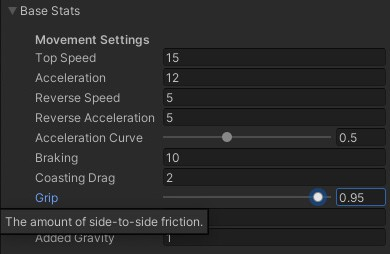

- **你也可以在公共方法或函数前面使用summary [XML标记](https://docs.microsoft.com/en-us/dotnet/csharp/language-reference/xmldoc/recommended-tags#summary)：** VisualStudio 可以为许多常见的 XML 样式注释提供 IntelliSense。

```cs
// EXAMPLES:
// This is a common comment.
// Use them to show intent, logical flow, and approach.

// You can also use a summary XML tag.
//
/// <summary>
/// Fire the weapon
/// </summary>
public void Fire()
{
...
}
```

- **在注释分隔符(//)和注释文本之间应有一个空格。**

- **添加法律免责声明：** 注释适用于许可证或版权信息。但是，避免在代码中插入完整的法律声明。应该链接到包含完整法律信息的外部页面。

- **风格：** 保持注释的统一外观，例如，每个注释以大写字母开头，以句点结尾。无论你的团队决定什么，都要将其纳入风格指南并遵循它。

- **不要在注释周围创建格式化的星号块或特殊字符：** 这降低了可读性，并导致代码混乱。

- **删除注释掉的代码：** 尽管在测试和开发过程中注释掉语句可能是正常的，但不要把注释掉的代码放在任何地方。依赖于你的源代码控制系统。然后鼓起勇气删掉那两行代码。

- **让你的TODO评论保持最新：** 当你完成任务时，确保清除你留下的 TODO注释作为提醒。过时的注释会分散注意力。

你可以在 TODO 中添加名称和日期，以提高可追究性和上下文。

此外，要现实一些。五年前你在代码中留下的 TODO？你永远不会去做的。记住YAGNI（You Ain't Gonna Need It，你不会需要它）。删除 TODO注
释，直到你需要实现它为止。

- **避免写日志：** 注释不是你的开发日记的地方。当你开始一个新类时，不需要在注释中记录你正在做的所有事情。正确使用源代码控制会使这变得多余。

- **避免署名：** 你不需要添加署名，例如 // added by devA 或 devB，尤其是在你使用源代码控制的情况下。

# 7 常见错误

> “如果调试是移除软件错误的过程，那么编程一定是把它们放进去的过程。”
> — Edsger W. Dijkstra，计算机科学先驱

整洁的代码不是偶然的。它是个人试图像团队一样思考和编码的深思熟虑的结果。

当然，并不是每件事都能按计划进行。无论你如何努力尝试，不整洁的代码不可避免地会发生。你需要去寻找它。

[代码异味是一个迹象，表明项目中可能潜伏着麻烦代码。](https://en.wikipedia.org/wiki/Code_smell)虽然以下症状不一定指向潜在的问题，但当它们出现时值得调查：

- **谜一般的命名：** 每个人都喜欢好谜题，但在编码标准中除外。类、方法和变量需要直截了当、没有废话的名称。

- **不必要的复杂性：** 当你试图预测一个类的所有可能需求时，就会发生过度工程化。这可以表现为带有长方法或试图做太多事情的大型的上帝对象。将大型类分解成更小的专用部分，每个部分都有自己的职责。

- **不灵活：** 一个小小的改动不应该要求你在其他地方进行多处改动。如果是这种情况，请仔细检查你是否违反了单一职责原则当你让一件事承担不止一项责任时，它就会承担更多责任。

当你赋予某个事物多个职责时，它更容易出错，因为更难预测所有事情。如果你更新了一个只做一件事的方法，并且更新后的逻辑仍然有效，你期望你的其余代码之后继续有效。

- **脆弱性：** 如果你做了一个微小的更改，所有东西都停止工作，这通常表明有问题。

- **不动性：** 你经常会编写可在不同上下文中重用的代码。如果它需要许多依赖项才能部署到其他地方，那么就解耦逻辑的工作方式。

- **重复代码：** 如果你注意到你已经复制粘贴了代码，那么是时候重构了。将核心逻辑提取到它自己的函数中，并从其他函数中调用它。复制粘贴的代码难以维护，因为每次更改时都需要在多个位置更新逻辑。

- **过多的注释：** 注释可以帮助解释不直观的代码。但是，开发人员可能会过度使用它们。对每个变量或语句都进行注释是不必要的。记住，最好的注释是一个命名良好的方法或类。如果你将逻辑分解成更小的部分，更短的代码片段需要更少的解释。

# 8 结语

> “编程不是零和游戏。把一些东西教给其他程序员并不会让你失去它。”
> — John Carmack，id软件公司的联合创始人

我们希望你喜欢这份关于整洁代码原则的简要介绍。

这里介绍的技巧与其说是一套具体的规则，不如说是一套习惯，就像所有习惯一样，你需要通过日常应用来自己发现它们。

正如指南前面提到的，您可以随意复制这份[面向 Unity 开发者的 C\# 样式表](https://github.com/thomasjacobsen-unity/Unity-Code-Style-Guide)，将其用作您自己指南的起点。

通过将代码分解成小的模块化片段来使其具有可扩展性。随着开发马拉松的展开，要做好一遍又一遍地重写代码的准备。由于需求的变化，生产可能是一个艰难的过程。幸运的是，你不需要独自去做。

当你作为一个团队进行编码时，游戏开发不再是一场漫长的单人赛跑，而更像是一场接力赛。你有队友可以分担工作量，并分担整个赛程。

记住要留在自己的赛道上，传递接力棒，你们将一起冲过终点线。

如果你正在寻找关于如何清理代码的帮助，请联系 Unity
的专业服务团队——[加速解决方案团队](https://unity.com/solutions/accelerate-solutions-games?utm_source=demand-gen&utm_medium=pdf&utm_campaign=clean-code&utm_content=clean-code-that-scales-ebook)。该团队由
Unity 最资深的软件开发人员组成。加速解决方案团队专注于性能优化、开发加速、游戏规划、创新等等，为各种规模的游戏工作室提供定制的咨询和开发解决方案。

加速解决方案团队提供的服务之一是CAP（代码、资源和性能）。这项为期两周的咨询服务首先会对你的代码和资源进行为期三天的深入研究，以找出
性能问题的根本原因。这将附带一份可操作的详细报告，其中包含最佳实践建议。要了解更多关于这项服务或Unity 加速解决方案团队提供的其他服务的信息，请立即[与 Unity代表联系](https://create.unity3d.com/web-accelerate-solutions-games?utm_source=demand-gen&utm_medium=pdf&utm_campaign=clean-code&utm_content=clean-code-that-scales-ebook)。

## 参考文献

本指南是计算机领域使用的最佳实践的简短列表。有关更多信息，请参阅

[Microsoft 框架设计指南(Microsoft Framework Design Guidelines](https://docs.microsoft.com/en-us/dotnet/standard/design-guidelines/))，作为本文档的总体样式指南。

你还可以从已经写好的关于整洁代码的综合卷中了解更多信息。以下是我们最喜欢的几本书，你可以考虑进一步学习：

《*代码整洁之道*》. Robert C. Martin, 2008. Prentice Hall. ISBN 978-0132350884.

《*程序员修炼之道：20周年纪念版*》. David Thomas and Andrew Hunt, 2019, Addison Wesley, ISBN 978-0135957059.

# 9 附录：脚本模版

> “少说多做，用代码说话”
> — Linus Torvalds, Linux和Git的创造者

一旦你为你的样式指南建立了格式规则，就可以配置你的脚本模板。这些模板会用于生成脚本资产(如c\#脚本、着色器或素材)的空白起始文件。

在这里找到Unity的预配置脚本模板：

**Windows: C:\\Program Files\\Unity\\Editor\\Data\\Resources\\ScriptTemplates**

**Mac: /Applications/Unity/Unity.app/Contents/Resources/ScriptTemplates**

在macOS上，显示Unity .app包内容以显示 Resources 子目录。

在这个路径中，你会看到默认的模板：

81-C\# Script-NewBehaviourScript.cs.txt

82-Javascript-NewBehaviourScript.js.txt

83-Shader Standard Surface Shader-NewSurfaceShader.shader.txt

84-Shader Unlit Shader-NewUnlitShader.shader.txt

每当你在 Project 窗口通过 Create 创建一个新的脚本资源时，Unity使用其中一个模板。

如果你用文本编辑器打开名为81-C\#Script-NewBehaviourScript.cs.txt的文件，你会看到以下内容：

```cs
using System.Collections;
using System.Collections.Generic;
using UnityEngine;

public class #SCRIPTNAME# : MonoBehaviour
{
    // Start is called before the first frame update
    void Start()
    {
    #NOTRIM#
    }

    // Update is called once per frame
    void Update()
    {
    #NOTRIM#
    }
}

```
注意关键词：

- **\#SCRIPTNAME\#：** 这是您为脚本指定的名称。如果你没有自定义名称，它会使用默认名称，例如NewBehaviourScript。

- **\#NOTRIM\#：** 这保证了空格的存在，确保在大括号之间空出一行。

脚本模板是可自定义的。例如，可以添加命名空间或删除默认的 Update
方法。修改模板可以在每次创建这些脚本资产之一时节省一些键盘输入。

脚本模板文件名遵循以下模式：

PriorityNumber–MenuPath–DefaultName.FileExtension.txt

一个破折号(-)字符将名称的不同部分分开：

- PriorityNumber 是脚本在创建菜单中出现的顺序。数字越小，优先级越高。

- MenuPath
允许你自定义文件在创建菜单中的显示方式。你可以用双下划线(\_\_)创建类别。

- 例如，“CustomScript Misc ScriptableObject”在Create &gt;
CustomScript &gt; Misc 菜单下创建菜单项 ScriptableObject。

- DefaultName 如果你不指定，则指定资源的默认名称。

- FileExtension 是附加到资源名称的文件扩展名。

另外，请注意，每个脚本模板的文件扩展名后还会附加 .txt。

如果你想将脚本模板应用于特定的 Unity 项目，请将整个 ScriptTemplates文件夹复制并粘贴到项目的 Assets文件夹下。

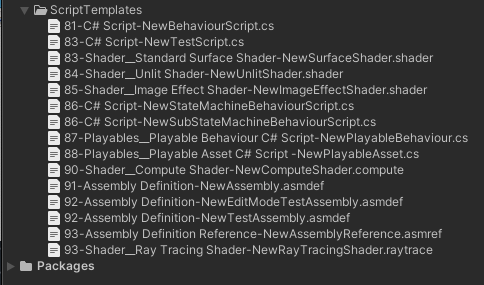

*复制到Unity项目的ScriptTemplates*

接下来，创建新的脚本模板或修改原始文件以符合您的偏好。如果你不打算更改任何脚本模板，请从项目中删除它们。

例如，你可以为 ScriptableObjects
创建一个空白的脚本模板。在ScriptTemplates
文件夹下创建一个新的文本文件，名为：

80-ScriptableObject-NewScriptableObject.cs.txt

编辑文本为：

```cs
using System.Collections;
using System.Collections.Generic;
using UnityEngine;

[CreateAssetMenu(fileName = “#SCRIPTNAME#”, menuName = “#SCRIPTNAME#”)]
public class #SCRIPTNAME# : ScriptableObject
{
#NOTRIM#
}
```

这将创建一个空白的 ScriptableObject 脚本，并带有CreateAssetMenu属性。

保存脚本模板后重新启动编辑器。下次你应该会在 Create 菜单中看到一个额外的选项。

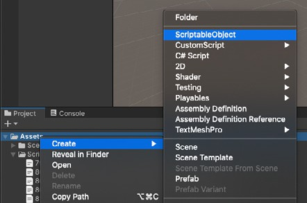

*自定义脚本模板在 Create 菜单中添加一个新菜单项*

从 Create 菜单中创建一个新的ScriptableObject脚本(以及相应的ScriptableObject资产)。

确保备份自定义的脚本模板和原始模板。如果 Unity 无法识别修改后的模板，你将需要恢复所有文件。

一旦你有一套喜欢的脚本模板，将你的 ScriptTemplates 文件夹复制到一个新项目中，并根据你的特定需求进行自定义。你也可以更改应用程序资源
中的原始脚本模板，但要小心谨慎。这会影响使用该版本Unity 的所有项目。

有关自定义脚本模板的更多信息，请参阅此[支持文章](https://support.unity3d.com/hc/en-us/articles/210223733-How-to-customize-Unity-script-templates?utm_source=demand-gen&utm_medium=pdf&utm_campaign=clean-code&utm_content=clean-code-that-scales-ebook)。

另外，请查看附件中的项目，以获得一些额外的脚本模板示例。

# 10 附录：调试和测试

> “调试就像一部犯罪电影里的侦探，而你同时也是凶手。”
> — Filipe Fortes

自动化测试是提高代码质量和减少错误修复时间的一种有效工具。[测试驱动开发(TDD)](https://en.wikipedia.org/wiki/Test-driven_development)是一种开发方法，在开发软件的同时创建[单元测试](https://en.wikipedia.org/wiki/Unit_testing)。实际上，在使特定功能正常工作之前，你将定期编写每个测试用例。

在开发软件时，你需要针对这整个自动化流程测试套件重复运行它。这与先编写软件，然后再构建测试用例形成鲜明对比。在TDD 中，编码、测试和重构是交织在一起的。

以下是 Kent Beck 在 《*测试驱动开发：实用指南*》中提出的基本思想：

1. **添加单个单元测试：** 这描述了你想要添加到应用程序中的一个新功能；从你的团队或用户群中，详细说明需要做什么。

2. **运行测试：** 这描述了你想要添加到应用程序中的一个新功能；从你的团队或用户群中，详细说明需要做什么。

3. **编写通过新测试的最简单代码：** 只编写足够的逻辑来使其通过新的单元测试。此时不必是干净的代码。它可以使用不优雅的结构、硬编码的
魔法数字等等，只要它通过单元测试即可。

4. **确认所有测试都通过：** 运行完整的自动化测试套件。你之前的单元测试应该都通过。新代码满足新的测试要求，同时也满足旧的要求。

    如果不符合，就修改你的新代码——并且只修改你的新代码——直到所有测试都通过。

5. **重构：** 返回并清理你的新代码。使用你的风格指南，并确保一切都符合标准。

    移动代码，使其在逻辑上组织起来。将相似的类和方法放在一起，等等。删除重复的代码，并重命名任何标识符，以最大限度地减少对注释的需求。拆分过长的方法或类。

    每次重构后都要运行自动化测试套件。

6. **重复：** 每次添加新功能时都要经历这个过程。每一步都是一个小的增量变化。在源代码控制下进行频繁的提交。调试时，你只需要为每个单元测试检查少量的新代码。这简化了你的工作范围。如果所有其他方法都失败了，回滚到之前的提交并重新开始。

这就是要点。如果你用这种方法开发软件，你必然会倾向于遵循KISS原则。一次添加一个功能，边做边测试。每次测试都要不断重构，这样清理代码就成为一种持续的仪式。

像大多数整洁代码的原则一样，TDD 在短期内需要额外的工作，但通常可以改善长期的可维护性和可读性。

## Unity 测试框架

[Unity 测试框架(UTF)](https://docs.unity3d.com/Packages/com.unity.test-framework%401.1/manual/index.html?utm_source=demand-gen&utm_medium=pdf&utm_campaign=clean-code&utm_content=clean-code-that-scales-ebook)UTF使用 [NUnit](https://nunit.org/)，以前称为 Unity 测试运行器，为 Unity开发人员提供了一个标准的测试框架。，一个 .net 语言的开源测试库。

Unity 测试框架可以在编辑器(使用 Edit 模式或 Play 模式)和目标平台(如单机、Android、iOS)上执行单元测试。通过包管理器安装UTF。[在线文档](https://docs.unity3d.com/Packages/com.unity.test-framework%401.1/manual/manual.html?utm_source=demand-gen&utm_medium=pdf&utm_campaign=clean-code&utm_content=clean-code-that-scales-ebook)将帮助你入门。

Unity 测试框架的一般工作流程是：

- **创建一个新的测试套件，称为 [Test Assembly](https://docs.unity3d.com/Packages/com.unity.test-framework@1.1/manual/workflow-create-test-assembly.html?utm_source=demand-gen&utm_medium=pdf&utm_campaign=clean-code&utm_content=clean-code-that-scales-ebook)：**测试运行器UI简化了这个过程，并在项目中创建了一个文件夹。

- **创建测试：** 测试运行器UI帮助您管理将创建为单元测试的c\#脚本。选择Test Assembly 文件夹并导航到 Asset &gt; Creat &gt; Testing &gt; C\# Test Script。编辑此脚本并为您的测试添加逻辑。

- **运行测试：** 使用Test Runner UI运行所有单元测试或运行选定的单元测试。

使用[JetBrains Rider](https://www.jetbrains.com/help/rider/Unity.html)，您还可以[直接从脚本编辑器运行 UTF](https://www.jetbrains.com/help/rider/Running_and_Debugging_Unity_Tests.html)。

- **在编辑器或为独立程序添加 Play 模式测试：** 默认测试程序集工作在 Edit 模式下工作。如果你希望单元测试在运行时工作，请在运行模式下创建一个单独的程序集。也为你的独立版本配置它(测试结果显示在编辑器)。

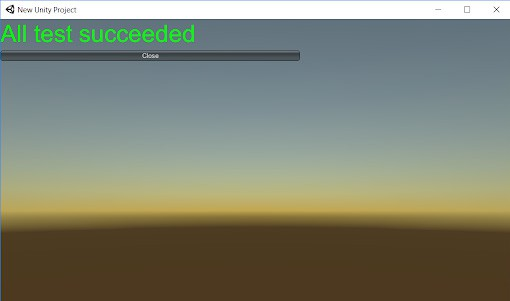

测试框架在编辑器中显示独立构建的结果。

请参阅[测试框架](https://docs.unity3d.com/Packages/com.unity.test-framework%401.1/manual/workflow-run-playmode-test-standalone.html?utm_source=demand-gen&utm_medium=pdf&utm_campaign=clean-code&utm_content=clean-code-that-scales-ebook)微站点，了解更多关于启动和运行UTF的信息。
