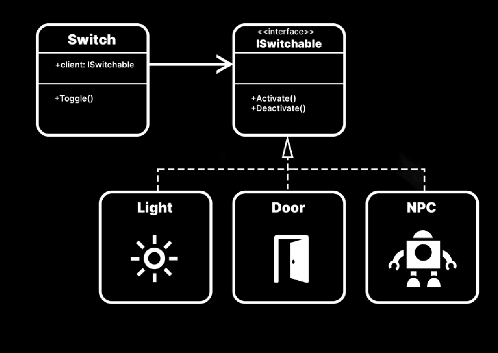
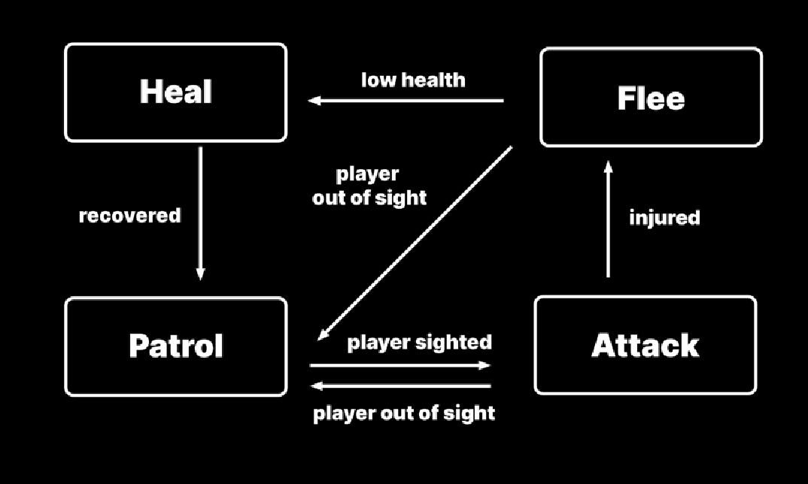

**使用设计模式和 SOLID 原则提升您的编码水平**

# 介绍设计模式

在 Unity 中工作时，您不需要重新发明轮子。很可能已经有人为您发明了一个。

您遇到的每一个软件设计问题，都有上千个开发人员曾经遇到过。虽然您不能总是直接向他们寻求建议，但您可以通过设计模式从他们的决策中学习。

设计模式是软件工程中常见问题的通用解决方案。它们并非可以直接复制粘贴到代码中的完整解决方案，但您可以将设计模式视为工具箱中的额外工具。有些模式比其他模式更显而易见。

本指南汇集了 Unity 开发中众所周知的设计模式。为了更易于理解，本指南中的示例已简化，并减少了技术术语，但在开始学习之前，您应该具备 C# 基础知识的实际应用经验。

**重要提示**：第二版包含了 Unity 社区成员提出的一些新模式。此外，本指南附带的代码示例和项目已升级，可与 Unity 6 配合使用。Unity 6 将于今年晚些时候推出。如果您想跟随本指南中的示例以及随附的演示项目进行学习，请确保下载 [Unity 6 Preview](https://unity.com/releases/unity-6) 。

如果您仍然是设计模式的新手，或者需要快速复习，本指南还提供了一些可以在游戏开发中应用它们的常见场景。对于那些从其他面向对象语言（Java、C++ 等）转向 C# 的人来说，这些示例将向您展示如何专门针对 Unity 调整模式。

设计模式的核心就是思想。它们并非适用于所有情况。但是，如果使用得当，它们可以帮助您构建更大规模的可扩展应用程序。将它们集成到您的项目中可以提高代码可读性，并使您的代码库更简洁。随着您对模式的经验积累，您将能够认识到何时使用它们以加快您的开发流程。

然后您就可以停止重新发明轮子，开始做一些新的事情。

**贡献者**

本指南由 Wilmer Lin 撰写，他是一名拥有超过15年影视行业经验的3D和视觉效果艺术家，现在是一名独立游戏开发者和教育家。高级技术内容营销经理 Thomas Krogh-Jacobsen 和高级 Unity 工程师 Peter Andreasen 和 Scott Bilas 也做出了重大贡献。

# 如何使用本指南

本指南旨在向您展示思考和组织代码的新方法。它适用于Unity开发的各种软件设计模式。

## 示例项目

本电子书附有一个[示例项目](https://assetstore.unity.com/packages/slug/289616) ，展示了本书中的一些代码。请从 Asset Store 下载该项目，并跟随使用相应的场景来探索这些设计模式及其基本原则。


_将菜单导航到SOLID和设计模式示例_

用 **Boot** 场景启动项目。 这是一个 bootstrap 场景，用于配置演示并提供对主菜单的访问（请参见下面的 factbox）。然后，您可以通过菜单导航到相应的示例。每个场景都演示了不同的 SOLID 概念或设计模式。


_探索示例项目_

请注意，示例项目和本指南中的代码示例之间可能存在细微差异。为了提高清晰度和可读性，一些示例使用了简化的代码（例如，公共字段）。

您的团队可能更喜欢与本指南或示例项目中使用的约定不同的编码风格。我们建议创建一个符合您特定需求的 C# 样式指南，然后整个团队始终如一地遵循它。

进一步的指导，可以参考我们的电子书，[*《创建 C# 代码样式指南——编写更简洁的可扩展代码》*](Create-a-C%23-style-guide-Write-cleaner-code-that-scales/Translated/Create-a-C%23-style-guide-Write-cleaner-code-that-scales.md)[(*Create a C\# style guide: Write cleaner code that scales*)](https://unity.com/resources/create-code-c-sharp-style-guide-e-book?ungated=true) （注：本书已经翻译完成，[点击](Create-a-C%23-style-guide-Write-cleaner-code-that-scales/Translated/Create-a-C%23-style-guide-Write-cleaner-code-that-scales.md)跳转）, 提供了一些关于如何调整、创建和实施代码样式指南的技巧。

## 场景启动加载器

该项目具有一个 `SceneBootstrapper`(场景启动加载器) 类，用于在将项目划分为多个 Unity 场景时简化开发流程。

每当您进入运行模式时，bootstrap 逻辑会自动将加载一个指定的 **Boot** 场景作为第一件事。出于这个原因，Boot 场景应该在 **File\> Build Settings** 中排第一位。

这种方法确保了游戏的起点一致。即使您目前没有打开 Boot 场景，进入运行模式也会强制项目从那里加载。

`SceneBootstrapper` 还会在运行模式启动之前跟踪编辑器中最后一个活动的场景，并将此信息存储在 `EditorPrefs` 中。退出运行模式后，它会恢复到最后一个活动场景，让您更容易从离开的地方继续。


_使用菜单切换 SceneBootstrapper_


如果您想单独探索场景，而不需要每次都通过 Boot 场景，只需在 Design Patterns 菜单中禁用引导程序 (**Design Patterns \> Don’t Load Bootstrap on Play**)。通过相同的菜单重新启用 Bootstrapper。

为了使应用程序正常运行，所有场景都必须列在构建设置中，Bootstrapper 场景位于索引 0 处。否则，示例实现中的 `IsSceneInBuildSettings` 方法将记录一个错误。

要更深入地了解引导程序是如何工作的，您可以参考附录部分。您也可以在[这篇相关文章](https://discussions.unity.com/t/welcome-to-the-new-ui-toolkit-sample-project-quizu/308607#bootloadscreen-20) 中探索[QuizU](https://discussions.unity.com/t/welcome-to-the-new-ui-toolkit-sample-project-quizu/308607)中类似 `Bootstrapper`。


_`Bootstrapper` 加载 Boot 场景_

### KISS 原则

回顾这些例子时，请记住，解决问题并没有一刀切的“正确方法”。示例代码是众多解决方案中的一个。

当有疑问时，通过[KISS 原则](https://en.wikipedia.org/wiki/KISS_principle)：KISS原则过滤本指南中的所有内容:“保持简单，愚蠢”，只在必要时增加复杂性。

每一种设计模式都伴随着权衡，无论这意味着需要维护额外的结构，还是一开始就需要更多的设置。在实现它之前，决定好处是否值得额外的工作。

如果您不确定一种模式是否适用于您的具体问题，您可能最好等一种感觉更自然的情况。不要因为一个模式对您来说是新的或新奇的就使用它；在需要的时候再用。

然后，设计模式将服务于它预期的目的:帮助您开发更好的软件。

让我们开始吧。

# SOLID 原则

SOLID 是一个[助忆](https://en.wikipedia.org/wiki/Mnemonic)缩写，代表软件设计的五个核心基本原则。您可以把它们当作在编码时需要牢记的五条基本规则，目的是使[面相对象](https://en.wikipedia.org/wiki/Object-oriented)设计更易于理解、灵活和[可维护](https://en.wikipedia.org/wiki/Software_maintenance) 。

在深入学习设计模式之前，让我们先看看一些影响设计模式运作的设计原则。

这五个核心原则是：

-   [单一功能原则](https://en.wikipedia.org/wiki/Single-responsibility_principle)
-   [开闭原则](https://en.wikipedia.org/wiki/Open%E2%80%93closed_principle)
-   [里氏替换原则](https://en.wikipedia.org/wiki/Liskov_substitution_principle)
-   [接口隔离原则](https://en.wikipedia.org/wiki/Interface_segregation_principle)
-   [依赖反转原则](https://en.wikipedia.org/wiki/Dependency_inversion_principle)

让我们逐一查看每个概念，看看它们如何帮助您使代码更加易于理解、灵活和可维护。

## 单一功能原则

一个类应该只有一个改变的理由，那就是它的单一功能。

第一个也是最重要的SOLID原则是 [单一功能原则](https://en.wikipedia.org/wiki/Single-responsibility_principle) (single responsibility principle, SRP), 它规定每个模块、类或函数负责一件事，并且只封装那部分逻辑。

换句话说，它指出您应该创建许多较小的类，而不是一个单体类。较短的类和方法更容易解释、理解和实现。

如果您使用 Unity 工作了一段时间，可能已经熟悉这个概念。当您创建一个游戏对象时，它会包含多个较小的组件。例如，它可能包含：

- 一个 `MeshFilter` 组件，用于存储对 3D 模型的引用
- 一个 `Renderer` 组件，用于控制模型表面在屏幕上的显示方式
- 一个 `Transform` 组件，用于存储缩放、旋转和位置
- 一个 `Rigidbody` 组件，如果它需要与物理模拟互动

每个组件都有其明确的功能，并且能高效地完成这项任务。您通过游戏对象构建整个场景。它们各自组件之间的相互作用，才使得游戏成为可能。

您也可以以相同的方式构建您的脚本组件。设计时确保每个组件的功能清晰明确，然后让它们协同工作，形成复杂的行为。

如果您忽视单一功能原则，您可能会创建一个具有多个功能的自定义组件，如下所示：


_一个具有多个功能的 `Player` 脚本_

```cs
public class UnrefactoredPlayer : MonoBehaviour
{
    [SerializeField] private string inputAxisName;
    [SerializeField] private float positionMultiplier;
    private float yPosition;
    private AudioSource bounceSfx;

    private void Start()
    {
        bounceSfx = GetComponent<AudioSource>();
    }

    private void Update()
    {
        float delta = Input.GetAxis(inputAxisName) * Time.deltaTime;

        yPosition = Mathf.Clamp(yPosition + delta, -1, 1);
        transform.position = new Vector3(transform.position.x, yPosition *
        positionMultiplier, transform.position.z);
    }

    private void OnTriggerEnter(Collider other)
    {
        bounceSfx.Play();
    }
}
```
这个未重构的 `UnrefactoredPlayer` 类混合了多种功能。它会在玩家与某个物体碰撞时播放声音，管理输入，并处理移动。即使这个类目前相对较短，但随着项目的演变，维护它将会变得复杂。考虑将 `Player` 类拆分成更小的类。


_将 Player 重构为具有单一功能的类_

```cs
[RequireComponent(typeof(PlayerAudio), typeof(PlayerInput), typeof(PlayerMovement))]
public class Player : MonoBehaviour
{
    [SerializeField] private PlayerAudio playerAudio;
    [SerializeField] private PlayerInput playerInput; 
    [SerializeField] private PlayerMovement playerMovement;

    private void Start()
    {
        playerAudio = GetComponent<PlayerAudio>();
        playerInput = GetComponent<PlayerInput>(); 
        playerMovement = GetComponent<PlayerMovement>();
    }
}

public class PlayerAudio : MonoBehaviour
{
    …
}
public class PlayerInput : MonoBehaviour
{
    …
}

public class PlayerMovement : MonoBehaviour
{
    …
}
```
`Player` 脚本仍然可以管理其他脚本组件，但每个类只做一件事。这种设计使得代码更容易修改，尤其是在项目需求随时间变化时。

然而，另一方面，您需要平衡单一功能原则与常识。不要过度简化，以至于创建出只有一个方法的类。

在应用单一功能原则时，请记住以下目标：

- **可读性：** 短小的类更容易阅读。没有固定的规则，但许多开发者将200-300行代码作为上限。您自己或团队决定什么算是“短”。当您超过这个阈值时，考虑是否可以将其重构为更小的部分。
- **可扩展性：** 您可以更轻松地从小的类中继承。修改或替换它们而不用担心破坏未预料到的功能。
- **可重用性：** 设计您的类要小而模块化，这样您就可以在其他游戏部分重用它们。

重构时，考虑如何将代码重组以提高团队的工作效率。虽然一开始可能需要额外的努力，但这将为您节省大量的后续维护时间和麻烦。

#### 简单并不容易

在软件设计中，“简单”常被提及，它是可靠性的前提条件。您的软件设计能应对生产环境中的变化吗？您能在长时间内扩展和维护您的应用程序吗？

本指南中介绍的许多设计模式和原则帮助您实现简单性。通过这样做，它们使您的代码更加可扩展、灵活和可读。然而，这需要额外的工作和规划。“简单”并不等同于“容易”。

尽管您可以不使用这些模式（并且往往更快地）实现相同的功能，但快速和容易并不一定意味着简单。让某事变得简单意味着让它专注。设计时只做一件事，不要用其他任务使其变得复杂。

请观看 Rich Hickey 的讲座，[Simple Made Easy](https://www.infoq.com/presentations/Simple-Made-Easy/)，以了解简单性如何帮助您构建更好的软件。

### 示例项目

示例项目包括一个简单的演示，展示了如何将单一功能原则应用于玩家角色。`Player` 类引用了其他脚本，每个脚本处理玩家行为的特定方面：

- `PlayerInput` 捕获并处理来自键盘的玩家输入，将其转换为一个方向向量。
- `PlayerMovement` 根据来自 `PlayerInput` 类的输入向量控制玩家的移动。
- `PlayerAudio` 在玩家与障碍物碰撞时播放音效。
- `PlayerFX` 处理玩家的粒子系统。

单一功能原则使代码库更加模块化，易于阅读。它还简化了更新或扩展每个组件的过程，而不会影响其他组件。


_单一功能演示将 Player 分解为更小的组件_

## 开闭原则

[开闭原则](https://en.wikipedia.org/wiki/Open%E2%80%93closed_principle) (open-closed principle, OCP) 在 SOLID 设计中表示：类应该对扩展开放，对修改关闭。一个经典的例子是计算形状的面积。您应该设计类，使得可以在不修改原始代码的情况下，创建新的行为。

在这个例子中，`AreaCalculator` 类有方法返回矩形和圆形的面积。为了计算面积，`Rectangle` 类有 `Width` 和 `Height` 属性，而 `Circle` 只需要一个 `Radius` 和圆周率值。

```cs
public class AreaCalculator
{
    public float GetRectangleArea(Rectangle rectangle)
    {
        return rectangle.width * rectangle.height;
    }
    public float GetCircleArea(Circle circle)
    {
        return circle.radius * circle.radius * Mathf.PI;
    }
}

public class Rectangle
{
    public float width;
    public float height;
}

public class Circle
{
    public float radius;
}
```

这虽然可以正常工作，但如果您想在 `AreaCalculator` 中添加更多的形状，您将需要为每个新形状创建一个新的方法。如果以后要加入一个五边形或八边形怎么办？如果需要 20 个新的形状，`AreaCalculator` 类将很快变得复杂且难以维护。

您可以创建一个名为 `Shape` 的基类，并为每种形状创建一个方法。然而，这将导致代码中充满多个 if 语句来处理每种类型的形状，这样的设计不容易扩展。

您希望程序对扩展开放（能够使用新的形状），而对修改关闭（不修改 `AreaCalculator` 的内部实现）。虽然当前的 `AreaCalculator` 是功能性的，但它违反了开闭原则。


_如何设计 `AreaCalculator` 来支持新的形状呢？_

您可以考虑定义一个抽象的 `Shape` 类：

```cs
public abstract class Shape
{
    public abstract float CalculateArea();
}
```
其中包含一个名为 `CalculateArea` 的抽象方法。然后，您可以让 `Rectangle` 和 `Circle` 继承自 `Shape`，每个形状都可以计算自己的面积并返回相应的结果：

```cs
public class Rectangle : Shape
{
    public float width;
    public float height;
    public override float CalculateArea()
    {
    return width * height;
    }
}

public class Circle : Shape
{
    public float radius;
    public override float CalculateArea()
    {
        return radius * radius * Mathf.PI;
    }
}
```

`AreaCalculator` 类可以简化为：

```cs
public class AreaCalculator
{
    public float GetArea(Shape shape)
    {
        return shape.CalculateArea();
    }
}

public class AreaCalculator : MonoBehaviour
{
    private void Start()
    {
        Debug.Log(GetArea(new RectAngle { width = 2, height = 3 }));
        Debug.Log(GetArea(new Circle { radius = 3 }));
    }
    public float GetArea(Shape shape)
    {
        return shape.CalculateArea();
    }
}
```

经过修订的 `AreaCalculator` 类现在可以获取任何正确实现了抽象 `Shape` 类的形状的面积。这样，您就可以在不改变原始代码的情况下扩展 `AreaCalculator` 的功能。


_根据开闭原则修改后的类_

每当您需要一个新的多边形时，只需定义一个继承自 `Shape` 的新类。每个子类形状都会重写 `CalculateArea` 方法，返回正确的面积。

这种新设计使调试变得更加容易。如果一个新形状引入了错误，您不需要重新审视 `AreaCalculator`。旧的代码保持不变，因此只需检查新代码中的逻辑错误。

在 Unity 中创建新类时，利用接口和抽象类的设计可以避免在逻辑中使用笨重的 `switch` 或 `if` 语句，这些语句会导致后续扩展变得困难。一旦您习惯于按照 OCP 来设置类，长期来看，添加新代码会变得更加简单。

### 示例项目

示例项目展示了在一个简单的演示中应用开闭原则的类似例子。在这里，抽象基类 `AreaOfEffect` 引入了一个名为 `CalculateArea` 的抽象方法。

派生类（`CircleEffect`、`HexagonalEffect`、`RectangleEffect` 和 `TriangularEffect`）可以实现它们独特的计算影响区域或播放视觉效果的公式。每个类只需在 `CalculateArea` 方法中定义自己的逻辑。添加新的区域效果类型不会改变现有代码。

当玩家与 `EffectTrigger` 组件发生碰撞时，它与 `AreaOfEffect` 进行交互，而无需了解每个效果的具体细节。这样，添加新的效果变得更加灵活和可扩展。


开闭原则提高您的代码的可扩展性。

## 里氏替换原则

[里氏替换原则](https://en.wikipedia.org/wiki/Liskov_substitution_principle)(Liskov substitution principle, LSP) 派生类必须能够替代其基类使用。在面向对象编程中，继承允许您通过子类来增加功能。然而，如果不小心，这可能会导致不必要的复杂性。

作为 SOLID 的第三条原则，里氏替换原则告诉您如何应用继承，使得子类更加健壮和灵活。

假设您的游戏需要一个名为 `Vehicle` 的类，这将作为您为应用程序创建的车辆子类的基类。例如，您可能需要一个 `Car` 或 `Truck` 类。


_所有内容都继承自 Vehicle_

在任何可以使用基类（`Vehicle`）的地方，您应该能够使用像 `Car` 或 `Truck` 这样的子类，而不会破坏应用程序。

您的 `Vehicle` 类可能看起来像这样：

```cs
public class Vehicle
{
    public float speed = 100;
    public Vector3 direction;

    public void GoForward()
    {
        ...
    }

    public void Reverse()
    {
        ...
    }

    public void TurnRight()
    {
        ...
    }

    public void TurnLeft()
    {
        ...
    }
}
```

假设您正在构建一个回合制游戏，在这个游戏中您需要将车辆移到棋盘上。


_一个示例游戏：汽车与火车的对抗_

您可以有另一个类，叫做 `Navigator`，用于引导车辆沿着预定路径行驶：

```cs
public class Navigator
{
    public void Move(Vehicle vehicle)
    {
        vehicle.GoForward();
        vehicle.TurnLeft();
        vehicle.GoForward();
        vehicle.TurnRight();
        vehicle.GoForward();
    }
}
```

通过这个类，您期望能够将任何车辆传递给 `Navigator` 的 `Move` 方法，这在 `Car` 和 `Truck` 上应该都能正常工作。然而，当您想要实现一个名为 `Train` 的类时会发生什么？


_火车将违反您的基类_

TurnLeft 和 TurnRight 方法在 Train 类中无法正常工作，因为火车不能离开轨道。如果您将火车传递到 `Navigator` 的 `Move` 方法中，当程序遇到这些方法时，将抛出未实现异常（或什么也不做）。如果您不能用一个类型替代它的子类型，那就违反了里氏替换原则。

因为 `Train` 是 `Vehicle` 的子类，您本应可以在任何接受 `Vehicle` 类的地方使用它。如果做不到这一点，可能会导致代码行为不可预测。为了更好地遵循里氏替换原则，考虑以下几点：

-   **如果在子类化时移除功能，可能会破坏里氏替换原则：** NotImplementedException 是违反此原则的明显标志，方法留空也会导致这种情况。如果子类没有像基类那样的行为，您就没有遵循 LSP —— 即使没有显式的错误或异常。
-   **保持抽象简洁：** 您在基类中添加的逻辑越多，越有可能破坏 LSP。基类应该只表达派生子类的共同行为。
-   **子类需要与基类具有相同的公共成员：** 这些成员在调用时也需要具有相同的签名和行为。
-   **在建立类层次结构之前，考虑类的 API：** 尽管您可能认为它们都是车辆，但让 Car 和 Train 继承自不同的父类可能更合适。现实中的分类不一定能直接转化为类的继承关系。
-   **倾向于组合而非继承：** 与其通过继承传递功能，不如创建一个接口或单独的类来封装某种特定行为。然后通过组合不同的功能来构建“组合”。


_组合优于继承_

为了解决这个设计问题，可以废弃原始的 `Vehicle` 类型，将大部分功能移动到接口中：

```cs
public interface ITurnable
{
    public void TurnRight();
    public void TurnLeft();
}

public interface IMovable
{
    public void GoForward();
    public void Reverse();
}
```

通过创建 `RoadVehicle` 类型和 `RailVehicle` 类型，更好地遵循 LSP 原则。然后，`Car` 和 `Train` 将分别继承它们各自的基类。


_考虑里氏替换原则进行重构_

```cs
public class RoadVehicle : IMovable, ITurnable
{
    public float speed = 100f;
    public float turnSpeed = 5f;
    public virtual void GoForward()
    {
        ...
    }

    public virtual void Reverse()
    {
        ...
    }

    public virtual void TurnLeft()
    {
        ...
    }

    public virtual void TurnRight()
    {
        ...
    }
}

public class RailVehicle : IMovable
{
    public float speed = 100;
    public virtual void GoForward()
    {
        ...
    }

    public virtual void Reverse()
    {
        ...
    }
}

public class Car : RoadVehicle
{
    ...
}

public class Train : RailVehicle
{
    ...
}
```

通过这种方式，功能通过接口传递，而不是继承。`Car` 和 `Train` 不再共享相同的基类，这样就满足了 LSP。尽管您可以让 `RoadVehicle` 和 `RailVehicle` 从同一个基类派生，但在这种情况下没有必要这么做。

这种思维方式可能是反直觉的，因为您对现实世界有一定的假设。在软件开发中，这被称为[圆形-椭圆形问题](https://en.wikipedia.org/wiki/Circle%E2%80%93ellipse_problem)。并非每一个实际的 [is-a](https://zh.wikipedia.org/wiki/Is-a) 关系都能转化为继承。记住，您希望您的软件设计来推动您的类层次结构，而不是基于您对现实的先入之见。

遵循里氏替换原则，限制您如何使用继承，这样可以保持您的代码库可扩展性和灵活性。

### 示例项目

示例项目通过一组增益道具展示了里氏替换原则。`PowerUp` 抽象类作为示例玩家增益效果的基类（包括 `InvulnerabilityPowerUp`、`HealthBoost` 和 `SpeedBoost`）。每个子类都会重写 `ApplyEffect` 方法，以实现特定的逻辑。

里氏替换原则允许 `PowerUp` 的任何实例被其子类的实例替代。这确保了无论遇到何种具体类型的增益道具，游戏都能正常运行。

其结果是代码的可重用性和可维护性得到了提升。进一步加强了开闭原则，未来添加新的增益道具类型时，无需修改现有代码。


_在里氏替换原则中，子类对象始终可以替代基类对象使用_

## 接口隔离原则

[接口隔离原则](https://en.wikipedia.org/wiki/Interface_segregation_principle)(interface segregation principle, ISP)指出，客户（client）不应被强迫依赖它不使用的方法。

换句话说，避免使用庞大的接口。遵循与单一职责原则相同的思想，它告诉您保持类和方法简短。这能提供最大的灵活性，使接口保持紧凑和专注。

假设您正在制作一款策略游戏，其中有不同的玩家单位。每个单位有不同的属性，比如生命值和速度。您可能想要创建一个接口，确保所有单位都实现类似的功能：

```cs
public interface IUnitStats
{
    public float Health { get; set; }
    public int Defense { get; set; }

    public void Die();
    public void TakeDamage();
    public void RestoreHealth();

    public float MoveSpeed { get; set; }
    public float Acceleration { get; set; }

    public void GoForward();
    public void Reverse();
    public void TurnLeft();
    public void TurnRight();

    public int Strength { get; set; }
    public int Dexterity { get; set; }
    public int Endurance { get; set; }
}
```

假设您想制作一个可摧毁的道具，比如一个可以破坏的桶或箱子。这个道具也需要生命值的概念，尽管它不会移动。一个箱子或桶也不会拥有游戏中其他单位的许多能力。

将其拆分为多个较小的接口，而不是创建一个包含过多方法的大接口。这样，实现这些接口的类只需组合它们所需要的部分功能。


_将接口拆分为更小的部分_

```cs
public interface IMovable
{
    public float MoveSpeed { get; set; }
    public float Acceleration { get; set; }
    public void GoForward();
    public void Reverse();
    public void TurnLeft();
    public void TurnRight();
}

public interface IDamageable
{
    public float Health { get; set; }
    public int Defense { get; set; }
    public void Die();
    public void TakeDamage();
    public void RestoreHealth();
}

public interface IUnitStats
{
    public int Strength { get; set; }
    public int Dexterity { get; set; }
    public int Endurance { get; set; }
}
```

您还可以为爆炸桶添加一个 `IExplodable` 接口：

```cs
public interface IExplodable
{
    public float Mass { get; set; }
    public float ExplosiveForce { get; set; }
    public float FuseDelay { get; set; }
    public void Explode();
}
```

由于一个类可以实现多个接口，您可以将敌人单位组合成 `IDamageable`、`IMoveable` 和 `IUnitStats`。

一个爆炸桶可以只使用 `IDamageable` 和 `IExplodable` 接口，而不需要其他不必要的接口。

```cs
public class ExplodingBarrel : MonoBehaviour, IDamageable, IExplodable
{
    ...
}

public class EnemyUnit : MonoBehaviour, IDamageable, IMovable, IUnitStats
{
    ...
}

```
### 示例项目

示例项目展示了通过一组目标对象来应用接口隔离原则。通过鼠标瞄准，使用左键射击。

每个目标只实现它所需要的方法。通过定义更小、更专注的接口（如 `IEffectTrigger`、`IExplodable` 和 `IDamageable`），每个类只实现相关的功能。这减少了类和接口之间不必要的依赖。

-   `IEffectTrigger` 允许对象在特定位置触发视觉或音频效果。在这个例子中，投射物在碰撞时显示一个小的命中效果。
-   `IDamageable` 允许对象受到伤害。附加生命条的目标在生命耗尽时消失。
-   `IExplodable` 在目标死亡时实例化一个爆炸预设。

接口的隔离使得对象在游戏环境中的交互更加灵活。例如，`Projectile` 类可以影响其他对象，而不需要直接了解每个目标的具体实现。


_接口隔离原则表明，客户不应依赖它不使用的方法_

#### 序列化接口

即使您将 `SerializeField` 属性应用于接口类型的字段，或者将其设为公共字段，该字段在检视面板中也不会显示。Unity 的序列化系统是专门为处理具体类设计的，尤其是那些继承自 `MonoBehaviour` 或 `ScriptableObject` 的类。

接口本质上是抽象的，它们本身并不持有具体的数据，因此不在序列化机制的直接范围内。为了绕过这个限制，可以采取以下方法：

- 不要尝试序列化接口，而是序列化一个实现该接口的具体对象的引用（例如，`MonoBehaviour` 或 `ScriptableObject`）。
- 在运行时，使用 is 关键字来检查并转换序列化的对象，然后您可以验证它是否实现了所需的接口。

这里有一个示例：

```cs
// 定义一个接口
public interface IInteractable
{
    void Interact();
}

// 实现接口的具体类
public class DoorController : MonoBehaviour, IInteractable
{
    public void Interact()
    {
        // 门的逻辑
        Debug.Log(“Door opened”);
    }
}

public class GameManager : MonoBehaviour
{
    [SerializeField]
    private MonoBehaviour interactableObject;
    private void Start()
    {
        // 在运行时进行检查和类型转换
        if (interactableObject is IInteractable interactable)
        {
            interactable.Interact();
        }
    }
}
```

同样，这也倾向于[组合优于继承](https://en.wikipedia.org/wiki/Composition_over_inheritance)，类似于里氏替换原则的示例。接口隔离原则有助于解耦您的系统，使其更容易修改和扩展。

## 依赖反转原则

[依赖反转原则](https://en.wikipedia.org/wiki/Dependency_inversion_principle) (dependency inversion principle, DIP) 指出，高层模块不应直接依赖于低层模块。两者都应该依赖于抽象。

让我们来解读一下这是什么意思。当一个类与另一个类有关系时，它就有一个依赖或[耦合](https://en.wikipedia.org/wiki/Coupling_(computer_programming))。每个依赖都会带来一定的风险。

如果一个类知道另一个类的内部实现方式太多，修改第一个类可能会破坏第二个类，反之亦然。高度耦合被认为是不良的编码实践。应用程序中的一个错误可能会引发一连串的问题。

理想情况下，目标是尽量减少类之间的依赖。每个类的内部部分也需要紧密协作，而不是依赖外部连接。当一个对象依赖于内部或私有逻辑进行工作时，它被认为是内聚（cohesive）的。

在最佳情况下，目标是实现[松耦合](https://en.wikipedia.org/wiki/Loose_coupling)和[高内聚](https://en.wikipedia.org/wiki/Cohesion_(computer_science))。


_追求松耦合和高内聚_

您需要能够修改和扩展您的游戏应用。如果它过于脆弱、难以修改，那么就要检查它当前的结构。

依赖反转原则可以帮助减少类之间的紧密耦合。在构建应用程序中的类和系统时，一些类自然是“高层次”的，一些则是“低层次”的。高层类依赖于低层类来完成某些任务，而 SOLID 原则告诉我们要反过来。

假设您正在制作一个游戏，其中角色探索关卡并触发一个门的开启。您可能想要创建一个名为 `Switch` 的类和另一个名为 `Door` 的类。


_`Switch`（高层）直接依赖于 `Door`（低层）类_

在高层，您希望角色移动到特定位置，然后触发某些事情发生。这个任务将由 `Switch` 来完成。

而在低层，是另一个类 `Door`，它包含了打开门的实际实现方式。为了简化，假设我们通过一个 `Debug.Log` 语句来代表开关门的逻辑。

```cs
public class Switch : MonoBehaviour
{
    public Door door;
    public bool isActivated;
    public void Toggle()
    {
        if (isActivated)
        {
            isActivated = false;
            door.Close();
        }
        else
        {
            isActivated = true;
            door.Open();
        }
    }
}

public class Door : MonoBehaviour
{
    public void Open()
    {
        Debug.Log(“The door is open.”);
    }
    public void Close()
    {
        Debug.Log(“The door is closed.”);
    }
}
```

`Switch` 可以调用 `Toggle` 方法来开关门。它是可行的，但问题是，`Door` 的依赖直接耦合进了 `Switch` 类。如果 `Switch` 的逻辑需要作用于不仅仅是门，比如激活一个灯或巨型机器人怎么办？

您可以在 `Switch` 类中添加额外的方法，但这样您就违反了开闭原则（Open-Closed Principle）。每次扩展功能时，您都需要修改原有代码。

抽象再次拯救我们。您可以在这两个类之间插入一个名为 `ISwitchable` 的接口。


_在两个类之间插入 `ISwitchable` 接口_

ISwitchable 只需要一个公共属性，用来标记它是否处于活动状态，并且提供几个方法 `Activate` 和 `Deactivate`。

```cs
public interface ISwitchable
{
    public bool IsActive { get; }
    public void Activate();
    public void Deactivate();
}
```

然后，`Switch` 类就会变成依赖于 `ISwitchable` 客户，而不是直接依赖于 `Door` 类。

```cs
public class Switch : MonoBehaviour
{
    public ISwitchable client;
    public void Toggle()
    {
        if (client.IsActive)
        {
            client.Deactivate();
        }
        else
        {
            client.Activate();
        }
    }
}
```

另一方面，您需要重新设计 `Door` 类来实现 `ISwitchable` 接口：

```cs
public class Door : MonoBehaviour, ISwitchable
{
    private bool isActive;
    public bool IsActive => isActive;
    public void Activate()
    {
        isActive = true;
        Debug.Log(“The door is open.”);
    }
    public void Deactivate()
    {
        isActive = false;
        Debug.Log(“The door is closed.”);
    }
}
```

现在，您已经反转了依赖关系。接口创建了一个抽象层，而不是将 `Switch` 硬性绑定到 `Door` 上。`Switch` 不再直接依赖于 `Door` 特定的打开和关闭方法，而是通过 `ISwitchable` 的 `Activate` 和 `Deactivate` 方法进行操作。

这个小而重要的改变促进了代码的复用。之前 `Switch` 只会与 `Door` 配合工作，现在它可以与任何实现了 `ISwitchable` 接口的对象一起工作。

这使得您可以创建更多的类，这些类可以被 `Switch` 激活。高层的 `Switch` 可以工作，不管是触发一个陷阱门，还是激活一个激光束。只要它们实现了兼容的 `ISwitchable` 接口，`Switch` 就能与它们配合。


_`Switch` 现在可以激活任何 `ISwitchable` 对象_

就像 SOLID 中的其他原则一样，依赖反转原则要求您检查如何通常设置类之间的关系。通过松耦合的方式便捷地扩展您的项目。

### 示例项目

示例项目展示了通过实现一个门和陷阱的例子来应用依赖反转原则。点击每个开关来激活相应的设备。记住，高层模块（例如开关）不应依赖低层模块（例如门或陷阱）。

相反，`ISwitchable` 接口充当了它们之间的抽象层。它定义了一个激活或停用对象的契约，无论这些对象的具体实现如何。

`Door` 和 `Trap` 类实现了 `ISwitchable` 接口。这使得它们能够被系统的其他部分控制，而无需直接了解它们的具体行为。

因此，`Door` 可以处理开关门的机制，而 `Trap` 可以处理激活和停用的逻辑，所有这些都在相同的接口下。

通过依赖抽象而非具体实现，系统可以轻松地扩展新的可切换对象类型。



_在依赖反转中，高层模块不应依赖低层模块。两者都应该依赖于抽象_

#### 接口与抽象类

为了遵循“组合优于继承”的理念，本指南中的许多示例使用了接口。然而，您也可以通过抽象类来实现许多设计原则和模式。

在 C# 中，接口和抽象类都是实现抽象的有效方式。您选择使用哪一个，取决于具体情况。

##### 抽象类

`abstract` 关键字允许您定义一个基类，通过继承将通用功能（方法、字段、常量等）传递给子类。

您不能直接实例化一个抽象类。相反，您需要派生一个具体的类。

在前面的示例中，抽象类也可以实现相同的依赖反转，只是方法不同。因此，您可以不使用接口，而是通过从一个名为 `Switchable` 的抽象类派生一个具体类（例如 `Light` 或 `Door`）来实现。


_使用抽象类_

继承定义了 is-a 关系。上图展示了所有可以开关的“可切换”对象。

抽象类的优势在于它们可以包含字段和常量，也可以包含静态成员。它们还可以应用更严格的访问修饰符，如 `protected` 和 `private`。与接口不同，抽象类可以实现逻辑，从而使您能够在具体类之间共享核心功能。

继承适用于单一继承关系，但如果您想创建一个派生类，它同时具备两个不同基类的特性，就会遇到问题。在 C# 中，您不能从多个基类继承。


_选择基类_

如果您的游戏中有一个关于所有机器人的抽象类，那么就更难选择从哪个类继承。您是应该使用 `Robot` 基类，还是 `Switchable` 基类？

##### 接口

如同接口隔离原则所述，接口在某些情况下面对继承不适用时，提供了更多的灵活性。您可以通过 [has-a](https://zh.wikipedia.org/wiki/Has-a) 关系轻松选择和组合功能。

然而，接口只包含成员的声明。实现接口的类需要负责具体的逻辑实现。

因此，这并非总是一个“非此即彼”的决定。使用抽象类来定义共享代码的基础功能，使用接口来定义您需要灵活性的附加能力。

在这个例子中，您可以从 `Robot` 基类继承核心功能，然后使用接口 `ISwitchable` 来为 NPC 添加开关功能。


_NPC 机器人使用接口和抽象类_

请记住，抽象类和接口之间的以下差异：

|  抽象类                                      |  接口                                    |
|---------------------------------------------|------------------------------------------|
|  完全或部分实现方法                           | 声明方法，但不能实现它们                   |
|  声明/使用变量和字段                          | 只声明方法和属性（但不声明字段）            |
|  可以包含静态成员                             |  不能声明/使用静态成员                     |
|  可以使用构造函数                             |  不能使用构造函数                         |
| 使用所有访问修饰符（如 protected、private 等） | 不能使用访问修饰符（所有成员默认是 public） |

记住：一个类最多只能继承一个抽象类，但可以实现多个接口。

## 对 SOLID 理解

理解 SOLID 原则需要日常练习。将其视为五条基本规则，始终牢记在编程中。以下是简明的回顾：

-   **单一功能原则：** 确保每个类只做一件事，且只有一个变更原因。
-   **开闭原则：** 您应该能够在不改变现有代码的情况下扩展一个类的功能。
-   **里氏替换原则：** 子类应该能够替换基类。
-   **接口隔离原则：** 保持接口简短，方法尽量少，客户只实现它们需要的功能。
-   **依赖反转原则：** 依赖于抽象，不要直接依赖具体类。

SOLID 原则是帮助您编写更简洁代码的指南，旨在提高代码的可维护性和可扩展性。SOLID 原则在企业级软件设计中占据主导地位已经有近二十年，因为它们特别适用于必须扩展的大型应用程序。

在某些情况下，遵循 SOLID 原则可能需要在开始时进行额外的工作。您可能需要将某些功能重构成抽象或接口。然而，通常长远来看，这种做法能带来更大的回报。

您可以自行决定在项目中严格遵循这些原则的程度；它们不是绝对的。每个原则的实现都有细微的差别，且有许多实现方式无法在此覆盖。记住：理解原则背后的思考比具体的语法更重要。

当不确定如何使用它们时，回顾 KISS 原则（Keep It Simple, Stupid）。保持简单，不要为了应用这些原则而强行将它们加入脚本中。让它们在必要时自然地融入到您的代码中。

欲了解更多信息，请查看[Unity SOLID 演示](https://www.youtube.com/watch?v=eIf3-aDTOOA%3Futm_source%3Ddemand-gen&utm_medium=pdf&utm_campaign=clean-code&utm_content=game-programming-patterns-ebook)来自 Unite Austin。

# 游戏开发中的设计模式

一旦您理解了SOLID原则，您就会想要深入了解设计模式。

设计模式让您能够重复利用已知的解决方案来处理日常的开发问题。然而，设计模式并不是一个现成的库或框架，也不是一种算法，它是一组特定步骤来实现某个结果。

相反，可以把设计模式看作是一种蓝图。它是一个通用的计划，具体的构建工作则由您来完成。两个程序可能遵循相同的模式，但代码却可能大不相同。

当开发者遇到相同的问题时，很多人不可避免地会提出相似的解决方案。一旦这样的解决方案被重复使用足够多次，某个开发者就可能“发现”一个模式，并正式给它命名。

## 四人帮

今天许多软件设计模式源自于 Erich Gamma、Richard Helm、Ralph Johnson和John Vlissides 的开创性著作《设计模式：可复用面向对象软件的基础》（Design Patterns: Elements of Reusable Object-Oriented Software）。这本书描述了在各种日常应用中识别出的23种模式。

原作者通常被称为“四人帮”（Gang of Four，GoF），您也会听到这些原始模式被称为GoF模式。尽管书中的示例大多是用C++（和Smalltalk）编写的，但您可以将他们的思想应用到任何面向对象的语言中，如C#。

自从“四人帮”于1994年首次出版《设计模式》以来，开发者已经在多个领域发现了更多的面向对象模式。许多工程学科都有成熟的设计模式，游戏开发也不例外。

## 学习设计模式

虽然您可以在不学习设计模式的情况下成为一名游戏程序员，但学习它们只会帮助您成为更好的开发者。毕竟，设计模式之所以被称为设计模式，是因为它们是解决常见问题的通用解决方案。

软件工程师在正常的开发过程中总是会重新发现它们。您可能已经无意中实现了一些这些模式。

训练自己去寻找它们。这样做可以帮助您：

-   **学习面向对象编程：** 设计模式不是埋藏在神秘的 StackOverflow 帖子中的秘密。它们是克服开发中日常障碍的常用方法。它们可以告诉您许多其他开发者是如何处理相同问题的。记住，即使您不使用模式，其他人也在使用。
-   **与其他开发者交流：** 模式可以作为团队沟通时的简写。提到“命令模式”或“对象池”，有经验的 Unity 开发者会确切知道您想实现什么。
-   **探索新框架：** 当您导入内置包或从 Asset Store 获取某些东西时，不可避免地会遇到一个或多个在此讨论的模式。

    识别设计模式将帮助您理解新框架的工作原理及其创建过程中涉及的思维过程。

当然，并不是所有设计模式都适用于每个游戏应用程序。不要用[马斯洛的锤子](https://en.wikipedia.org/wiki/Law_of_the_instrument)去寻找它们；否则，您可能只会找到钉子。

像任何其他工具一样，设计模式的有用性取决于上下文。每个模式在某些情况下提供了好处，同时也有其缺点。软件开发中的每个决策都伴随着妥协。

您是否在动态生成大量游戏对象？这是否影响了您的性能？重构代码能解决这个问题吗？

了解这些设计模式，并在合适的时候，从您的游戏开发工具包中拿出它们来解决手头的问题。

## Unity 中的模式

Unity 中的模式

Unity 已经实现了几种既定的游戏开发模式，省去了您自己编写它们的麻烦。这些包括：

- **游戏循环和更新**：所有游戏的核心是一个独立于时钟速度的无限循环，因为驱动游戏应用程序的硬件可能差异很大。为了适应不同速度的计算机，游戏开发者通常需要使用固定时间步长（具有设定的每秒帧数）和可变时间步长，游戏引擎会测量自上一帧以来经过的时间。

  Unity 开箱即用地处理了这一点，所以您不必自己实现它。您只需要使用 `MonoBehaviour` 方法如 `Update`、`LateUpdate` 和 `FixedUpdate` 来管理游戏玩法。然后，您可以在游戏时钟的每一帧中修改游戏对象和组件。

- **原型模式**：通常您需要复制对象而不影响原始对象。这种创建模式解决了复制和克隆对象以创建类似对象的问题。这样您就避免了为游戏中的每种对象定义一个单独的类来生成它们。

  Unity 的 [预制件系统](https://docs.unity3d.com/6000.0/Documentation/Manual/Prefabs.html?utm_source=demand-gen&utm_medium=pdf&utm_campaign=clean-code&utm_content=game-programming-patterns-ebook) 实现了一种形式的游戏对象原型。这允许您复制一个包含其组件的模板对象。覆盖特定属性以创建 [Prefab 变体](https://docs.unity3d.com/6000.0/Documentation/Manual/PrefabVariants.html?utm_source=demand-gen&utm_medium=pdf&utm_campaign=clean-code&utm_content=game-programming-patterns-ebook) 或将 [嵌套 Prefab](https://docs.unity3d.com/6000.0/Documentation/Manual/NestedPrefabs.html?utm_source=demand-gen&utm_medium=pdf&utm_campaign=clean-code&utm_content=game-programming-patterns-ebook) 放入其他 Prefab 中以创建层次结构。使用特殊的 [Prefab 编辑模式](https://docs.unity3d.com/6000.0/Documentation/Manual/EditingInPrefabMode.html?utm_source=demand-gen&utm_medium=pdf&utm_campaign=clean-code&utm_content=game-programming-patterns-ebook) 在隔离或上下文中编辑 Prefab。

- **组件模式**：大多数在 Unity 中工作的人都知道这种模式。与其创建具有多重职责的大类，不如构建每个只做一件事的小组件。

  如果您使用组合来选择和组合组件，您可以将它们组合成复杂的行为。添加 `Rigidbody` 和 `Collider` 组件以实现物理效果。添加 `MeshFilter` 和 `MeshRenderer` 以实现 3D 几何体。每个游戏对象的丰富性和独特性仅取决于其组件的集合。

当然，Unity 不能为您做所有事情。不可避免地，您会需要其他未内置的模式。让我们在接下来的章节中探索其中的一些模式。

# 工厂模式


工厂可以生成一个或多个产品。

有时，拥有一个专门创建其他对象的特殊对象是很有帮助的。许多游戏在游戏过程中会生成各种各样的东西，而且您通常在运行时才知道需要什么。

工厂模式指定了一个特殊对象，称为工厂，用于此目的。在某种程度上，它封装了生成其“产品”所涉及的许多细节。直接的好处是可以简化您的代码。

然而，如果每个产品遵循一个通用接口或基类，您可以更进一步，让它包含更多自己的构造逻辑，从而将其隐藏在工厂本身之外。这样创建新对象就变得更加可扩展。

您还可以将工厂子类化，创建多个专门用于特定产品的工厂。这样做有助于在运行时生成敌人、障碍物或其他任何东西。

## 示例：一个简单的工厂模式

假设您想创建一个工厂模式来实例化游戏关卡中的物品。您可以使用预制件来创建游戏对象，但您可能还希望在创建每个实例时运行一些自定义行为。

与其使用 `if` 语句或 `switch` 来维护这些逻辑，不如创建一个名为 `IProduct` 的接口和一个名为 `Factory` 的抽象类：

```cs
public interface IProduct
{
    public string ProductName { get; set; }

    public void Initialize();
}

public abstract class Factory : MonoBehaviour
{
    public abstract IProduct GetProduct(Vector3 position);

    // 与所有工厂共享方法

    …
}
```

产品需要遵循一个特定的模板来定义它们的方法，但它们不共享其他功能。因此，您定义了 `IProduct` 接口。

工厂可能需要一些共享的通用功能，所以这个示例使用了抽象类。在使用子类时，请注意 SOLID 原则中的里氏替换原则。

它们可以形成如下结构：


_使用接口定义产品之间的共享属性和逻辑_

`IProduct` 接口定义了产品之间的共同点。在这个例子中，您只需要一个 `ProductName` 属性和产品在 `Initialize` 时运行的任何逻辑。

然后，您可以根据需要定义任意数量的产品（如 `ProductA`、`ProductB` 等），只要它们遵循 `IProduct` 接口。

基类 `Factory` 有一个 `GetProduct` 方法，返回一个 `IProduct`。它是抽象的，所以您不能直接实例化 `Factory`。您可以派生几个具体的子类（如 `ConcreteFactoryA` 和 `ConcreteFactoryB`），它们将实际获取不同的产品。

在这个例子中，`GetProduct` 方法接受一个 `Vector3` 位置参数，以便您可以更轻松地在特定位置实例化一个预制件游戏对象。每个具体工厂中的一个字段还存储了相应的预制件模板。

以下是示例 `ProductA` 和 `ConcreteFactoryA`。

```cs
public class ProductA : MonoBehaviour, IProduct
{
    [SerializeField] private string productName = “ProductA”;
    public string ProductName { get => productName; set => productName = value ; }

    private ParticleSystem particleSystem;

    public void Initialize()
    {
        // 此产品的任何独特的逻辑
        gameObject.name = productName;
        particleSystem = GetComponentInChildren<ParticleSystem>();
        particleSystem?.Stop();
        particleSystem?.Play();
    }
}

public class ConcreteFactoryA : Factory
{
    [SerializeField] private ProductA productPrefab;

    public override IProduct GetProduct(Vector3 position)
    {
        // 创建预制件实例并获得产品组件
        GameObject instance = Instantiate(productPrefab.gameObject, position, Quaternion.identity);
        ProductA newProduct = instance.GetComponent<ProductA>();

        // 每个产品包含它自己的逻辑
        newProduct.Initialize();

        return newProduct;
    }
}
```

注意每个产品可以有自己的 `Initialize` 版本。示例中的 `ProductA` 预制件包含一个 `ParticleSystem`，当 `ConcreteFactoryA` 实例化一个副本时会运行。工厂本身不包含任何特定的逻辑来触发这些行为。

探索示例项目，看看 `ClickToCreate` 组件如何在工厂之间切换，以创建具有不同行为的 `ProductA` 和 `ProductB`。`ProductB` 在生成时播放声音，而 `ProductA` 则触发粒子效果。

## 优缺点

当您需要设置许多产品时，工厂模式将带来最大的好处。在应用程序中定义新的产品类型不会改变现有的产品，也不需要您修改之前的代码。

将每个产品的内部逻辑分离到各自的类中，可以使工厂代码相对简洁。每个工厂只需调用每个产品的 `Initialize` 方法，而无需了解其底层细节。

缺点是您需要创建许多类和子类来实现这个模式。与其他模式一样，这会引入一些开销，如果您没有大量的产品种类，这可能是不必要的。


_一个产品播放声音，而另一个播放粒子效果。两者都使用相同的接口_

## 改进

工厂模式的实现可以有很大的不同，考虑在构建自己的工厂模式时进行以下调整：

- **使用字典来搜索产品：**您可能希望将产品存储为字典中的键值对。使用唯一的字符串标识符（例如名称或某个 ID）作为键，类型作为值。这可以使检索产品及其对应的工厂更加方便。
- **使工厂（或工厂管理器）静态化：**这使得使用更方便，但需要额外的设置。静态类不会出现在 检视面板 中，因此您需要将产品集合也设为静态。
- **将其应用于非游戏对象和非 MonoBehaviour：**不要将自己限制在 Prefabs 或其他 Unity 特定的组件上。工厂模式可以与任何 C# 对象一起工作。
- **与对象池模式结合：**工厂不一定需要实例化或创建新对象。它们也可以检索层次结构中的现有对象。如果您一次实例化许多对象（例如，从武器发射的投射物），使用对象池模式可以更优化地管理内存。

工厂可以根据需要生成任何游戏元素。然而，请注意，创建产品通常不是它们的唯一目的。您可能会将工厂模式作为另一个更大任务的一部分（例如，在对话框中设置 UI 元素或游戏关卡的一部分）。

# 对象池

管理游戏场景中众多对象的生命周期是实现最佳性能的关键。虽然 C# 的自动内存管理系统通过垃圾收集器提供了便利，但当对象频繁创建和销毁时，这一特性也可能引入明显的卡顿或峰值。

为了缓解这个问题，可以考虑使用[**对象池**](https://gameprogrammingpatterns.com/object-pool.html)模式。这种技术通过重用游戏对象来优化性能。您不需要不断地创建和销毁对象，而是维护一个“池”，其中包含预先初始化的、已停用的对象。当您需要一个对象时，应用程序不会实例化它，而是从池中请求游戏对象并启用它。

使用后，对象会被停用并返回池中，避免了销毁的开销。理想情况下，您应该在不易察觉的时刻（例如在加载屏幕期间）初始化对象池，以防止卡顿。这种优化技术在创建和销毁大量游戏对象时非常有用。

如果您使用过 Unity 的 ParticleSystem，那么您已经有了对象池的第一手经验。ParticleSystem 组件包含一个最大粒子数量的设置。这只是简单地回收可用粒子，防止效果超过最大数量。对象池的工作方式类似，但可以应用于您选择的任何游戏对象。


_对象池可以帮助您在射击子弹时避免游戏卡顿_

## 示例：简单的对象池系统

Unity 包含了一个内置的对象池功能，通过 [UnityEngine.Pool](https://docs.unity3d.com/2021.1/Documentation/ScriptReference/Pool.ObjectPool_1.html?utm_source=demand-gen&utm_medium=pdf&utm_campaign=clean-code&utm_content=game-programming-patterns-ebook) 命名空间实现。该命名空间在 Unity 2021 LTS 及更高版本中可用，它简化了对象池的管理，自动化了对象生命周期和池大小控制等方面。

然而，创建您自己的对象池可以帮助您理解该模式的底层原理。让我们一起走过如何构建一个简单的对象池，实际演示其机制。

例如，一个简单的池化系统，包含两个定义好的 `MonoBehaviours`：

- 一个 `ObjectPool`，持有一组可以从中抽取的游戏对象
- 一个 `PooledObject` 组件，添加到预制件上，帮助每个克隆项保持对池的引用

在 `ObjectPool` 中，您需要设置描述池大小的字段、您想要存储的 `PooledObject` 预制件，以及将形成池本身的集合（在这个例子中是一个栈）。

```cs
public class ObjectPool : MonoBehaviour
{
    [SerializeField] private int initPoolSize;
    [SerializeField] private PooledObject objectToPool;

    // 将池化的对象存储在一个集合中
    private Stack<PooledObject> stack;
    private void Start()
    {   
        SetupPool();
    }

    // 创建对象池（在卡顿不明显时调用）
    private void SetupPool()
    {
        stack = new Stack<PooledObject>();
        PooledObject instance = null;

        for (int i = 0; i < initPoolSize; i++)
        {
            instance = Instantiate(objectToPool);
            instance.Pool = this;
            instance.gameObject.SetActive(false);
            stack.Push(instance);
        }
}
```

`SetupPool` 方法填充对象池。创建一个新的 `PooledObjects` 栈，然后实例化 `objectToPool` 的副本，以填充 `initPoolSize` 个元素。在 `Start` 方法中调用 `SetupPool`，以确保它在游戏过程中运行一次。

您还需要方法来获取一个池化的项目（GetPooledObject）并将其返回到池中（ReturnToPool）：

```cs
// 从池中返回第一个激活的 GameObject
public PooledObject GetPooledObject()
{
    // 如果池不够大，实例化一个新的 PooledObject
    if (stack.Count == 0)
    {
        PooledObject newInstance = Instantiate(objectToPool);
        newInstance.Pool = this;
        return newInstance;
    }

    // 否则，只需从列表中获取下一个
    PooledObject nextInstance = stack.Pop();
    nextInstance.gameObject.SetActive(true);
    return nextInstance;
}

public void ReturnToPool(PooledObject pooledObject)
{
    stack.Push(pooledObject);
    pooledObject.gameObject.SetActive(false);
}

```

`GetPooledObject` 只有在池为空时才创建一个新的 `PooledObject`。否则，它只返回下一个可用的元素。如果池的大小足够，大多数情况下您只会获得对现有游戏对象的引用。

调用 `GetPooledObject` 的客户端需要移动/旋转池化对象到位。

每个池化元素将有一个小的 `PooledObject` 组件，只是为了引用 `ObjectPool`：

```cs
public class PooledObject : MonoBehaviour
{
    private ObjectPool pool;
    public ObjectPool Pool { get => pool; set => pool = value; }

    public void Release()
    {
        pool.ReturnToPool(this);
    }
}
```

调用 `Release` 会禁用游戏对象并将其返回到池队列中。

附带的项目包括一个附加到游戏对象上的 `ExampleGun` 脚本。它存储了对对象池的引用。当用户射击时，武器脚本调用其 `GetPooledObject` 方法，而不是调用 `Object.Instantiate`。

在投射物本身上有一个 `ExampleProjectile` 脚本和一个 `PooledObject` 脚本。`ExampleProjectile` 有一个 `Deactivate` 方法，用于在几秒钟后禁用每个发射的子弹游戏对象，并将其返回到可用池中。


`禁用并重用池化对象`

通过这种方式，您可以看起来像是发射了数百颗子弹，但实际上您只是禁用了它们并进行了回收。只需确保您的池大小足够大，以显示同时活动的对象。

如果您需要超过池的大小，池可以实例化额外的对象。然而，大多数情况下，它会从现有的非活动对象中提取。

如果您想查看从头创建对象池的实现，请参阅示例项目中的 **ManualExample** 文件夹。

## UnityEngine.Pool

Unity 包含了一个内置的对象池系统，通过 [UnityEngine.Pool](https://docs.unity3d.com/2021.1/Documentation/ScriptReference/Pool.ObjectPool_1.html?utm_source=demand-gen&utm_medium=pdf&utm_campaign=clean-code&utm_content=game-programming-patterns-ebook) 命名空间实现（在 Unity 2021 LTS 及更高版本中可用），因此不需要像前面的例子那样创建您自己的 PooledObject 或 ObjectPool 类。

这为您提供了一个基于栈的 ObjectPool 来跟踪您的对象，使用对象池模式。根据您的需要，您还可以使用 CollectionPool（如 List、HashSet、Dictionary 等）。

示例项目展示了如何使用 UnityEngine.Pool 中的内置 ObjectPool 重建手动创建的投射物池：

```cs
using UnityEngine.Pool;

public class RevisedGun : MonoBehaviour
{
    // 基于栈的 ObjectPool，适用于 Unity 2021 及更高版本
    private IObjectPool<RevisedProjectile> objectPool;

    // 如果尝试返回已存在于池中的项目，则抛出异常
    [SerializeField] private bool collectionCheck = true;

    // 额外选项，用于控制池的容量和最大大小
    [SerializeField] private int defaultCapacity = 20;
    [SerializeField] private int maxSize = 100;

    private void Awake()
    {
        objectPool = new ObjectPool<RevisedProjectile>(
            CreateProjectile, 
            OnGetFromPool, 
            OnReleaseToPool,
            OnDestroyPooledObject, 
            collectionCheck, 
            defaultCapacity, 
            maxSize
        );
    }

    // 在创建项目以填充对象池时调用
    private RevisedProjectile CreateProjectile()
    {
        RevisedProjectile projectileInstance = Instantiate(projectilePrefab);
        projectileInstance.ObjectPool = objectPool;
        return projectileInstance;
    }

    // 在将项目返回到对象池时调用
    private void OnReleaseToPool(RevisedProjectile pooledObject)
    {
        pooledObject.gameObject.SetActive(false);
    }

    // 在从对象池中检索下一个项目时调用
    private void OnGetFromPool(RevisedProjectile pooledObject)
    {
        pooledObject.gameObject.SetActive(true);
    }

    // 在超过池中最大项目数时调用（即销毁池中的对象）
    private void OnDestroyPooledObject(RevisedProjectile pooledObject)
    {
        Destroy(pooledObject.gameObject);
    }

    private void FixedUpdate()
    {
        // 您的更新逻辑
    }
}
```

大部分脚本适用于原始的 `ExampleGun` 脚本。然而，[ObjectPool](https://docs.unity3d.com/2021.1/Documentation/ScriptReference/Pool.ObjectPool_1-ctor.html?utm_source=demand-gen&utm_medium=pdf&utm_campaign=clean-code&utm_content=game-programming-patterns-ebook) 构造函数现在包括了一些有用的功能，可以在以下情况下设置逻辑：

- 首次创建池化项目以填充池时
- 从池中取出项目时
- 将项目返回池中时
- 销毁池化对象时（例如，如果达到最大限制）

然后您必须定义一些相应的方法传递给构造函数。

注意，内置的 `ObjectPool` 还包括默认池大小和最大池大小的选项。超过最大池大小的项目会触发自我销毁操作，从而保持内存使用在可控范围内。

投射物脚本进行了小的修改，以保留对 `ObjectPool` 的引用。这使得将对象释放回池中更加方便。

```cs
public class RevisedProjectile : MonoBehaviour
{
    // 私有字段，用于存储对象池的引用
    private IObjectPool<RevisedProjectile> objectPool;

    // 公共属性，用于给投射物一个对其对象池的引用
    public IObjectPool<RevisedProjectile> ObjectPool { set => objectPool = value; }

}
```

[UnityEngine.Pool API](https://docs.unity3d.com/2021.1/Documentation/ScriptReference/Pool.ObjectPool_1.html?utm_source=demand-gen&utm_medium=pdf&utm_campaign=clean-code&utm_content=game-programming-patterns-ebook) 让对象池的设置更快，因为您不必从头开始重建这个模式。这让您少了一件要自己发明的东西。

## 优缺点

对象池是优化性能的强大工具，但要注意，每种设计模式都会带来额外的考虑因素。

对象池带来的优势包括：

- **减少垃圾回收的开销**：通过重用对象而不是反复创建和销毁，可以减少垃圾回收的需求。在运行时，这有助于防止性能的突然波动或卡顿。
- **性能提升**：提前初始化对象并在需要时激活对于某些节奏快的游戏（如射击游戏）有助于提高性能。
- **优化初始化**：通过在非关键时机分散创建对象，可以优化资源和应用程序的启动时间。

需要牢记的缺点包括：

- **增加复杂度**：对象池需要更多的管理。必须正确地初始化和释放对象，否则会引发错误或 bug。
- **内存使用**：虽然对象池可以减少垃圾回收，但它们会导致更高的静态内存使用量。对象池会在内存中存储一组预定义数量的对象，即使不使用它们也是如此。需要根据项目需求平衡池的大小。
- **更多管理**：确定对象池的最佳大小可能非常困难。池太小会导致频繁的分配，而池太大会造成对已分配内存的低使用率。

## 改进

上面的例子只是一个简单的演示。当您在实际项目中部署对象池时，可以考虑以下改进：

- **将其设为静态或单例**：如果您需要从多个来源生成池化对象，考虑将对象池设为静态并可以重用。这使它在应用程序的任何地方都可以被访问，但无法使用检视面板。或者，您也可以将对象池模式与单例模式结合，使其在全局可访问，从而简化使用。
- **使用字典来管理多个池**：如果您有许多不同的预制件想要池化，可以将它们存储在不同的池中，并用键值对保存，这样您就知道该从哪个池中获取对象（预制件的 [InstanceID](https://docs.unity3d.com/ScriptReference/Object.GetInstanceID.html?utm_source=demand-gen&utm_medium=pdf&utm_campaign=clean-code&utm_content=game-programming-patterns-ebook) 可用作唯一键）。
- **有创意地移除未使用的游戏对象**：高效利用对象池的关键在于“隐藏”未使用的对象并将其返回池中。利用任何机会来停用对象（例如，它们离屏幕后或被爆炸效果遮蔽时，等等）。
- **检查错误**：避免将已在池中的对象再次释放。当使用 [**ObjectPool<T>**](https://docs.unity3d.com/ScriptReference/Pool.ObjectPool_1-ctor.html) 创建一个实例时，可以将 `collectionCheck` 参数设置为 `true`。如果尝试将已在池中的对象返回池中，那么在 Editor 中会抛出异常。
- **设置最大尺寸/上限**：大量的池化对象会占用内存。通过在 [ObjectPool](https://docs.unity3d.com/ScriptReference/Pool.ObjectPool_1-ctor.html) [构造函数](https://docs.unity3d.com/ScriptReference/Pool.ObjectPool_1-ctor.html) 的 `maxSize` 参数来限制池大小。

您如何使用对象池会根据具体项目而有所不同。这种模式在需要一次性发射多个投射物（如弹幕射击游戏）时特别常见。

每次您实例化大量对象，都有可能引发垃圾回收高峰并导致游戏短暂卡顿。对象池可以帮助缓解这一问题，让您的游戏运行更加流畅。

# 单例模式

单例模式常常名声不佳。如果您是 Unity 开发的新手，单例模式很可能是您会遇到的第一个易于识别的模式之一。它同时也是最受诟病的设计模式之一。

根据原始的“四人帮”的定义，单例模式：
- 确保某个类只能被实例化一次
- 为该唯一实例提供全局访问

如果您需要在整个场景中协调不同操作时，这会很有用。例如，您可能希望在场景中只存在一个游戏管理器，用来控制主要的游戏循环。您也大概只想要一个文件管理器来写入文件系统。像这样的中心化管理器级对象通常是使用单例模式的好选择。


`SimpleSingleton` 会销毁第一个实例之外的所有实例。

在《游戏编程模式》（Game Programming Patterns） 一书中，提到单例模式弊大于利，并将其列为反模式（anti-pattern）。单例模式的名声不好是因为它使用起来非常简单，容易导致滥用。开发者往往会在不合适的情况下使用单例模式，从而引入不必要的全局状态或依赖关系。

让我们来看看在 Unity 中如何构建一个单例，并权衡它的优点和缺点。然后您就可以决定是否要在您的应用程序中使用它。

## 示例：简单的单例

下面是一个最简单的单例示例之一：

```cs
using UnityEngine;

public class SimpleSingleton : MonoBehaviour
{
    public static SimpleSingleton Instance;

    private void Awake()
    {
        if (Instance == null)
        {
            Instance = this;
        }
        else
        {
            Destroy(gameObject);
        }
    }
}
```

`public static Instance` 将持有场景中单例的唯一实例。

在 `Awake` 方法中，需要检查它是否已经被设置。如果 `Instance` 目前是 `null`，那么我们将该引用设置为这个特定的对象。这个对象必须是场景中的第一个单例。

否则，如果已经设置过，那么当前这个对象肯定是重复的；通过调用 `Destroy(gameObject)` 来保证场景里只存在一个此组件的实例。

如果在运行时您把脚本附加到层级视图 (Hierarchy) 中多个游戏对象上，`Awake` 里的逻辑会保留第一个对象，并丢弃其余的。


_单例模式只允许存在一个实例_

Instance 字段是 public 并且是 static 的。场景中的任何组件都可以从任意位置全局访问这个唯一的单例实例。

## 持久化和惰性初始模式

当前的 `SimpleSingleton` 可以正常工作。然而，它存在两个问题：如果加载新场景，该游戏对象会被销毁。

• 在使用它之前，您需要在层级视图中设置好这个单例对象。  
• 由于单例通常用作全局管理器脚本，您可以受益于通过调用 `DontDestroyOnLoad` 让其持续存在。

此外，您可以使用 [惰性初始模式](https://en.wikipedia.org/wiki/Lazy_initialization) 来在第一次需要单例时自动构建它。您只需要一些逻辑来创建一个游戏对象，并为其添加相应的单例组件。

改进版的单例大致如下所示：

```cs
public class Singleton : MonoBehaviour
{
    private static Singleton instance;
    public static Singleton Instance
    {
        get
        {
            if (instance == null)
            {
                SetupInstance();
            }
            return instance;
        }
    }

    private void Awake()
    {
        if (instance == null)
        {
            instance = this;
            DontDestroyOnLoad(this.gameObject);
        }
        else
        {
            Destroy(gameObject);
        }
    }

    private static void SetupInstance()
    {
        instance = FindObjectOfType<Singleton>();
        if (instance == null)
        {
            GameObject gameObj = new GameObject();
            gameObj.name = “Singleton”;
            instance = gameObj.AddComponent<Singleton>();
            DontDestroyOnLoad(gameObj);
        }
    }
}
```

`Instance` 现在是一个公共属性，用于引用私有的实例字段。第一次访问该单例时，会在属性的 `Getter` 中检查 `Instance` 是否存在。如果不存在，`SetupInstance` 方法会创建一个带有相应组件的游戏对象。  

`DontDestroyOnLoad(gameObject)` 可以防止场景加载时从层级视图中清除单例。现在，单例实例会持久存在，即使您在游戏中切换场景也会保持激活。

## 使用泛型

既然这两个脚本版本都没有说明如何在同一个场景中创建不同的单例对象，那么如果您想要一个作为 `AudioManager` 的单例，并且还想要另一个作为 `GameManager` 的单例，它们现在无法共存。您需要复制相关代码并将逻辑粘贴到每个类中。

与其这样，不如创建一个通用版本的脚本，例如下面这样：

```cs
public class Singleton<T> : MonoBehaviour where T : Component
{
    private static T instance;
    public static T Instance
    {
        get
        {
            if (instance == null)
            {
                instance = (T)FindObjectOfType(typeof(T));
                if (instance == null)
                {
                    SetupInstance();
                }
            }
            return instance;
        }
    }

    public virtual void Awake()
    {
        RemoveDuplicates();
    }

    private static void SetupInstance()
    {
        instance = (T)FindObjectOfType(typeof(T));
        if (instance == null)
        {
            GameObject gameObj = new GameObject();
            gameObj.name = typeof(T).Name;
            instance = gameObj.AddComponent<T>();
            DontDestroyOnLoad(gameObj);
        }
    }

    private void RemoveDuplicates()
    {
        if (instance == null)
        {
            instance = this as T;
            DontDestroyOnLoad(gameObject);
        }
        else
        {
            Destroy(gameObject);
        }
    }
}
```

这样，您就能将任何类转换为单例。只需在声明您的类时继承自这个泛型单例即可。例如，您想让一个名为 GameManager 的 MonoBehaviour 成为单例，就可以像这样声明：

```cs
public class GameManager: Singleton<GameManager>
{
    // ...
}
```

然后，您就可以在任何需要的地方通过 `public static GameManager.Instance` 来调用 `GameManager`。

## 优缺点

单例模式与本指南中的其他模式不同，它在多个方面都违背了 SOLID 原则。许多开发者出于各种原因而不喜欢它们：

- **单例需要全局访问：** 因为您将它们作为全局实例使用，它们可能会隐藏大量依赖关系，使得调试问题变得更加困难。  
- **单例使测试变得困难：** 单元测试必须相互独立。由于单例可能会更改场景中多个游戏对象的状态，这会干扰您的测试。  
- **单例导致高耦合：** 本指南中的大多数模式都是为了降低依赖耦合，而单例恰恰做了相反的事情。高耦合会使重构更加困难，如果您更改一个组件，就可能影响与之相连的任何组件，导致代码混乱。

因此，对于想要维护多年的企业级游戏来说，许多开发者会避免使用单例。

但并不是所有游戏都属于企业级应用程序。您可能并不需要像商业级软件那样持续不断地扩展它们。

实际上，单例也带来了一些好处，如果您正在构建不需要高度扩展性的小型游戏，这些好处可能会非常吸引人：

- **单例相对易于学习：** 其核心模式本身并不复杂。  
- **单例使用上更便捷：** 要从另一个组件使用您的单例，只需引用其公共的静态实例即可。该实例在场景中的任何对象都能随时访问。  
- **单例性能更高：** 因为您可以全局访问静态的单例实例，您可以避免使用 `GetComponent` 或 `Find` 之类的开销操作。

这样，您就能让一个管理器对象（例如游戏流程管理器或音频管理器）始终能够被场景中的所有其他游戏对象访问。如果您已经实现了对象池，您也可以将其设计成单例，以便获取池化对象时更加方便。

如果您决定在项目中使用单例模式，要尽量减少使用。不要滥用，为少数几个真正需要全局访问的脚本保留它。

# 命令模式

命令模式是最初"四人帮"设计模式之一，当您想要跟踪一系列特定动作时，它非常有用。如果您玩过使用撤销/重做功能或在列表中保存输入历史的游戏，您可能已经见过命令模式的应用。想象一个策略游戏，用户可以在实际执行之前规划几个回合。这就是命令模式。

不是直接调用方法，命令模式允许您将一个或多个方法调用封装为一个"命令对象"。


_使用命令模式存储动作_

将这些命令对象存储在队列或栈等集合中，可以让您控制它们的执行时机。这充当了一个小型缓冲区。您可以选择延迟执行一系列动作，或者撤销它们。

要实现命令模式，您需要一个包含您的动作的通用对象。这个命令对象将包含要执行的逻辑以及如何撤销它。

## 命令对象和命令调用者

有多种方法可以实现这个模式，这里是使用接口的一个版本：

```cs
public interface ICommand
{
    void Execute();
    void Undo();
}
```

在这种情况下，每个游戏玩法动作都将实现 `ICommand` 接口（您也可以使用抽象类来实现）。

每个命令对象将负责其自己的 `Execute` 和 `Undo` 方法。因此，向游戏中添加更多命令不会影响任何现有命令。

您需要另一个类来执行和撤销命令。创建一个 `CommandInvoker` 类。除了 `ExecuteCommand` 和 `UndoCommand` 方法外，它还有一个撤销栈来保存命令对象的序列。

```cs
public class CommandInvoker
    {
    private static Stack<ICommand> undoStack = new Stack<ICommand>();

    public static void ExecuteCommand(ICommand command)
    {
        command.Execute();
        undoStack.Push(command);
    }

    public static void UndoCommand()
    {
        if (undoStack.Count > 0)
        {
            ICommand activeCommand = undoStack.Pop();
            activeCommand.Undo();
        }
    }
}
```

## 示例：可撤销的移动

假设您想要在应用程序中让玩家在迷宫中移动。您可以创建一个 `PlayerMover` 来负责改变玩家的位置：

```cs
public class PlayerMover : MonoBehaviour
{
    [SerializeField] private LayerMask obstacleLayer;
    private const float boardSpacing = 1f;

    public void Move(Vector3 movement)
    {
        transform.position = transform.position + movement;
    }

    public bool IsValidMove(Vector3 movement)
    {
        return !Physics.Raycast(transform.position, movement, boardSpacing, obstacleLayer);
    }
}
```

您将传入一个 Vector3 到 `Move` 方法中，根据四个罗盘方向来引导玩家。您还可以使用射线检测来探测相应 `LayerMask` 中的墙壁。当然，您想要应用命令模式的具体实现与模式本身是分开的。


_命令模式可以使动作变得可撤销_

要遵循命令模式，需要将 `PlayerMover` 的 `Move` 方法封装为一个对象。不是直接调用 `Move`，而是创建一个新的类 `MoveCommand`，它实现了 `ICommand` 接口：

```cs
public class MoveCommand : ICommand
{
    PlayerMover playerMover;
    Vector3 movement;
    public MoveCommand(PlayerMover player, Vector3 moveVector)
    {
        this.playerMover = player;
        this.movement = moveVector;
    }

    public void Execute()
    {
        playerMover.Move(movement);
    }

    public void Undo()
    {
        playerMover.Move(-movement);
    }
}
```

`ICommand` 要求有一个 `Execute` 方法来存储您想要完成的操作。您想要完成的任何逻辑都放在这里，所以用移动向量调用 `Move`。

`ICommand` 还需要一个 `Undo` 方法来将场景恢复到之前的状态。在这个例子中，`Undo` 逻辑是减去移动向量，本质上是将玩家推向相反的方向。

`MoveCommand` 存储它需要执行的任何参数。通过构造函数来设置这些参数。在这个例子中，您保存了适当的 `PlayerMover` 组件和移动向量。

一旦您创建了命令对象并保存了它需要的参数，就使用 `CommandInvoker` 的静态 `ExecuteCommand` 和 `UndoCommand` 方法来传入您的 `MoveCommand`。这会运行 `MoveCommand` 的 `Execute` 或 `Undo`，并在撤销栈中跟踪命令对象。


_`CommandInvoker`，`ICommand`，和 `MoveCommand`_

`InputManager` 不会直接调用 `PlayerMover` 的 `Move` 方法。相反，添加一个额外的方法 `RunMoveCommand`，用于创建新的 `MoveCommand` 并将其发送给 `CommandInvoker`。

```cs
private void RunPlayerCommand(PlayerMover playerMover, Vector3 movement)
{
    if (playerMover == null)
    {
    return;
    }

    if (playerMover.IsValidMove(movement))
    {
        ICommand command = new MoveCommand(playerMover, movement);
        CommandInvoker.ExecuteCommand(command);
    }
}
```

然后，设置 UI 按钮的各个 `onClick` 事件来调用 `RunPlayerCommand` 并传入四个移动方向的向量。

查看示例项目以了解 `InputManager` 的实现细节，或者使用键盘或游戏手柄设置您自己的输入。您的玩家现在可以在迷宫中导航了。点击 `Undo` 按钮可以让您回溯到起始方格。

## 优缺点

通过生成命令对象集合，可以轻松实现可重玩性（replayability）或可撤销性（undoability）。您还可以使用命令缓冲区来按特定控制顺序回放动作。

例如，想象一个格斗游戏，特定按钮点击序列会触发连击或攻击。使用命令模式存储玩家动作可以使设置这样的连击变得更简单。

另一方面，和其他设计模式一样，命令模式也会引入更多结构。您需要决定这些额外的类和接口是否能为在应用程序中部署命令对象提供足够的好处。

## 改进

一旦您掌握了基础知识，就可以根据上下文影响命令的时序，并按顺序或逆序调用它们。

在整合命令模式时，请考虑以下几点：

- **创建更多命令：** 示例项目只包含一种命令对象 `MoveCommand`。您可以创建任意数量实现 `ICommand` 的命令对象，并使用 `CommandInvoker` 跟踪它们。

- **添加重做功能只需要另一个栈：** 当您撤销一个命令对象时，将其压入一个单独的重做操作栈中。这样您就可以快速循环浏览撤销历史或重做这些操作。当用户执行全新的移动时清空重做栈（您可以在随附的示例项目中找到实现）。


_撤销和重做栈_

- **为命令对象缓冲区使用不同的集合：** 如果您想要先进先出(FIFO)行为，队列可能更方便。如果使用列表，则跟踪当前活动索引；活动索引之前的命令可以撤销，之后的命令可以重做。


_列表或其他集合作为命令缓冲区_

- **限制栈的大小：** 撤销和重做操作可能会快速失控。将栈限制为最后几个命令。
- **将任何必要的参数传入构造函数：** 这有助于封装逻辑，如 MoveCommand 示例所示。

`CommandInvoker` 和其他外部对象一样，只看到命令对象的 `Execute` 或 `Undo` 接口，而看不到其内部工作原理。在调用构造函数时，为命令对象提供所需的任何数据。

# 状态模式

想象一下构建一个可玩角色。在某一时刻，角色可能站在地面上。移动控制器时，它看起来会奔跑或行走。按下跳跃按钮，角色就会跃入空中。几帧之后，它着陆并重新回到闲置的站立状态。

## States and state machines

游戏是交互式的，我们需要在运行时跟踪许多系统的变化。如果您绘制一个表示角色不同状态的[状态图](https://en.wikipedia.org/wiki/State_diagram)，可能会得到类似这样的结果：


_一个简单的状态图_

这描述了一个[有限状态机](https://en.wikipedia.org/wiki/Finite-state_machine)（FSM），它类似于流程图但有一些区别：

- 图表由多个状态组成（闲置/站立、行走、奔跑、跳跃等），在给定时刻只有一个当前状态是活动的。
- 每个状态都可以根据运行时的条件触发到另一个状态的转换。
- 当发生转换时，输出状态成为新的活动状态。

在游戏开发中，FSM 的一个典型用例是跟踪游戏角色或道具的内部状态。

要在代码中设置基本的状态机，您可能会使用枚举和 switch 语句这样的简单方法。

```cs
public enum PlayerControllerState
{
    Idle,
    Walk,
    Jump
}

public class UnrefactoredPlayerController : MonoBehaviour
{
    private PlayerControllerState state;
    
    private void Update()
    {
        GetInput();
        switch (state)
        {
            case PlayerControllerState.Idle:
                Idle();
                break;
            case PlayerControllerState.Walk:
                Walk();
                break;
            case PlayerControllerState.Jump:
                Jump();
                break;
        }
    }

    private void GetInput()
    {
        // 处理行走和跳跃控制
    }
    private void Walk()
    {
        // 行走逻辑
    }
    private void Idle()
    {
        // 闲置逻辑
    }
    private void Jump()
    {
        // 跳跃逻辑
    }
}
```

这种方法可行，但 `PlayerController` 脚本很快就会变得混乱。添加更多状态和复杂性会使类变得臃肿。每次我们想要做出改变时，都需要重新审视 `PlayerController` 脚本的内部实现。

按照 SOLID 原则，我们希望让类更短小且更专注。保持它们对修改关闭但对扩展开放，以确保更好的可扩展性和可管理性。

## 示例：简单的状态模式

幸运的是，[状态模式](https://en.wikipedia.org/wiki/State_pattern)可以帮助您重新组织逻辑。根据原始的“四人帮”的说法，状态模式解决了两个问题：

- 当对象的内部状态改变时，它的行为也应该改变。
- 状态特定的行为被独立定义。添加新状态不会影响现有状态的行为。

虽然上面的例子 `UnrefactoredPlayerController` 类可以跟踪状态变化，但它不满足第二个问题。您希望在添加新状态时最小化对现有状态的影响。相反，您可以将状态封装为一个对象。

想象一下像这样构建每个状态：


_封装的状态具有 `Entry`、`Exit` 和 `Execute` 方法_

在这里，您进入状态并循环每一帧，直到某个条件导致控制流退出。为了实现这个模式，创建一个 IState 接口：

```cs
public interface IState
{
    public void Enter()
    {
        // 进入状态时运行的代码
    }

    public void Execute()
    {
        // 每帧逻辑，包括转换到新状态的条件
    }

    public void Exit()
    {
        // 退出状态时运行的代码
    }
}
```

游戏中的每个具体状态都将实现 `IState` 接口：
- **Enter：** 首次进入状态时执行的逻辑。
- **Execute：** 每帧运行的逻辑（有时称为 `Tick` 或 `Update`）。您可以像 `MonoBehaviour` 那样进一步细分 `Execute` 方法，比如分为 `Update`、`FixedUpdate`、`LateUpdate` 等。
`Execute` 中的功能会在每帧执行，直到检测到触发状态改变的条件。
- **Exit：** 在离开当前状态并转换到新状态之前运行的代码。

您需要为每个实现 `IState` 的状态创建一个类。在示例项目中，已经为 `WalkState`、`IdleState` 和 `JumpState` 分别设置了独立的类。

另外，`StateMachine` 类将管理状态之间的进入和退出控制流。对于上述三个示例状态，`StateMachine` 可能如下所示：

```cs
[Serializable]
public class StateMachine
{
    public IState CurrentState { get; private set; }
    public WalkState walkState;
    public JumpState jumpState;
    public IdleState idleState;

    public void Initialize(IState startingState)
    {
        CurrentState = startingState;
        startingState.Enter();
    }

    public void TransitionTo(IState nextState)
    {
        CurrentState.Exit();
        CurrentState = nextState;
        nextState.Enter();
    }

    public void Execute()
    {
        if (CurrentState != null)
        {
            CurrentState.Execute();
        }
    }
}
```

要遵循这个模式，`StateMachine` 需要引用其管理下的每个状态的公共对象（在本例中是 `walkState`、`jumpState` 和 `idleState`）。由于 `StateMachine` 不继承自 `MonoBehaviour`，因此使用构造函数来设置每个实例：

```cs
public StateMachine(PlayerController player)
{
    this.walkState = new WalkState(player);
    this.jumpState = new JumpState(player);
    this.idleState = new IdleState(player);
}
```
您可以向构造函数传递任何需要的参数。在示例项目中，每个状态都引用了一个 `PlayerController`。然后您可以使用它来每帧更新每个状态（参见下面的 `IdleState` 示例）。

关于 `StateMachine` 需要注意以下几点：

- `Serializable` 特性允许我们在检视面板中显示 `StateMachine`（及其公共字段）。然后另一个 `MonoBehaviour`（例如 `PlayerController` 或 `EnemyController`）可以将 `StateMachine` 用作字段。
- `CurrentState` 属性是只读的。`StateMachine` 本身不会显式设置这个字段。像 `PlayerController` 这样的外部对象可以调用 `Initialize` 方法来设置默认状态。
- 每个 `State` 对象决定自己调用 `TransitionTo` 方法来改变当前活动状态的条件。在设置 `StateMachine` 实例时，您可以向每个状态传递任何必要的依赖项（包括 `StateMachine` 本身）。

在示例项目中，`PlayerController` 已经包含了对 `StateMachine` 的引用，所以您只需传入一个 `player` 参数。

每个状态对象将管理其自身的内部逻辑，您可以创建任意多的状态来描述您的游戏对象或组件。每个状态都有自己的类来实现 `IState` 接口。遵循 SOLID 原则，添加更多状态对任何先前创建的状态的影响都很小。

以下是 `IdleState` 的示例：

```cs
public class IdleState : IState
{
    private PlayerController player;

    public IdleState(PlayerController player)
    {
        this.player = player;
    }

    public void Enter()
    {
        // 进入状态时运行的代码
    }

    public void Execute()
    {
        // 在这里添加逻辑以检测是否存在转换到其他状态的条件
        ...
    }

    public void Exit()
    {
        // 退出状态时运行的代码
    }
}
```

同样，使用构造函数来传入 `PlayerController` 对象。在示例中，这个 `player` 包含了对 `StateMachine` 的引用以及 `Update` 逻辑所需的所有其他内容。`idleState` 会监控 `Character Controller` 的速度或跳跃状态，然后适时调用 `StateMachine` 的 `TransitionTo` 方法。

您也可以查看示例项目中的 `WalkState` 和 `JumpState` 实现。这种方式不是使用一个包含所有行为切换的大型类，而是让每个状态都有自己的更新逻辑。这样，各个状态就能够相互独立地运行。

## 优缺点

状态模式可以帮助您在设置对象的内部逻辑时遵守 SOLID 原则。每个状态相对较小，只负责追踪转换到其他状态的条件。按照开闭原则，您可以添加更多状态而不影响现有状态，并避免使用繁琐的 `switch` 或 `if` 语句。

另一方面，如果您只需要追踪少量状态，这种额外的结构可能会显得过于复杂。这种模式可能只有在您预期状态会增长到一定复杂度时才有意义。


_状态模式用于追踪对象的内部状态_

## 改进

示例项目中的胶囊体会改变颜色，并且 UI 会随着玩家的内部状态更新。在实际应用中，状态改变时可以伴随更复杂的效果：

- **将状态模式与动画结合：** 状态模式的一个常见应用是动画。玩家或敌人角色在宏观层面通常表现为基本几何体（一个胶囊体）。然后，您可以让动画几何体对内部状态变化作出反应，使游戏角色看起来在跑步、跳跃、游泳、攀爬等。

    如果您使用过Unity的 `Animator` 窗口，您会发现它的工作流程与状态模式很相配。每个动画片段占据一个状态，同一时间只有一个状态处于活动状态。


`Animator` 状态图示例：比较它与 `StateMachine` 的结构。

- **添加事件：** 要向外部对象传达状态变化，您可能想要添加事件（参见观察者模式）。在进入或退出状态时触发事件可以通知相关监听器并使它们在运行时作出响应。

- **添加层级：** 当您开始用状态模式描述更复杂的实体时，您可能想要实现分层状态机（hierarchical state machines）。某些状态不可避免地会相似；例如，如果玩家或游戏角色在地面上，无论是在 `WalkingState` 还是 `RunningState` 中都可以下蹲或跳跃。

    如果您实现一个 `SuperState` ，您可以将共同行为放在一起。然后通过继承，您可以在子状态中重写特定内容。例如，您可以先声明一个 `GroundedState` ，然后从中继承 `RunningState` 或 `WalkingState` 。

- **实现简单AI：** 有限状态机在生成基本敌人 AI 时也很有用。使用 FSM 方法构建 NPC 大脑可能如下所示：



`基于状态模式的简单 AI`

这里再次展示了状态模式在完全不同场景中的应用。每个状态代表一个动作，如攻击、逃跑或巡逻。同一时间只有一个状态处于活动状态，每个状态决定自己何时转换到下一个状态。

## 示例：游戏状态

在前面的示例中，当玩家移动、跳跃或静止时，角色的材质颜色和UI标签会更新。您可以在任何需要追踪对象内部状态的地方应用状态模式。角色动画是一个典型的例子 - 这一点如此重要，以至于Unity在其 [ `AnimatorController` ](https://docs.unity3d.com/ScriptReference/Animations.AnimatorController.html) 中内置了 [ `状态机` ](https://docs.unity3d.com/ScriptReference/Animations.AnimatorStateMachine.html)。

示例项目包含了一个更高级的状态机，用于状态模式的另一个实际应用 —— 维护游戏状态。演示本身使用这个状态机来管理其运行时行为。

在 **Scripts/StateMachine** 文件夹中有几个组件用于构建和定制更复杂的状态机：

- `StateMachine` 追踪对象的当前状态并处理各状态之间的转换。它执行每个状态的生命周期方法并在循环中监控状态变化。
- `IState` 接口为每个状态对象定义标准功能（如 `Enter` 、 `Execute` 和 `Exit` 等生命周期方法以及向其他状态的转换）。
- `AbstractState` 实现 `IState` 接口并作为所有状态的基类。

要设置状态模式，需要定义具体的状态：

- 通用 `State` 类可以在进入和执行时执行预定义的动作。
- `DelayState` 在转换到下一个状态之前引入等待时间，适用于进度条或加载界面。
- `LoadSceneState` 和 `UnloadLastSceneState` 是用于管理场景转换的状态类。这些状态可以叠加式地加载或卸载场景，允许我们将项目内容分成独立的 Unity 场景。

要转换到其他状态，需要实现响应特定条件或事件的逻辑。这允许根据游戏事件或用户输入进行状态更改：

- `ILink` 接口定义状态之间的转换。
- 实现 `EventLink` 以基于特定 C# 事件触发转换。
- 实现 `EventSOLink` 以基于特定 ScriptableObject 事件触发转换。
- 实现 `SceneEventSOLink` 以基于特定场景加载事件触发转换。

状态机使用多个事件通道（同时使用自定义 C# 事件和基于 ScriptableObject 的事件）与应用程序中的其他系统通信。

将这些组合在一起，您就能构建一个适用于多种应用类型的状态机。只需根据项目需求创建额外的状态或转换即可。

在示例项目中， `GameManager` 使用这个状态机来驱动应用程序的整体流程。系统使用基于 ScriptableObject 的事件来实现从菜单 UI 到演示内容的转换。

用户交互时（例如按钮点击）会通知 GameManager 改变其内部状态。然后 UI 会根据这个状态图进行更新：


_`GameManager` 状态图_

虽然示例主要关注 UI 更新，但 `GameManager` 的状态可以根据您的应用程序的具体需求进行定制。

在这里，使用状态模式使得从较小的部分组装应用程序变得更容易。每个菜单按钮都会触发一个事件。这个事件接着会触发向新状态的转换，并加载相应的演示内容。

引入新功能就像添加一个新状态并配置必要的转换一样简单。根据 SOLID 原则，构建应用程序的新部分不会影响现有项目。

### 探索 QuizU 项目

想要看到更多设计模式的实际应用吗？[QuizU](https://assetstore.unity.com/packages/essentials/tutorial-projects/quizu-a-ui-toolkit-sample-268492) 示例项目在其主菜单中也展示了 MVP 和状态模式的使用，这些菜单是使用 UI Toolkit 构建的。该项目在主游戏循环中还包含了这个状态机的一个变体。您可以在 Unity 讨论区探索这个项目及其[配套的系列文章](https://discussions.unity.com/t/welcome-to-the-new-ui-toolkit-sample-project-quizu/308607)。


# 观察者模式

在运行时，您的游戏中可以发生很多事情。当您消灭一个敌人时会发生什么？或者当您收集一个提升攻击力或完成一个目标时呢？您通常需要一种机制，允许某些对象在不直接引用它们的情况下通知其他对象，从而避免创建不必要的依赖关系。

观察者模式是解决这类问题的常见方案。它允许您的对象进行通信，但保持松散耦合，采用“一对多”的依赖关系。当一个对象状态发生变化时，所有依赖的对象会自动收到通知。这类似于广播塔向许多不同的听众广播信号。


_观察者模式的功能类似于广播塔。主题（Subject）向观察者（Observer）广播_

正在广播的对象称为主题。其他正在监听的对象称为观察者。

这种模式松散地解耦了主题，主题并不真正了解观察者，也不关心它们在接收到信号后会做什么。虽然观察者依赖于主题，但观察者之间并不了解彼此。

## 事件

观察者模式已经非常普遍，以至于它已经内置在 C# 语言中。您可以设计自己的主题-观察者类，但通常这是不必要的。还记得“不要重新发明轮子”这一点吗？C# 已经使用事件实现了这个模式。

事件只是一种指示某事已经发生的通知。它涉及几个部分：

-   发布者（主题）基于[委托](https://docs.microsoft.com/en-us/dotnet/csharp/programming-guide/delegates/)创建一个事件，建立一个特定的函数签名。事件只是主题将在运行时执行的一些操作（例如，受到伤害、点击按钮等）。
-   订阅者（观察者）然后各自创建一个称为事件处理器（event handler）的方法，该方法必须匹配委托的签名。
-   每个观察者的事件处理器订阅发布者的事件。您可以根据需要让任意数量的观察者加入订阅。所有这些观察者都将等待事件触发。
-   当发布者在运行时发出事件发生的信号时，称之为触发事件。这反过来会调用订阅者的事件处理器，这些处理器会根据响应运行它们自己的内部逻辑。

通过这种方式，您可以让许多组件对主题的单一事件做出反应。如果主题指示一个按钮被点击，观察者可以播放动画或声音，触发过场动画，或保存文件。它们的响应可以是任何内容，这就是为什么您经常会发现观察者模式被用来在对象之间发送消息的原因。


_主题触发事件以通知观察者_

## 示例：简单的主题和观察者

例如，您可以这样定义一个基本的主题/发布者：

```cs
using UnityEngine;
using System;

public class Subject : MonoBehaviour
{
    public event System.Action ThingHappened;

    public void DoThing()
    {
        ThingHappened?.Invoke();
    }
}
```

在这里，继承自 `MonoBehaviour` 以更容易地附加到游戏对象，但这不是必需的。

虽然您可以自由定义自己的自定义委托，[`System.Action`](https://docs.microsoft.com/en-us/dotnet/api/system.action?view=net-6.0) 在大多数情况下都能满足需求。如果您需要在事件中发送参数，使用 [`Action<T>`](https://docs.microsoft.com/en-us/dotnet/api/system.action-1?view=net-6.0) 委托，并在尖括号内传递它们作为 [`List<T>`](https://docs.microsoft.com/en-us/dotnet/api/system.collections.generic.list-1?view=net-6.0)（最多 16 个参数）。

`ThingHappened` 是实际的事件，主题在 `DoThing` 方法中调用它。

要监听事件，您可以构建一个示例观察者类：

```cs
public class Observer : MonoBehaviour
{
    [SerializeField] private Subject subjectToObserve;
    private void OnThingHappened()
    {
        // 响应事件的逻辑在这里
        Debug.Log("Observer responds");
    }

    private void OnEnable()
    {
        if (subjectToObserve != null)
        {
            subjectToObserve.ThingHappened += OnThingHappened;
        }
    }

    private void OnDisable()
    {
        if (subjectToObserve != null)
        {
            subjectToObserve.ThingHappened -= OnThingHappened;
        }
    }
}
```


在这里，您为了方便继承自 `MonoBehaviour`，但这不是必需的。

将此组件附加到一个游戏对象，并在检视面板中引用 `subjectToObserve`，以监听 `ThingHappened` 事件。

`OnThingHappened` 方法可以包含观察者响应事件时执行的任何逻辑。开发者通常在事件处理器前添加 “On” 前缀（只需使用您的样式指南中的命名约定）。

在 `Awake` 或 `Start` 中，您可以使用 `+=` 操作符订阅事件。这样会将观察者的 `OnThingHappened` 方法与主题的 `ThingHappened` 合并。

如果有任何操作运行主题的 `DoThing` 方法，就会触发事件。然后，观察者的 `OnThingHappened` 事件处理器会自动调用并打印调试语句。

注意：如果您在运行时删除或移除观察者，而它仍然订阅着 `ThingHappened`，调用该事件可能会导致错误。因此，重要的是在 `MonoBehaviour` 的 `OnDestroy` 方法中使用 `-=` 操作符取消订阅事件。

在 `MonoBehaviour` 的 `OnDestroy` 方法中使用 `-=` 操作符取消订阅事件至关重要。它可以防止内存泄漏，避免空引用，并通过在 Unity 对象的生命周期中管理事件订阅来保持代码整洁。

### 命名约定

观察者模式的各个部分的命名没有统一的约定。在您的样式指南中，务必确定如何命名这些部分：

- **事件：**这是实际的动作或信号。在这个例子中，事件被称为 `ThingHappened` 。

- **事件处理器：**这是对事件响应时执行的逻辑。在这个例子中，事件处理器以“On.”为前缀。事件处理器 `OnThingHappened` 在响应 `ThingHappened` 事件时执行。

- **触发事件的方法：**这是一个调用事件的方法。在这个例子中， `DoThing` 是触发事件的方法。

事件通常用描述动作或发生的动词命名（如 `DoorOpened` , `DamageReceived` ）。为事件、它们的触发器和响应使用命名约定可以帮助更清晰地展示它们之间的关系。

有关创建您们团队自己的 C# 样式指南的更多信息，请参阅电子书，《[创建 C# 代码样式指南：编写更简洁的可扩展代码](https://unity.com/resources/create-code-c-sharp-style-guide-e-book?isGated=false)》（注：本书已经翻译完成，[点击](Create-a-C%23-style-guide-Write-cleaner-code-that-scales/Translated/Create-a-C%23-style-guide-Write-cleaner-code-that-scales.md)跳转）。

您可以将观察者模式应用于游戏过程中几乎发生的所有事情。例如，每当玩家消灭一个敌人或收集一个物品时，游戏可以触发一个事件。如果您需要一个跟踪分数或成就的统计系统，观察者模式可以让您创建一个而不影响原有的游戏的代码。

许多 Unity 应用程序将事件应用于：

- 目标或任务
- 胜负条件
- 玩家死亡、敌人死亡或伤害
- 物品拾取
- 用户界面

主题只需要在适当的时机引发一个事件，然后任意数量的观察者都可以订阅。


_观察者示例场景_

在示例项目中，`ButtonSubject` 允许用户通过鼠标按钮触发一个 `Clicked` 事件。然后，具有 `AudioObserver` 和 `ParticleSystemObserver` 组件的其他几个游戏对象可以以自己的方式响应该事件。

确定哪个对象是“主题”，哪个是“观察者”仅取决于使用方式。任何引发事件的都是主题，任何响应事件的都是观察者。同一个游戏对象上的不同组件可以是主题或观察者。即使同一个组件在一个上下文中是主题，在另一个上下文中也是观察者。

例如，示例中的 `AnimObserver` 在按钮被点击时会增加一点移动。尽管它是 `ButtonSubject` 游戏对象的一部分，但它作为观察者运行。

### UnityEvents 和 UnityActions

Unity 还包括一个独立的 [**UnityEvents**](https://docs.unity3d.com/ScriptReference/Events.UnityEvent.html) 系统，它使用来自 **UnityEngine.Events** API的 [**UnityAction**](https://docs.unity3d.com/ScriptReference/Events.UnityAction.html) 委托。

UnityEvents 为观察者模式提供了图形界面。这些提供了一种对艺术家友好的方法，用于快速原型设计或在无需额外代码的情况下设置交互。如果您使用过 Unity 的 UI 系统（例如，创建 [UI Button](https://docs.unity3d.com/Packages/com.unity.ugui%401.0/manual/script-Button.html) 的 `OnClick` 事件），您已经对此有了一些经验。


_UnityEvents具有用于设置的图形组件_

在这个例子中，按钮的 `OnClick` 事件调用并触发两个 `AudioObservers` 的 `OnThingHappened` 方法的响应。因此，您可以在不编写代码的情况下设置主题的事件。

如果您想让设计师或非程序员创建游戏事件，`UnityEvents` 非常有用。然而，要注意它们可能比 `System` 命名空间中的等效事件或操作要慢。

在考虑 `UnityEvents` 和 `UnityActions` 时，权衡性能与使用。请参阅 Unity Learn 上的[使用事件创建简单消息系统](https://learn.unity.com/tutorial/create-a-simple-messaging-system-with-events)模块作为示例。

## 优缺点

实现事件会增加一些额外的工作，但确实带来了一些优势：

-   **观察者模式有助于解耦您的对象：** 事件发布者不需要了解事件订阅者本身的任何信息。通过保持一定的分离，主题和观察者之间的通信无需在一个类和另一个类之间创建直接的依赖关系。
-   **您不需要自己构建它：** C# 已经包含了一个成熟的事件系统，您可以使用 [System.Action](https://docs.microsoft.com/en-us/dotnet/api/system.action?view=net-6.0) 委托，而无需定义您自己的委托。或者，Unity 也包括 [UnityEvents](https://docs.unity3d.com/ScriptReference/Events.UnityEvent.html) 和 [UnityActions](https://docs.unity3d.com/ScriptReference/Events.UnityAction.html)。
-   **每个观察者实现自己的事件处理逻辑：** 这样，每个观察对象都维护了它需要响应的逻辑。这使得调试和单元测试更加容易。
-   **非常适合用户界面：** 您的核心游戏代码可以与 UI 逻辑分开存在。然后，您的 UI 元素可以监听特定的游戏事件或条件并做出适当的响应。MVP 和 MVC 模式就是为此目使用观察者模式的。

请注意观察者模式的这些注意事项：

-   **它增加了额外的复杂性：** 像其他模式一样，创建事件驱动的架构确实需要更多的前期设置。此外，在删除主题或观察者时要小心。确保在 `OnDestroy` 中取消订阅观察者。
-   **观察者需要引用定义事件的类：** 观察者仍然依赖于发布事件的类。使用一个处理所有事件的静态 `EventManager`（如下所示）可以帮助将对象彼此解耦。
-   **性能可能成为问题：** 事件驱动的架构增加了额外的开销。大型场景和许多游戏对象可能会影响性能。

## 改进

这里只介绍了观察者模式的基本版本，但您可以扩展它以满足您的游戏应用的所有需求。

在设置观察者模式时，请考虑以下建议：

-   **使用 ObservableCollection 类：** C# 提供了一个动态的 [ObservableCollection](https://docs.microsoft.com/en-us/dotnet/api/system.collections.objectmodel.observablecollection-1?view=net-5.0) 来跟踪特定的更改。它可以在项目被添加、移除或列表被刷新时通知您的观察者。
-   **传递唯一的实例 ID 作为参数：** 层级中的每个游戏对象都有一个唯一的 [实例 ID](https://docs.unity3d.com/ScriptReference/Object.GetInstanceID.html)。如果您触发的事件可能适用于多个观察者，请将唯一 ID 传递到事件中（使用类型 [Action\<int\>](https://docs.microsoft.com/en-us/dotnet/api/system.action-1?view=net-6.0)）。然后，只有当游戏对象匹配唯一 ID 时，才在事件处理器中运行逻辑。
-   **创建一个静态 EventManager：** 由于事件可以驱动大部分的游戏玩法，许多 Unity 应用程序使用静态或单例的 `EventManager`。这样，您的观察者可以引用中央的游戏事件源作为主题，简化设置。

[FPS Microgame](https://learn.unity.com/project/fps-template) 有一个不错的静态 `EventManager` 实现，它实现了自定义的 `GameEvents` 并包括添加或移除监听器的静态辅助方法。

[Unity Open Project](https://github.com/UnityTechnologies/open-project-1) 也展示了一个使用 [ScriptableObjects](https://youtu.be/WLDgtRNK2VE) [来传递 UnityEvents](https://youtu.be/WLDgtRNK2VE) 的游戏架构。它使用事件来播放音频或加载新场景。

-   **创建一个事件队列：** 如果您的场景中有很多对象，您可能不想一次性触发所有事件。想象一下，当您调用一个单一事件时，成千上万个对象播放声音会造成的混乱。

将观察者模式与命令模式结合起来，可以将您的事件封装到一个事件队列中。然后，您可以使用命令缓冲区一次播放一个事件，或根据需要选择性地忽略它们（例如，如果您有一个同时发出声音的对象的最大数量）。

观察者模式在 Model View Presenter（MVP）架构模式中占据重要地位，下一章将更详细地介绍。

# Model View Presenter MVP

Model View Controller（MVC）是一组在开发用户界面时常用的设计模式。

MVC 背后的基本理念是将软件的逻辑部分与数据和展示部分分离。游戏，像其他应用程序一样，依赖于用户界面将玩家与程序的底层数据连接起来。UI 和数据组件通常会跨越应用程序的各个部分，如果直接耦合，可能会导致潜在的问题。

紧密耦合的组件可能会引入不必要的依赖关系，增加代码库的复杂性，并使其更容易出现错误。MVC 模式促进了应用程序各部分之间的模块化和较松散的耦合。这有助于减少不必要的依赖关系，并有可能减少[意大利面代码](https://en.wikipedia.org/wiki/Spaghetti_code)。

## Model View Controller (MVC) 设计模式

顾名思义，MVC 模式将您的应用程序分为三个层次：

- **Model 存储数据：** Model 严格来说是一个数据容器，保存值。它不执行游戏逻辑或运行计算。
- **View 是接口：** View 格式化并渲染数据的图形呈现在屏幕上。
- **Controller 处理逻辑：** 可以将其视为“大脑”。它处理游戏数据并计算值在运行时如何变化。


_Model 、 View 与 Controller_

这种关注点分离还具体定义了这三个部分如何相互作用。 Model 管理应用程序数据，而 View 将这些数据展示给用户。 Controller 处理输入，并对游戏数据做出任何决策或计算。然后，它将结果发送回 Model。

因此， Controller 自身不包含任何游戏数据。 View 也是如此。MVC设计限制了每一层的职责。一部分保存数据，另一部分处理数据，最后一部分将这些数据展示给用户。

从表面上看，您可以将其视为单一职责原则的扩展。每一部分做一件事，并且做得很好，这是MVC架构的一个优势。

## Model View Presenter (MVP) 和 Unity

在使用 MVC 开发 Unity 项目时，现有的 UI 框架（[UI Toolkit](https://docs.unity3d.com/Manual/UIElements.html) 或 [Unity UI](https://docs.unity3d.com/Manual/com.unity.ugui.html)）自然地作为 View 来运作。因为引擎为您提供了完整的用户界面实现，您不需要从零开始开发单独的 UI 组件。

然而，遵循传统的 MVC 模式将需要与 View 特定的代码来监听 Model 数据在运行时的任何变化。

虽然这是一种有效的方法，但许多 Unity 开发者选择使用 MVC 的一种变体，在这种变体中，Controller 充当中介。在这里，View 不直接观察 Model。相反，它做类似以下的事情：

这种 MVC 的变体被称为 Model View Presenter 设计或者 MVP。MVP 仍然保留了三个独立应用层之间的关注点分离。然而，它稍微改变了每个部分的职责。

在 MVP 中，Presenter，（MVC 中称为 Controller）充当其他层之间的中介。它从 Model 中检索数据，然后将其格式化以在 View 中显示。MVP 切换了哪个层处理输入。与 Controller 不同， View 负责处理用户输入。

请注意架构如何利用事件和观察者模式。虽然 View 通过按钮、切换开关和滑块等 UI 元素捕获用户输入，但它通过事件将这些输入传递给 Presenter。

然后，Presenter 根据这些交互更新 Model。一旦数据被更新，另一个事件会通知 Presenter。然后，它使用修改后的数据刷新 UI。


_MVP：MVC 的一种变体_

## 示例：生命界面

为了形式化一个 MVP 示例，想象一个简单的系统，用于显示角色或物品的生命状态。您可以将所有内容塞入一个混合数据和 UI 的类中，但这样扩展性不佳。随着需要扩展，添加更多功能会变得更加复杂。

相反，您可以以更 MVP 为中心的方式重写您的生命组件。将脚本分为 `HealthModel` 和 `HealthPresenter`。

在 MVP 中，任何对象都可以保存生命数据，但使用 ScriptableObject 在这里效果很好，因为它将行为与数据本身解耦。示例 `HealthModel ScriptableObject` 看起来像这样：

```cs
[CreateAssetMenu(fileName = "HealthData", menuName = "DesignPatterns/MVP/HealthModel")]
public class HealthModel : ScriptableObject
{
    public event Action HealthChanged;

    public int CurrentHealth;
    public string LabelName;

    ...
    public void Increment(int amount) { ... }
    public void Decrement(int amount) { ... }
    public void Restore() { ... }
}
```

`HealthModel` 仅存储实际的生命值 `CurrentHealth`，并在该值每次变化时调用一个事件 `HealthChanged`。`HealthModel` 不包含游戏逻辑，只包含增减数据的方法。它还包含一个用于 `LabelName` 的字符串字段。

示例使用 UI Toolkit，因此 View 在 UXML 中定义。接口包括生命条本身、状态标签和数值标签。视觉表示使用 USS 文件进行样式设置。在 UI Builder 中管理这些资产或直接以文本形式管理。


_UI Builder 中的 UXML_

`HealthPresenter` 在 Model 的数据层和 View 的用户界面之间充当中介。它响应 `HealthModel` 的变化来更新 UI，并处理用户输入以修改生命数据。

序列化字段引用了 UI document（View）和 `m_HealthModelAsset ScriptableObject`（Model）。

```cs
public class HealthPresenter : MonoBehaviour
{
    [SerializeField] private UIDocument m_Document;
    [SerializeField] private HealthModel m_HealthModelAsset;
    private VisualElement m_Root;
    private ProgressBar m_HealthBar;
    private Label m_StatusLabel;
    private Label m_ValueLabel;

    private void OnEnable()
    {
        NullRefChecker.Validate(this);
        m_Root = m_Document.rootVisualElement;
        ...
        if (m_HealthModelAsset != null)
        {
            m_HealthModelAsset.HealthChanged += OnHealthChanged;
            UpdateUI();
        }
    }

    private void OnHealthChanged() => UpdateUI();

    private void OnDisable()
    {
        if (m_HealthModelAsset != null)
            m_HealthModelAsset.HealthChanged -= OnHealthChanged;
    }

    private void UpdateUI()
    {
        ...
        // 根据生命 Model 数据更新UI元素的逻辑
    }

    private void RegisterElements()
    {
        var resetButton = m_Root.Q<Button>(“reset-button”);
        if (resetButton != null)
            resetButton.clicked += RestoreHealth;
    }

    public void RestoreHealth() => m_HealthModelAsset.Restore();
    public void ApplyDamage(int damage) => m_HealthModelAsset.Decrement(damage);
    }
}
```

其他游戏对象需要使用 `HealthPresenter` 通过 `ApplyDamage` 和 `RestoreHealth` 方法来修改生命值。

重要的是，`HealthPresenter` 包含一个 `UpdateUI` 方法，负责保持 View 与 Model 数据同步。这个方法在 `OnHealthChanged` 事件处理程序中调用，每当 `HealthModel` 中的生命数据发生变化时就会触发。

```cs
private void UpdateUI()
{
    float healthPercentage = (float)m_HealthModelAsset.CurrentHealth / m_HealthModelAsset.MaxHealth;
    
    // 更新进度条以反映当前生命值
    m_HealthBar.value = healthPercentage * 100;
    
    // 根据生命百分比更改进度条的颜色
    m_HealthBar.Q<VisualElement>("progress").style.backgroundColor = new StyleColor(Color.Lerp(Color.red, Color.green, healthPercentage));
    
    // 根据生命百分比更新状态标签
    m_StatusLabel.text = healthPercentage switch {
        < 0.33f => "Danger",
        < 0.66f => "Neutral",
        _ => "Good"
    };
    
    // 更新数值标签
    m_ValueLabel.text = m_HealthModelAsset.CurrentHealth.ToString();
}
```

`UpdateUI` 计算 `ProgressBar` 的值，改变填充条的背景颜色，并更新两个标签。逻辑根据需要将整数值转换为字符串消息或颜色，用于每个元素。

需要注意的是，`HealthPresenter` 需要订阅来自 `HealthModel` 的事件，以在 `CurrentHealth` 值变化时触发 `UpdateUI` 方法。

`UpdateUI` 方法之外的任何数据，如 `LabelName`，只在开始时初始化一次，并不会在 `CurrentHealth` 变化时自动更新。


_使用 MVP 的示例生命界面_

如果您正在使用 Unity UI，您还可以找到支持 UGUI 的旧版本示例场景。在 **7_MVP** 目录中探索 **MVP** 场景。只需记得在访问 Unity 场景之前禁用 `SceneBootstrapper`。

### Unity UI 中的 MVP 

在示例项目中，点击目标可以减少生命或通过按钮重置生命。这些 UI 元素通知 `HealthPresenter`（它调用 `ApplyDamage` 或 `ResetHealth`），而不是直接更改生命。

## 优缺点

MVP（和MVC）对于大型应用程序表现尤为出色。如果您的游戏需要一个相当规模的团队进行开发，并且您预计在发布后会长期维护它，您可能会从以下几点中受益：

- **工作分工顺畅：** 因为您已经将 View 与 Presenter 分离，开发和更新用户界面几乎可以独立于代码库的其他部分进行。

    这让您可以在专业开发人员之间分配劳动。您的团队中有前端开发专家吗？让他们负责 View 。他们可以独立于其他人工作。

- **使用MVP和MVC简化单元测试：** 这些设计模式将游戏逻辑与用户界面分离。因此，您可以模拟对象来与代码交互，而无需实际进入编辑器的播放模式。这可以节省大量时间。

- **可维护的可读代码：** 使用这种设计模式，您倾向于创建更小的类，这使它们更易于阅读。较少的依赖关系通常意味着软件出错的地方更少，潜在的隐藏漏洞也更少。

尽管 MVC 和 MVP 在 Web 开发或企业软件中广泛应用，但通常这些优势在您的应用程序达到足够的规模和复杂性之前并不明显。在您的 Unity 项目中实现这两种模式之前，您需要考虑以下几点：

- **需要提前规划：** 与本指南中描述的其他模式不同，MVC 和 MVP 是更大的架构模式。要使用其中之一，您需要按职责划分类，这需要一定的组织和更多的前期工作。

- **并非Unity项目中的所有内容都适合该模式：** 在“纯粹”的 MVC 或 MVP 实现中，任何渲染到屏幕上的内容实际上都是 View 的一部分。并非每个 Unity 组件都能轻松地在数据、逻辑和界面之间拆分（例如，MeshRenderer）。此外，简单的脚本可能无法从 MVC/MVP 中获得太多好处。

    您需要在可以最大限度地受益于该模式的地方运用判断力。通常，您可以让单元测试来指导您。如果 MVC/MVP 可以促进测试，请在该应用程序的方面考虑使用它们。否则，不要试图将该模式强加到您的项目中。

# Model-View-ViewModel

虽然 MVP 将关注点分离应用于我们的项目，但 Presenter 所做的许多工作仅仅是在 model 和 view 之间传递数据。这实质上就是大量用于数据处理的样板代码。

例如，在之前的场景，您有一个玩家统计数据，例如生命值。我们可以在 UI 中以多种方式表示这个值。例如，当生命值很低时，生命值可以显示为红色（完全生命为绿色），或者显示警告信息。

在 MVP 中，Presenter 需要查询接口，然后设置一些逻辑来根据需要更新每个 UI 元素。在大多数情况下，展示层仅仅是在提供现有的数据，格式化和预处理它们以供 View 使用。自动化这一过程可以简化我们的工作流程。


_MVVM 模式_

## Unity 6 中的 MVVM

因此，Unity 6 包含了一个运行时数据绑定系统，这将 MVP 模式升级为 [Model-View-ViewModel](https://en.wikipedia.org/wiki/Model%E2%80%93view%E2%80%93viewmodel)（MVVM）模式。与 MVP 类似，MVVM 也包含三个主要部分：

- **Model：**  Model 代表应用程序的数据和业务逻辑。这可以是任何对象，通常以 ScriptableObject 或 MonoBehaviour 的形式存在。
- **View：**  View 是显示数据并与用户交互的用户界面。在 UI Toolkit 中，这通常由一个 UXML 文件和一个 USS 样式表组成。
- **View Model：** 类似于 MVP 中的 Presenter ，View Model 充当 Model 与 View 之间的中介。这通常以 MonoBehaviour 实现。

感觉熟悉吗？应该是的。MVVM 属于 MVC 设计模式的同一家族。关键区别在于 MVVM 增加了**数据绑定**（见下文）。数据绑定使得当 Model 的属性变化时， View 的更新更加自动化。这简化并减少了同步底层数据与用户界面的大量重复代码。

### 数据绑定

[数据绑定](https://docs.unity3d.com/6000.0/Documentation/Manual/UIE-data-binding.html)确保非 UI 对象（例如 `MonoBehaviour` 上的字符串属性）和 UI 元素（如 `TextField` 的 `value` 属性）之间的属性同步。绑定本质上是非 UI 属性与修改它的 UI 元素之间的链接。

设置绑定会自动同步基础数据与相应视觉元素之间的更改。这消除了为每个 UI 更新手动编写事件处理程序的需要。

Unity 6 中的 UI Toolkit 现在支持[运行时数据绑定](https://docs.unity3d.com/6000.0/Documentation/Manual/UIE-runtime-binding.html)。此功能允许在运行时 UI 操作期间将 C# 对象的属性绑定到 UI 控件属性。只要不用于序列化数据，您也可以在编辑器 UI 中使用它。

## 示例：更新的样本项目

演示场景采用与 MVP 样本场景相同的生命值条示例，并使用 `MVVM` 和 `UI Toolkit` 的运行时数据绑定重新构建它。

就像在 MVP 示例中一样，场景包括交互元素来更新目标的生命值条。点击碰撞体会对目标造成伤害，而点击右下角的按钮会重置其生命值。


_`MVVM` 示例场景_

通过调整来自 MVP 示例场景的相同生命值条示例，展示了设计模式之间的差异：

`HealthModel` 再次是一个 ScriptableObject，包含一个 `CurrentHealth` 字段以及一些用于递增、递减和重置其值的基本方法。它还添加了一些用于数据绑定的额外数据转换器，但在其他方面是相同的。

`HealthView` 几乎保持不变，使用相同的 UXML 和 HealthBar 样式表。

`HealthViewModel` 再次作为 Model 和 View 之间的中介。然而，用于更新 UI 的大部分逻辑已经被转移到 UI Toolkit 的运行时数据绑定。脚本化组件再次设置按钮的交互性，并演示如何在 `C#` 中复制数据绑定。

注意 `UI` 与 `HealthModel ScriptableObject` 之间的数据绑定如何更新：

- **Label Name** 绑定到左侧的 UI Label。修改字段会自动在屏幕上更新。
- **Current Health** 字段的值出现在右侧的标签上。随着值的变化，文本会自动更新。
- 状态标签的文本属性根据 `CurrentHealth` 的值显示“Good”、“Neutral”或“Danger”。该标签的颜色相应地在绿色和红色之间插值。
- 进度条的颜色更新以匹配。这展示了如何通过 `HealthViewModel` 脚本设置数据绑定。

通过利用数据绑定，`MVVM` 模式简化了 Model 与 View 的同步。


_UI 绑定到 `HealthModel ScriptableObject` 的值_

### 数据绑定：UI Builder

让我们来看一个使用 UI Builder 设置数据绑定的基本示例。如果 UI 需要直接从 ScriptableObject 转换数据，这种绑定通常可以在不需要单独脚本的情况下完成。

为了准备 `HealthModel`，我们可以添加一个带有 `InitializeOnLoadMethod` 属性的静态方法。`RegisterConverters` 添加了一个 `ConverterGroup`（在此示例中命名为 “Int to HealthBar”），它可以将表示健康的整数值转换为颜色（从绿色到红色）或字符串表示（“Danger”，“Neutral” 或 “Good”）。这些可以提供视觉或文本反馈。

以下是如何实现这一点：

```cs
[InitializeOnLoadMethod]
public static void RegisterConverters()
{
    var converter = new ConverterGroup("Int to HealthBar");
    converter.AddConverter((ref int value) =>
        new StyleColor(Color.Lerp(Color.red, Color.green, value / (float)k_MaxHealth))
    );
    converter.AddConverter((ref int value) =>
    {
        float healthRatio = (float)value / (float)k_MaxHealth;
        return healthRatio switch
        {
            >= 0 and < 1.0f / 3.0f => "Danger",
            >= 1.0f / 3.0f and < 2.0f / 3.0f => "Neutral",
            _ => "Good"
        };
    });
    ConverterGroups.RegisterConverterGroup(converter);
}
```

然后，您可以在 UI Builder 中打开 UXML 并交互式地应用数据绑定：

- 定位您想要绑定到属性的 UI 元素。在示例项目中，我们将 `CurrentHealth` 绑定到状态标签和数值标签。
- 右键点击并从上下文菜单中选择 **Add binding…**（如果绑定已存在，则选择 **Edit binding…**）。


_在检视面板中添加数据绑定到一个属性_

- 然后，在 "添加绑定" 窗口中，选择一个 **Data Source**、**Data Source Path** 和 **Binding Mode**。

例如，在状态标签中，Data Source 是 **HealthData** 资源。Data Source Path 是 **CurrentHealth** 属性。Binding Mode 使用 **To Target** 设置，这意味着数据绑定是单向的，从源到 UI（即 UI 随数据变化而更新，而不会反过来）。


_Edit Binding 窗口_

- 如果您想从 ScriptableObject 中选择特定的转换器，请打开 **Advanced Settings**。

在这里，本地转换器使用在 `HealthModel ScriptableObject` 中创建的 **“Int to HealthBar”** 转换组。

一旦设置完成，数据绑定图标会出现在 UI Builder 的检视面板中。


_数据绑定出现在检视面板中_

一旦数据绑定设置完毕，用户界面无需额外代码即可正常工作。将此简化的工作流程与 MVP 示例场景中的 `HealthPresenter` 进行比较。

点击目标以损伤 `CurrentHealth`。进度条和标签会立即更新以反映新值。

在文本编辑器中打开 UXML，可以查看幕后发生了什么。每个设置有数据绑定的元素都有一个 `Binding` 块，包含在 UI Builder 中设置的所有信息。


数据绑定作为代码块出现在 UXML 中。

例如，上述健康栏状态标签 (`status-label`) 将 `CurrentHealth` 转换为适当的字符串和颜色；这些值随后绑定到 `text` 和 `style.color` 属性。

### 数据绑定：脚本

在某些情况下，您可能需要使用 C# 而不是 UI Builder 来设置数据绑定。当某些 UI 元素包含内部部分或子元素时，这非常有用。例如，`ProgressBar` 的背景和填充条在 UI Builder 的检视面板中无法直接选择。

此代码片段演示如何在 `HealthViewModel` 脚本中设置数据绑定：

```cs
private void SetDataBindings()
{
    var healthBar = m_Root.Q<ProgressBar>("health-bar");
    var healthBarProgress = healthBar?.Q<VisualElement>(className: "unity-progress-bar__progress");
    if (healthBarProgress != null)
    {
        healthBarProgress.dataSource = m_HealthModelAsset;
        var binding = new DataBinding
        {
            dataSourcePath = new PropertyPath(nameof(HealthModel.CurrentHealth)),
            bindingMode = BindingMode.ToTarget,
        };
        binding.sourceToUiConverters.AddConverter((ref int value) =>
            new StyleColor(Color.Lerp(Color.red, Color.green, (float)value / m_HealthModelAsset.MaxHealth))
        );
        healthBarProgress.SetBinding("style.backgroundColor", binding);
    }
}
```

`SetDataBindings` 方法查询 `VisualElement` 层次结构，以查找名为 “health-bar” 的 `ProgressBar`。然后，它像在 UI Builder 中一样设置数据绑定。

- 设置数据源。在本例中，数据源是项目中的 `HealthData ScriptableObject` 资源。
- 创建一个数据绑定对象，其中包含 `dataSourcePath` 和 `binding mode`。
- 如有必要，定义数据转换器。上述示例展示了如何将整数值转换为 `ProgressBar` 填充条上的 `StyleColor`。

然后，调用 UI 元素上的 `SetBinding`，传入属性（例如 `ProgressBar` 的填充颜色为 `style.backgroundColor`）和绑定对象。对于每个需要数据绑定的元素属性，重复此过程。

当无法直接绑定到 `ScriptableObject` 资产时，这一点尤为重要，例如当您需要在运行时创建 `ScriptableObject` 实例时。在需要引用其单个健康对象的包含 `HealthViewModel` 的游戏对象的情况下，通过脚本设置数据绑定，而不是使用 UI Builder。

将使用数据绑定与之前不使用数据绑定的 MVP 示例进行比较。每个示例都使用相同的 `UXML` 和 `USS`。

| **无数据绑定 (MVP)** | **数据绑定 (MVVM)** |
|---|---|
| `HealthPresenter` 监听 `HealthModel` 上的事件以进行更新。`HealthPresenter` 将值转换为 UI 元素显示（`UpdateUI`）。`HealthModel` 存储数据和基本业务逻辑（增加、减少）。 | `HealthModel` 注册一个 `ConverterGroup`，将 Model 数据转换为 UI 使用的格式。`HealthViewModel` 从 `HealthModel` 到 UI 创建绑定（`SetDataBindings`）。`HealthModel` 存储数据和基本业务逻辑（增加、减少）。 |


在 MVP 中，Presenter 订阅来自 Model 的事件以检测状态变化。当被通知到变化时，Presenter 将数据处理成适合 View 的格式，并相应地更新 View。

在 MVVM 中，首先在 Model 中注册任何必要的转换器。然后，在 ViewModel 中建立数据绑定。此设置允许 Model 中的变化通过现有的绑定自动更新 View。

您可以在 [文档](https://docs.unity3d.com/6000.0/Documentation/Manual/UIE-get-started-runtime-binding.html) 中找到有关运行时数据绑定的更详细介绍。

## 优缺点

MVVM 共享了许多 MVP 的优点，比如改进的可测试性和关注点分离。数据绑定可以减少保持 UI 与底层数据同步所需的样板代码数量，减少 Model 中触发的事件数量。这导致了更简洁、更易读、易于维护的代码。它还提高了 UI 的一致性，数据绑定减少了展示陈旧或不正确数据的风险。

然而，考虑到设置每个数据绑定的额外开销。设置数据源、数据源路径、绑定模式、转换器等需要稍微多一些的前期工作。这种模式可能只适用于较大的用户界面，在那里好处超过了额外的复杂性成本。

# 策略模式

Gameplay 很少保持静止。在运行时，您的游戏对象通常需要适应不断变化的条件并相应地更新自己。

例如，想象一个潜行游戏，玩家的移动风格需要在悄悄溜过守卫和被侦测后逃跑之间切换。或者，一个战斗系统，角色可以展示不同的攻击模式，如近战、远程或魔法。

随着游戏的增长，以一种清晰且可维护的方式实现这些动态行为可能具有挑战性。就像使用状态模式一样，使用 switch 语句可能导致类变得庞大臃肿。

[**策略模式**](https://en.wikipedia.org/wiki/Strategy_pattern) 通过将算法或行为封装在对象中并使其可互换，提供了这个问题的解决方案。每个策略对象封装了可以动态执行的独特行为。因此，客户端对象可以通过引用不同的策略对象在运行时切换其行为，而无需修改其自身的类结构。


_策略模式使行为在运行时可互换_

## 示例：能力系统

想象一下，您正在开发一款允许玩家在游戏进程中获得新能力的游戏。例如，这些能力可以作为奖励或“特权”以表彰在竞争激烈的 FPS 或动作 RPG 中的出色表现。当玩家符合获得新能力的条件时，相应的 UI 按钮可能会显示在屏幕上以指示其可用性。

### 重构前

最初，您可能会创建一个单独的脚本来处理所有特殊能力。这种方法可行，但随着您需要添加新能力或修改现有能力，维护起来会变得困难。

定义这些能力的初始设置可能看起来像这样：

```cs
public class AbilityRunner : MonoBehaviour
{
    public enum Ability
    {
        RadarPulse,
        AirSupport,
        FirstAid
    }

    public Ability currentAbility;

    void Update()
    {
        if (Input.GetKeyDown(KeyCode.Space))
        {
            ActivateAbility(currentAbility);
        }
    }

    void ActivateAbility(Ability ability)
    {
        switch (ability)
        {
            case Ability.RadarPulse:
                // 雷达脉冲逻辑
                Debug.Log("激活雷达脉冲");
                break;
            case Ability.AirSupport:
                // 空中支援逻辑
                Debug.Log("呼叫空中支援");
                break;
            case Ability.FirstAid:
                // 急救/治疗逻辑
                Debug.Log("使用急救");
                break;
        }
    }
}
```

随着游戏的发展，这个脚本变得越来越复杂，管理起来也越来越具挑战性。每新增一个能力，都需要对现有代码进行修改，这违反了开闭原则。请记住，我们的目标是保持软件对扩展开放，但对修改关闭。

### 实现策略模式

让我们使用策略模式重新设计能力系统。首先，创建一个抽象的 `Ability` 类或接口。这个类将定义一个名为 `Use` 的方法，所有具体的能力都必须实现这个方法。这个示例扩展自 ScriptableObject（但这里任何对象都可以使用）。

```cs
public abstract class Ability : ScriptableObject
{
    public string abilityName;
    public abstract void Use(GameObject gameObject);
}
```

然后，为每个具体能力创建 `Ability` 类的具体实现。这些类将在 `Use` 方法中实现实际的逻辑，以执行它们独特的动作。

```cs
[CreateAssetMenu(fileName = "RadarPulseAbility", menuName = "Abilities/RadarPulse")]
public class RadarPulse : Ability
{
    public override void Use(GameObject gameObject)
    {
        Debug.Log("Activating Radar Pulse");
        // 在此实现雷达脉冲逻辑
    }
}

[CreateAssetMenu(fileName = "AirSupportAbility", menuName = "Abilities/AirSupport")]
public class AirSupport : Ability
{
    public override void Use(GameObject gameObject)
    {
        Debug.Log("Calling in Air Support");
        // 在此实现空中支援逻辑
    }
}

[CreateAssetMenu(fileName = "FirstAidAbility", menuName = "Abilities/FirstAid")]
public class FirstAid : Ability
{
    public override void Use(GameObject gameObject)
    {
        Debug.Log("Using First Aid");
        // 在此实现急救/治疗逻辑
    }
}
```

这些 ScriptableObject 可以序列化并存储为项目资产。这允许它们在 Unity 的检视面板中轻松分配和修改。

然后，客户端对象可以引用这些策略对象。在这里，我们重构了 `AbilityRunner` 类，使其能够在运行时动态设置其特定的 `currentAbility`。在这个示例中，按下空格键会调用 `Use` 方法，从而执行能力逻辑。

```cs
public class AbilityRunner : MonoBehaviour
{
    // 通过 Unity 编辑器分配此项
    public Ability currentAbility;

    void Update()
    {
        if (Input.GetKeyDown(KeyCode.Space))
        {
            currentAbility.Use(gameObject);
        }
    }
}
```
每个能力现在被封装为自己的对象，可以在不影响核心游戏代码的情况下进行编辑、添加或删除。这增强了游戏的灵活性，允许在运行时动态更改能力。因此，创建新的能力也变得更加易于管理和扩展。

## 示例项目

该项目展示了策略模式的基本实现。玩家可以收集增益（power-ups）以达到所需的“连胜”（streak）。按钮根据连胜计数进行更新，随着玩家连胜的增加，显示不同的能力。点击按钮则激活当前的特殊能力作为策略。

按钮实际执行的操作被封装在 ScriptableObject 中。这意味着它可以在运行时进行互换，无论是在检视面板中还是通过独立的游戏逻辑。

在这个具体的示例中，连胜计数器将关联的增益或特殊能力与 UI 绑定，UI 会根据玩家的表现动态调整。

因为每个可互换的策略都被封装在自己的类中，添加更多的能力不会影响其他能力；只需根据游戏的需求创建更多的 ScriptableObject 能力。

在这里，按钮触发了一些装饰性的元素（比如粒子效果或声音），但并不限于任何一种。

每个封装的策略都可以执行广泛的动作，以满足游戏的特定需求。可以改变游戏机制，增强角色能力，甚至修改游戏环境。


_该项目使用策略模式实现了特殊能力或增益_

## 优缺点

策略模式在需要在运行时更改游戏行为的情况下非常有效。因为您可以在不修改现有代码的情况下添加新功能，这种模式使您的系统在遵守 SOLID 原则方面更加灵活。每种行为都被整洁地封装在自己的类中，这也使测试更加容易。

然而，管理更多的类可能会增加复杂性。因为策略对象会带来少量的开销，当性能至关重要时，请考虑使用替代模式或优化。

封装还意味着您需要仔细设计这些策略如何共享信息并与其他游戏系统（例如事件）进行通信。您需要避免将策略与其他组件紧密耦合；否则，您会抵消该模式的好处。

## 更多示例

策略模式不仅仅是管理能力的工具。您可以将其应用于游戏玩法的许多不同方面。以下是一些实际的例子：

**角色移动策略：** 想象您正在创建一款平台游戏，玩家角色的移动能力可以根据环境或能量增强（power-ups）进行升级。起初，玩家可能只能行走和跳跃，但后来他们获得了双跳、冲刺甚至飞行的能力。

**人工智能行为：** 根据游戏状态或玩家的动作在不同的 AI 行为之间切换。根据玩家情况调整敌人的状态，包括进攻、防御或巡逻策略。

**导航策略：** 如果您创建了一个路径查找系统，您可以使用策略模式来定义多种算法（如A\*、Dijkstra最短路径等），并根据上下文在游戏过程中进行切换。

**攻击策略：** 允许玩家或 AI 动态切换武器类型，使用诸如近战攻击（MeleeAttack）、远程攻击（RangedAttack）或范围效果攻击（AreaEffectAttack）的策略。或者想象一个 boss 敌人可以根据剩余生命值切换模式或独特的战斗能力。

**难度调整：** 根据玩家的表现自动调整游戏难度。实现一个实时变化的“自适应难度”策略。或者允许玩家选择一个“固定难度”策略，以获得一致的挑战。

# 享元模式

大型游戏世界通常包含充满众多游戏对象和组件的场景。如果相似的对象携带相同的数据字段，这可能导致显著的数据重复，从而增加内存使用。例如，一个森林场景，其中每个树对象存储其自己的配置数据。

我们的游戏场景中的一棵树可能包含：

-   定义树的复杂数据结构。如果您是通过程序生成树，这可能包括浮点数、颜色和 Vector3 值的数组或列表。
-   定义树在风中摇摆方式的动画曲线。
-   定义其他物理特性或游戏元数据的自定义类实例。

尽管每个单独的字段可能相对较小，但请记住，复制游戏对象也会复制其各种组件及其存储的数据字段。如果一个字段是值类型（例如，结构体、原始类型或数组），每个复制的游戏对象将拥有其自己的数据副本。将您的游戏世界森林填满树木，这种冗余会迅速累积。

享元模式是一种优化模式，可以通过集中共享数据来减少游戏中的数据重复量。因此，它允许单个对象引用这些共享数据，而不是存储它们自己的副本。


_使用享元模式在相似对象之间共享数据_

如果您已经习惯于 Unity 中的预制件工作流程，那么您已经熟悉这个概念。我们可以在相似对象之间共享尽可能多的数据，从而减少整体内存占用。

## 未重构示例

例如，一款充满战术单元的策略游戏。每个单元可能拥有诸如生命值、攻击力、防御力和移动能力等属性。为了识别每个单元，您可能还需要为它们添加团队标签和图标。

因此，一个未优化的游戏单元可能会有如下的类：

```cs
public class UnrefactoredUnitInstance : MonoBehaviour
{
    public string factionName;
    public Sprite factionIcon;
    public int baseHealth;
    public int baseAttack;
    public int baseDefense;
    public int baseMovement;
    // 该单位实例的唯一状态
    public int health;
    public int attack;
    public int defense;
    public int movement;
    public Vector3 position;

    private void Start()
    {
        RefreshUnitStats();
    }

    private void RefreshUnitStats()
    {
        health = baseHealth;
        attack = baseAttack;
        defense = baseDefense;
        movement = baseMovement;
        // ... 根据派系数据更新其他单位组件
    }

    public void SetFactionData(string factionName, Sprite factionIcon,
        int baseHealth, int baseAttack, int baseDefense, int baseMovement)
    {
        this.factionName = factionName;
        this.factionIcon = factionIcon;
        this.baseHealth = baseHealth;
        this.baseAttack = baseAttack;
        this.baseDefense = baseDefense;
        this.baseMovement = baseMovement;
        RefreshUnitStats();
    }
}
```

除了自身的状态外，单位还携带了额外的数据负载，这些数据在给定的派系或团队中应保持不变。创建新单位实例时，通过 `SetFactionData` 方法传递所有常见的派系数据，并存储其副本。添加的单位越多，重复存储的数据就越多。

这不仅会占用更多的内存 —— 还会使保持游戏中一切更新和一致性变得更加困难。手动在许多对象之间同步数据容易出错，并可能导致不一致。

对于少量对象来说，这不是问题。但对于来自同一派系的大量单位，增加的内存使用可能会变得明显 – 或至少难以管理。

## 实现享元模式

一个简单的解决方案是将共享数据存储在中央存储库中，或称为**享元**对象。

ScriptableObject 在这方面非常适用，因为它非常适合存储在运行时无需更改的数据（例如，设置、配置数据等）。

将共享数据重构到一个单独的类中可以减少冗余，如下所示：

```cs
// 享元对象 (ScriptableObject)
[CreateAssetMenu]
public class FactionData : ScriptableObject
{
    public string factionName;
    public Sprite factionIcon;
    public int baseHealth;
    public int baseAttack;
    public int baseDefense;
    public int baseMovement;
}

// 上下文对象
public class UnitInstance : MonoBehaviour
{
    public FactionData factionData;

    private void Start()
    {
        RefreshUnitStats();
    }

    private void RefreshUnitStats()
    {
        health = factionData.baseHealth;
        attack = factionData.baseAttack;
        defense = factionData.baseDefense;
        movement = factionData.baseMovement;
        // ...根据派系数据更新其他单位组件
    }

    // 该单位实例的唯一状态
    public int health;
    public int attack;
    public int defense;
    public int movement;
    public Vector3 position;
    // ...在此添加其他唯一状态
}
```
使用这种模式，`FactionData` 类是一个 `ScriptableObject`，代表共享的派系数据。它包含派系名称、图标和基础单位统计数据的字段。

`UnitInstance` 类是上下文对象，它持有对 `FactionData ScriptableObject` 的引用。它根据共享的派系数据刷新其统计数据。通过分离共享数据和独特数据，您可以减少内存使用和游戏对象之间潜在的不一致性。

## 示例项目

提供的示例通过优化一支舰队的飞船内存使用，演示了享元模式。


_使用享元模式在相似对象之间共享数据_

核心原则是区分内在（共享）与外在（独有）状态数据。内在数据是不可变的，并在实例之间共享，减少内存使用。外在数据在实例之间有所不同，并单独存储。

在示例中，**ShipData** 是一个 ScriptableObject，它包含所有舰船的内在共享数据，例如单位名称、速度、攻击力和防御力。所有舰船引用这些属性的相同数据集，最小化内存占用。

```cs
[CreateAssetMenu(fileName = "ShipData", menuName = "Flyweight/ShipData", order = 1)]
public class ShipData : ScriptableObject
{
    public string UnitName;
    public string Description;
    public float Speed;
    public int AttackPower;
    public int Defense;
}
```

通过 `CreateAssetMenu` 属性定义的上下文菜单创建 ScriptableObject 实例。

`Ship` 类可以代表舰队中的个别舰船。每个船实例持有对共享 `ShipData` 的引用，并反过来管理其自身独特的状态，如健康值。

```cs
public class Ship : MonoBehaviour
{
    [SerializeField] private ShipData m_SharedData;
    [SerializeField] private float m_Health;

    public void Initialize(ShipData data, float health)
    {
        m_SharedData = data;
        m_Health = health;
    }

    public void DisplayShipInfo()
    {
        Debug.Log($"Name: {m_SharedData.UnitName}, Health: {m_Health}");
    }
}
```

`ShipFactory` 负责生成舰队中的舰船。它使用预制游戏对象和共享的 `ShipData` 初始化每艘舰船。

```cs
public class ShipFactory : MonoBehaviour
{
    [SerializeField] private Ship shipPrefab;
    [SerializeField] private ShipData sharedShipData;
    [SerializeField] private float spacing = 1.0f;

    void Start()
    {
        GenerateShips(10, 10);
    }

    public void GenerateShips(int rows, int columns)
    {
        for (int i = 0; i < rows; i++)
        {
            for (int j = 0; j < columns; j++)
            {
                Vector3 position = new Vector3(i * spacing, 0, j * spacing);
                Ship newShip = Instantiate(shipPrefab, position, Quaternion.identity, transform);
                newShip.Initialize(sharedShipData, 100); // Assuming 100 is the starting health
                newShip.name = $"Ship_{i * columns + j}";
            }
        }
    }
}
```

通过在 ScriptableObject 中集中共享数据，您可以减少众多舰船实例的内存占用。同时，像健康这样的独特数据依然由每个舰船实例单独管理。

尽管单个游戏对象的节省不大，但随着您向场景中添加更多舰船，效率提升会变得更加明显。大量相似的对象最能发挥这一模式的优势。

从包管理器中添加 [Memory Profiler](https://unity.com/how-to/use-memory-profiling-unity) 包，以更好地了解内存节省情况。在 Memory Profiler 窗口（**Window > Analysis > Memory Profiler**）中搜索托管对象以确定分配的大小。比较实施模式前后的内存使用情况。


在 Memory Profiler 中比较内存节省情况。

虽然示例场景仅展示了一些共享字段，享元模式的优势在大型项目（如具有众多屏幕单位的 RPG 或策略游戏）中可以变得相当显著。

每当您有大量共享基类通用属性的对象时，使用享元模式来节省资源。

### 预制件与享元

预制件系统可以被视为享元模式的一种实现，但在方法和范围上有所不同。

- 预制件共享整个游戏对象结构，包括所有组件和层级，而享元模式允许选择性地共享特定的数据字段或属性。

- 享元模式在分离和管理共享数据方面提供了更大的灵活性，因为它不依赖于特定的游戏对象结构。

虽然预制件非常适合重用复杂的游戏对象，但享元模式在许多对象仅共享部分属性时提供了额外的优化。这两种方法可以相辅相成，预制件处理整体结构的重用，而享元模式优化这些结构中的共享数据字段。

## 优缺点

享元模式在众多对象共享共同状态的场景中表现出色。这在资源受限的平台上尤其有用，比如移动设备，减少内存消耗可以提升性能。需要实例化大量对象的应用程序可以利用享元模式更有效地扩展。

请注意，这种模式会带来额外的开销和复杂性。除了管理场景中的各个对象，您还需要管理它们共享的状态。只有当有足够数量的单元来证明这些额外开销的合理性时，享元模式的好处才会显现。

此外，因为您强制单元共享相同的基本数据，这会限制它们的灵活性。您需要覆盖共享数据以使每个单元独特，这类似于预制件工作流程，但应用于特定的数据集。

## 更多示例

尽管使用预制件也能实现享元模式提供的许多功能，但以下类型的场景中，享元模式可能是更好的选择：

**人群模拟**：构建一款带有一些背景人群的体育模拟游戏？使用该模式共享模型、动画和纹理来构建大型、动态的人群。

**角色/武器皮肤和自定义**：许多游戏通常允许玩家通过皮肤和附件自定义他们的武器或装备。这些物品的基本属性可以与享元共享，只有自定义部分单独存储。

**关卡艺术**：在设计森林时，将树的所有通用属性存储在基类 `Tree` 中。然后，您无需在子类中重复它们（例如，`PineTree`、`MapleTree` 等）。

请注意，在您的游戏拥有数千个共享数据的对象（例如，一款紧张射击游戏中的一群弹丸，或一款动作策略游戏中的军队单元）的场景中，考虑使用 Unity 的[面向数据的技术栈](https://github.com/Unity-Technologies/EntityComponentSystemSamples)（DOTS）。DOTS 可以通过其对多线程和减少数据依赖的关注，提供卓越的性能优化。阅读《[适用于高级 Unity 开发者的 DOTS 电子书](https://unity.com/blog/engine-platform/new-ebook-understanding-unity-dots)》，深入了解堆栈中的每个包和技术及其相关概念。

与任何设计模式一样，在实现之前评估您项目的具体需求。然后，作为团队决定哪种模式能提供最佳益处。

# 脏标记

有时候，游戏开发会变得复杂——或者至少在计算上变得昂贵。 [**脏标记（dirty flag）**](https://gameprogrammingpatterns.com/dirty-flag.html) 模式可以在场景中有大量计算或更新发生时提供帮助。

脏标记只是一个布尔值，用于指示自上次处理或渲染以来对象的状态是否已更改。如果对象是“脏的”，它会被更新；否则，会跳过更新，以节省计算资源。

脏标记通常在遍历复杂的层级结构或管理大型场景文件时使用。脏标记可以帮助最小化计算，直到某些对象被标记为“脏的”。例如，子变换可以忽略更新，直到父变换或根变换需要更新。这有助于最小化那些频繁改变状态的动态对象的不必要计算。

使用脏标记模式意味着在对象状态可能变化的地方有策略地放置检查点。这可以是在事件处理程序、物理更新或动画系统中。然后，这些检查确保只有游戏世界的一个子集会根据玩家动作或游戏事件被更新。每节省的资源都有助于减少开销。


使用脏标记模式来防止不必要的更新。

## 示例项目

例如，一个大型的开放世界游戏。一次性加载整个游戏环境往往会消耗大量资源。相反，常见的策略是仅加载玩家当前看到的游戏世界的一部分。

为此，游戏世界可以被划分为较小的 Unity 场景，根据需要进行加载。然而，这个场景加载过程相对较慢，可能导致短暂的暂停，干扰游戏体验。

因此，我们只想在必要时更新游戏世界。在这个例子中，我们引入了一种仅在满足特定条件时才执行的机制。当世界准备好更新时，我们用脏标记来标记它。否则，更新循环将跳过这部分昂贵的逻辑。

随着玩家在关卡中导航，这个游戏世界仅在玩家接近当前区块的边界时才会进行更新。这节省了计算资源，有助于确保无缝的游戏体验。

探索示例实现，了解如何应用这种模式：

-   游戏世界被划分为多个区块或区域，每个区域都有需要在玩家附近时加载的相关内容。
-   一个管理脚本跟踪玩家的移动，并根据玩家的当前位置确定哪些区块是相关的。
-   每个区块都有一个脏标记，指示其内容是否需要加载或卸载，基于玩家的接近程度和互动。

因为场景加载是一个相对昂贵的操作，脏标记模式确保昂贵的游戏世界更新仅在必要时运行。在这里，`GameSectors` 脚本管理游戏世界在运行时加载哪些部分。

```cs
public class GameSectors : MonoBehaviour
{
    public Player player;
    public Sector[] sectors;

    private void Update()
    {
        foreach (Sector sector in sectors)
        {
            bool isPlayerClose = sector.IsPlayerClose(player.transform.position);
            // 检查区域的状态是否需要改变
            if (isPlayerClose != sector.IsLoaded)
            {
                sector.MarkDirty();
            }
            // 根据脏标记更新区域
            if (sector.IsDirty)
            {
                if (isPlayerClose)
                {
                    sector.LoadContent();
                }
                else
                {
                    sector.UnloadContent();
                }
                // 重置脏标记
                sector.Clean();
            }
        }
    }
}
```

示例场景展示了如何根据玩家的接近程度可视化材质更改和场景加载/卸载。通过使用脏标记模式，内容的加载和卸载操作仅在玩家足够接近或远离一个区域时执行。

这最小化了不必要的处理和内存使用，因为应用程序一次只显示游戏世界的有限部分。

在此示例中，每个 `Sector` 维护其到玩家的距离作为加载或卸载资产的阈值。以下是样本代码片段：

```cs
public class Sector : MonoBehaviour
{
    [Tooltip("加载的最小距离")]
    public float m_LoadRadius;
    ...
    public bool IsLoaded { get; private set; } = false;
    public bool IsDirty { get; private set; } = false;

    void Awake()
    {
        ...
        Clean();
        IsLoaded = false;
    }

    public void MarkDirty()
    {
        IsDirty = true;
        Debug.Log($"Sector {gameObject.name} is marked dirty");
        ...
    }

    public void LoadContent()
    {
        IsLoaded = true;
        ...
        // 从项目中加载场景内容的逻辑
    }

    public void UnloadContent()
    {
        IsLoaded = false;
        ...
        // 卸载场景内容的逻辑
    }

    public bool IsPlayerClose(Vector3 playerPosition)
    {
        return Vector3.Distance(playerPosition, transform.position + m_CenterOffset) <= m_LoadRadius;
    }

    public void Clean()
    {
        IsDirty = false;
    }
    ...
}
```

在这种设置中，`SceneLoader` 组件会根据玩家在关卡中移动的情况，有选择地加载和卸载游戏的部分内容。

场景中的相机提供了一个俯视图，以说明这个系统是如何工作的。在实际应用中，想象一台相机跟随玩家，只显示有限的视野。在这种情况下，游戏可以有选择地加载和显示仅在玩家可见范围内的区域。


关卡的部分内容在被标记为“脏”后进行更新。

虽然我们可以进一步优化这一点（甚至不使用 `Update`），但这个例子展示了使用脏标记来减少对 `SceneManagement API` 的昂贵调用的一个简单案例。

## 优缺点

脏标记模式在大型模拟或生成程序化内容的系统中特别有价值。由于昂贵的操作仅在需要时执行，它最小化了不必要的计算并可以提升内存效率——对于像移动设备这样内存有限的平台尤为重要。

另一方面，注意脏标记可能会在组件之间引入紧密耦合。这增加了依赖层和风险。此外，由于更新会延迟到脏标记被设置，因此应用程序的状态可能会暂时滞后，看起来过时，直到必要的更新发生。

### 脏标记与脏位和缓存

“脏位”和“缓存”这些术语通常与脏标记模式一起提及。在计算中，它们各自有不同的目的。
脏标记模式是一种高级的软件设计策略，旨在减少应用程序中的不必要更新。

相比之下，脏位是一种低级指示器，用于系统编程中，标示已修改的内存页，需要在替换前进行更新。
更广泛的缓存技术通过存储数据的临时副本来提升数据检索速度，通常利用脏标记或脏位来确保缓存数据保持最新。

## 更多示例

每当您希望最小化昂贵计算或操作的影响时，可以使用脏标记，例如以下情况。

**复杂的层次变换。** 如果您有一个动画角色的子变换，尽量在父变换更新之前最小化动画（例如，只有在上肢或身体移动时才更新下肢）。如果您有一款阵型中的单位组成的策略游戏，只有在整个群组阵型被标记为脏后，单位才更新它们的动作。

**物理模拟**：对于涉及复杂交互或大量对象的物理模拟，仅在对象状态变化时（如位置、速度或外力）重新计算，以优化性能。

**路径查找：** 为AI代理重新计算路径可能是昂贵的。使用脏标记仅在障碍物移动或目标位置变化时更新路径。

**程序化内容生成：** 像场景加载示例一样，此模式可以根据特定触发器（如玩家移动或游戏事件）告诉系统何时重新生成程序化地形。

**UI 布局：** 在复杂的UI系统中，当某些条件改变时（如窗口大小调整、内容更新等），元素可能需要重新排列自己。脏标记模式可以用于仅在必要时更新布局，避免频繁的重新计算。例如，UI Toolkit 中的 `VisualElement` 包含一个 [MarkDirtyRepaint](https://docs.unity3d.com/ScriptReference/UIElements.VisualElement.MarkDirtyRepaint.html) 方法。同样，`EditorUtility` 具有 [ClearDirty](https://docs.unity3d.com/ScriptReference/EditorUtility.ClearDirty.html) 和 [SetDirty](https://docs.unity3d.com/ScriptReference/EditorUtility.SetDirty.html) 方法。


如果您是软件模式的新手，我们希望本指南已帮助您理解在 Unity 开发中可能遇到的一些最常见的模式。

无论是用于生成预制件的工厂，还是用于 AI 的状态模式，请在需要时随时使用这些技术。认识何时以及如何应用设计模式可以帮助您应对下一个 Unity 挑战。当然，不要强行让特定模式适应；不使用模式和使用模式一样重要。

当正确应用时，设计模式可以加快您的工作流程，并为经常出现的问题提供优雅的解决方案。然后，您可以专注于重要的事情：为您的玩家创造有趣而独特的体验。

因此，虽然您不需要重新发明轮子，但您确实可以在此基础上做出自己的改进。

# 结论

## 其他设计模式

本指南只是计算和游戏开发中几个著名设计模式的一小部分采样。虽然我们不会深入讨论它们的具体细节，但以下是一些可能对您有用的其他模式的简要概述：

- [**适配器（Adapter）**](https://en.wikipedia.org/wiki/Adapter_pattern)：该模式在两个不相关的实体之间提供了一个接口（也称为包装器），以便它们能够一起工作。
- [**双缓冲（Double buffer）**](https://gameprogrammingpatterns.com/double-buffer.html)：该模式允许您在计算完成时维护两组数组数据。然后，您可以在处理另一组数据的同时显示一组数据，这对于程序化模拟（例如细胞自动机）或只是将内容渲染到屏幕上很有用。
- [**解释器/字节码（Interpreter/Bytecode）**](https://gameprogrammingpatterns.com/bytecode.html)：如果您想添加模组支持或允许非程序员扩展您的游戏，您可以创建一种简化的语言，用户可以在外部文本文件中编辑。然后，字节码组件可以将该解释语言翻译为C#游戏代码。
- [**子类沙箱（Subclass sandbox）**](https://gameprogrammingpatterns.com/subclass-sandbox.html)：如果您有具有不同行为的类似对象，您可以在父类中将这些行为定义为受保护的。然后，子类可以混合和匹配以创建新的组合。
- [**类型对象（Type object）**](https://gameprogrammingpatterns.com/type-object.html)：如果您有许多种类的游戏对象，而不是为每一种创建子类，可以在一个单一的抽象或父类中定义所有可能的行为。通过在单独的数据文件（如ScriptableObject）中区分个别对象的特殊特性，可以在不更改代码的情况下进行自定义。例如，这允许您创建看似不同的物品的库存，这些物品都派生自同一个类。游戏设计师可以自定义数据文件，使每个物品独特（例如，RPG中的武器），所有这些都无需程序员的协助。
- [**数据局部性（Data locality）**](https://gameprogrammingpatterns.com/data-locality.html)：如果您优化数据存储方式，使其在内存中更高效，可以获得性能提升。用结构体替换类可以使您的数据更适合缓存。Unity的 [ECS 和 DOTS](https://unity.com/dots) 架构实现了这一模式。
- [**空间分区（Spatial partitioning）**](https://gameprogrammingpatterns.com/spatial-partition.html)：对于大型场景和游戏世界，使用特殊的结构根据位置组织您的游戏对象。网格（[Grid](https://en.wikipedia.org/wiki/Grid_(spatial_index))）、Trie（[Quadtree](https://en.wikipedia.org/wiki/Quadtree)、[Octree](https://en.wikipedia.org/wiki/Octree)）以及[二叉搜索树](https://en.wikipedia.org/wiki/Binary_search_tree)都是帮助您更高效地划分和搜索的技术。
- [**装饰器（Decorator）**](https://en.wikipedia.org/wiki/Decorator_pattern)：该模式允许您在不改变对象现有结构的情况下添加责任。装饰器可以赋予特殊能力或修改游戏对象，例如，向武器添加特权而无需更改基础武器类。

注意：本电子书中的所有维基百科参考资料都是通过知识共享许可证制作的：[https://creativecommons.org/licenses/by-sa/3.0/](https://creativecommons.org/licenses/by-sa/3.0/)。本文中引用的任何维基百科作者都未对我们的工作表示认可。

## Unity程序员的高级资源系列

编程设计模式指南是我们为经验丰富的Unity程序员创建的资源系列之一。该系列中的其他电子书包括：

1. 《[创建 C# 代码样式指南——编写更简洁的可扩展代码](https://unity.com/resources/create-code-c-sharp-style-guide-e-book?isGated=false)》（注：本书已经翻译完成，[点击](Create-a-C%23-style-guide-Write-cleaner-code-that-scales/Translated/Create-a-C%23-style-guide-Write-cleaner-code-that-scales.md)跳转）
2. [使用ScriptableObjects在Unity中创建模块化架构](https://unity.com/resources/create-modular-game-architecture-with-scriptable-objects-ebook?isGated=false)

您可以在Unity的[最佳实践中心](https://unity.com/how-to)或通过Unity文档中的[最佳实践页面](https://docs.unity3d.com/Manual/best-practice-guides.html)找到所有电子书（以及许多操作指南）。
